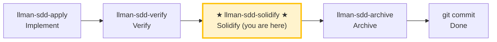

# LLMAN SDD Solidify

Use this skill to generate (regenerate) the executable `.feature` files for a change, from its delta `spec.toon` scenarios. BDD-on projects only.

## Pipeline Position



> 📍 You are in the solidify phase: after verify passes, before archive.
> BDD-off projects: this is a no-op (nothing to generate).

## Hard Constraints

- **BDD mode awareness** — check `llmanspec/config.yaml` for a `bdd:` block first, then branch:
  - **BDD-on** (`bdd:` present): proceed with solidify normally (steps below).
  - **BDD-off, no `.feature` files anywhere under `llmanspec/specs/`**: no-op. Report "nothing to solidify (BDD is off)".
  - **BDD-off, but `.feature` files exist**: report a **residual warning** — list each file and state: "Found N `.feature` file(s) but BDD is off (no `bdd:` block in `config.yaml`). They are ignored by `validate`/`index`. To make them executable again, add a `bdd:` block (e.g. `bdd:\n  run_command: \"cargo test --features bdd\"`). Re-enable intentionally, or remove them if no longer needed." **Do NOT delete the files** — surface them and let the user decide.
- **Framework-agnostic**: solidify does NOT scan `tests/bdd_steps.rs` or any BDD framework's step bindings. Whether a scenario is *executable* at runtime is decided by `bdd.run_command`.
- **Don't edit `.feature` by hand**: they are generated artifacts. Edit `spec.toon` scenarios, then re-run solidify.
- **Don't ask "should I continue?"**: run to completion unless you hit an unresolvable error.

## Steps

### 1) Confirm target change
- Determine the change id (from user input or context).
- Always announce: "Solidifying change: <id>".
- `spec.toon` is the SSOT. `.feature` files are the **executable subset** of its scenarios, serialized as Gherkin.
- Scenarios whose `when` invokes `llman sdd validate|archive|solidify` are **self-referencing** and are skipped (would recurse the BDD runner).

### 2) (Optional) Dry-run preview
- `llman sdd solidify <id> --dry-run` to preview which scenarios write vs skip.
- Review the skip reasons: `feature=false` and self-referencing scenarios are expected.

### 3) Execute solidify
- `llman sdd solidify <id>`
- This writes one `.feature` per capability under `llmanspec/specs/<capability>/<capability>.feature`.

### 4) Report
- Summarize: per capability, how many scenarios written vs skipped, and the output path.
- Skipped scenarios list their reason.

> 💡 Previous phase `llman-sdd-verify` (passed) → this phase generates `.feature` → next phase `llman-sdd-archive` (archive).

Before acting, read `llmanspec/config.yaml` and follow its `context` and `rules` if present.

Common commands:
- `llman sdd context --task "<description>" --paths "<files>"` (find relevant specs). Uses the pageindex agentic tree backend (needs `LLMAN_SDD_INDEX_CHAT_MODEL`). Preset via `LLMAN_SDD_INDEX_BACKEND`.
- `llman sdd list` (list changes)
- `llman sdd list --specs` (list specs with purpose/scope metadata)
- `llman sdd show <id>` (show change/spec)
- `llman sdd validate <id>` (validate a change or spec)
- `llman sdd validate --all` (bulk validate)
- `llman sdd index rebuild` (rebuild the pageindex tree index — no model needed)
- `llman sdd index check` (check index freshness)
- `llman sdd archive run <id>` (archive a change)
- `llman sdd archive freeze [--before YYYY-MM-DD] [--keep-recent N] [--dry-run]` (freeze archived dirs)
- `llman sdd archive thaw [--change <id> ...] [--dest <path>]` (restore from cold-backup)
- `llman sdd graph [CHANGE] [--format mermaid] [--scope active|archived|all] [--depth N]` (generate change dependency graph)


Validation fixes (TOON standalone specs):

1) Missing validation scope (`Spec valid_scope must not be empty`):
Main specs MUST carry a non-empty `valid_scope` inside the `.toon` document.
`llmanspec/specs/<feature-id>/spec.toon`:
```toon
kind: llman.sdd.spec
name: sample
purpose: "One-line overview."
valid_scope[1]: src
requirements[1]{req_id,title,statement}:
  r1,Title,System MUST do something.
scenarios[1]{req_id,id,given,when,then}:
  r1,happy,"",a trigger happens,the outcome is observed
```

2) No delta ops in a change: add at least one op + scenario in
`llmanspec/changes/<change-id>/specs/<feature-id>/spec.toon`:
```toon
kind: llman.sdd.delta
ops[1]{op,req_id,title,statement,from,to,name}:
  add_requirement,r1,Title,System MUST do something.,null,null,null
op_scenarios[1]{req_id,id,given,when,then}:
  r1,happy,"",a trigger happens,the outcome is observed
```

3) Tabular value quoting error ("Expected N tabular row values, but got M"):
Values containing **spaces**, commas, colons, or brackets MUST be double-quoted in tabular rows.
```toon
# BAD: spaces in an unquoted value split it into multiple values
r1,happy,"",a trigger happens,the outcome is observed

# GOOD: multi-word values quoted
r1,happy,"","a trigger happens","the outcome is observed"
```

4) BDD spec guardrail (`BDD is enabled but this spec declares no requirements and has no .feature files`):
When `config.yaml` has a `bdd` block, behavior specs live in `spec.toon` `scenarios` (TOON is the SSOT). `.feature` files are derived by `llman sdd solidify`. A spec with empty `requirements` and empty `scenarios` is an ERROR.

Notes:
- Each spec is a single standalone `.toon` file; there is no Markdown shell or ```toon fence.
- `null` represents missing optional fields.
- Migrate legacy `.md`+fence specs with `llman sdd migrate`.


## Context
- Gather the current change/spec state before acting.
- Prefer `llman sdd context --task --paths` to discover relevant specs instead of guessing or full scans.

## Goal
- State the concrete outcome for this command/skill execution.

## Constraints
- Keep changes minimal and scoped.
- Avoid guessing when identifiers or intent are ambiguous.
- Use `llman sdd context --task --paths` before reading full spec files.
- Choose workflow path based on change scale: behavioral contract changes use full SDD, implementation changes use quick path.

## Workflow
- Use `llman sdd` commands as the source of truth.
- Validate outcomes when files or specs are updated.
- Prefer `llman sdd context` over full reads or guessing.
- When context is unavailable follow error guidance (rebuild index or fall back to `list --specs --json`).

## Decision Policy
- Ask for clarification when a high-impact ambiguity remains.
- Stop instead of forcing through known validation errors.

## Output Contract
- Summarize actions taken.
- Provide resulting paths and validation status.

## Ethics Governance
- `ethics.risk_level`: classify risk as `low|medium|high|critical`.
- `ethics.prohibited_actions`: list actions that MUST NOT be performed.
- `ethics.required_evidence`: list required evidence before high-impact output.
- `ethics.refusal_contract`: define when to refuse and safe alternative response.
- `ethics.escalation_policy`: define when to escalate to user confirmation/review.