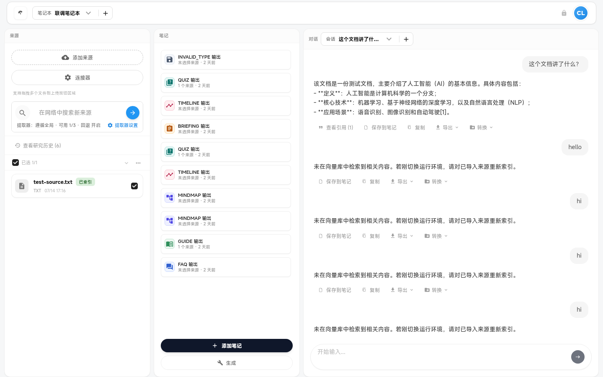
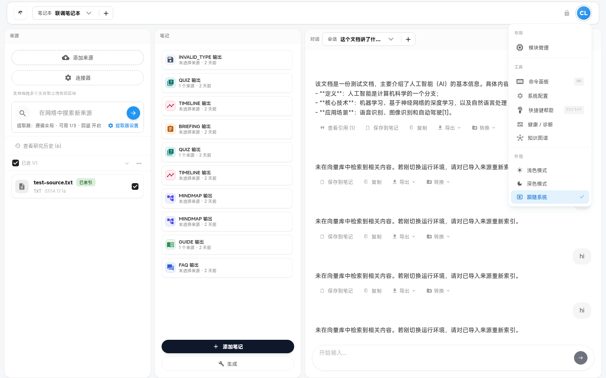
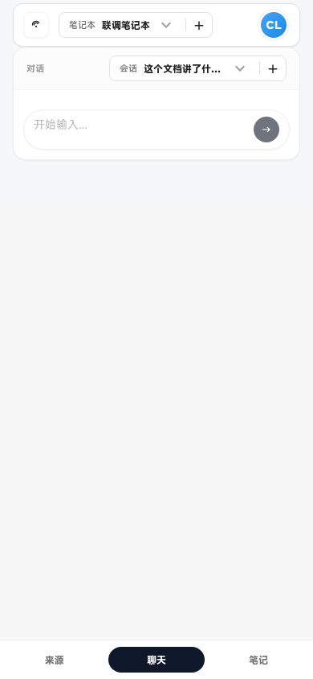
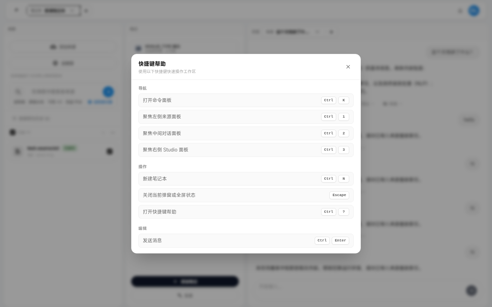

# 工作区外壳（Workspace Shell）

主布局、模块化画布、全局快捷键与主题。

默认桌面布局（`DEFAULT_LAYOUT`）：**来源 | 笔记 | 对话**（GridStack 可拖拽，localStorage 可能覆盖顺序）。

> NOTE: 待盘点

---

### `workspace-app-shell`

- **名称:** 工作区应用外壳
- **位置:** 全屏工作区根容器
- **入口:** 路由进入 `/`（Workspace 页面）
- **操作:** 挂载 `WorkspaceLayout`、协调各域 Hook 与 Overlay 状态
- **Server:** 间接依赖 notebooks / health
- **代码:** `apps/web/src/features/workspace/app/WorkspacePage.tsx`、`apps/web/src/features/workspace/layout/WorkspaceLayout.tsx`
- **截图:** `screenshots/workspace-app-shell.png` ✅
  

> NOTE: 待盘点

---

### `workspace-header`

- **名称:** 工作区顶栏
- **位置:** 页面顶部固定区域
- **入口:** 工作区加载后始终可见
- **操作:** 笔记本切换器、命令面板按钮、主题切换、诊断入口、自动笔记本提示
- **Server:** `GET /v2/notebooks`、`GET /health/dependencies`
- **代码:** `apps/web/src/features/workspace/layout/WorkspaceHeader.tsx`
- **截图:**
  - `screenshots/workspace-header.png` ✅
    
  - `screenshots/workspace-header-menu.png` ✅（头像菜单展开）
    

> NOTE: 待盘点

---

### `workspace-onboarding-banner`

- **名称:** 新用户引导横幅
- **位置:** 工作区主内容区顶部（无笔记本/无来源时）
- **入口:** 首次进入或空工作区状态
- **操作:** 引导创建笔记本、导入来源、打开命令面板、开始会话
- **Server:** `POST /v2/notebooks`、`POST /sources/upload`
- **代码:** `apps/web/src/features/workspace/layout/components/WorkspaceOnboardingBanner.tsx`
- **截图:** `screenshots/workspace-onboarding-banner.png`（待截图）

> NOTE: 待盘点

---

### `workspace-auto-notebook-hint`

- **名称:** 自动创建笔记本提示
- **位置:** 顶栏下方横幅（自动创建笔记本后）
- **入口:** 后端自动创建默认笔记本后显示
- **操作:** 查看说明、关闭提示（localStorage 记忆）
- **Server:** `POST /v2/notebooks`（自动创建场景）
- **代码:** `apps/web/src/features/workspace/layout/WorkspaceHeader.tsx`（`showAutoNotebookHint` 逻辑）
- **截图:** `screenshots/workspace-auto-notebook-hint.png`（待截图）

> NOTE: 待盘点

---

### `modular-canvas-layout`

- **名称:** 模块化画布布局
- **位置:** 桌面端三栏网格（来源 | 笔记 | 对话）
- **入口:** 宽屏布局（`isDesktopLayout`）
- **操作:** 拖拽调整模块尺寸与位置、持久化布局到 localStorage
- **Server:** —
- **代码:** `apps/web/src/features/workspace/layout/modular-canvas/`（`ModularCanvas.tsx`、`layoutStorage.ts`、`DEFAULT_LAYOUT`）
- **截图:** `screenshots/modular-canvas-layout.png`（待截图）

> NOTE: 待盘点

---

### `widget-catalog`

- **名称:** 模块目录（Widget Catalog）
- **位置:** 画布编辑模式下可选模块列表
- **入口:** 布局解锁后通过命令面板「添加模块」
- **操作:** 添加/移除 sources、chat、studio 模块
- **Server:** —
- **代码:** `apps/web/src/features/workspace/layout/modular-canvas/WidgetCatalog.tsx`、`widgetRegistry.ts`
- **截图:** `screenshots/widget-catalog.png`（待截图）

> NOTE: 待盘点

---

### `layout-lock-toggle`

- **名称:** 布局锁定切换
- **位置:** 命令面板 / 画布工具
- **入口:** `Ctrl+K` →「锁定布局」/「解锁布局」
- **操作:** 锁定后禁止拖拽；解锁进入编辑模式
- **Server:** —
- **代码:** `apps/web/src/features/workspace/layout/WorkspaceLayout.tsx`（`locked` / `toggleLock`）
- **截图:** `screenshots/layout-lock-toggle.png`（待截图）

> NOTE: 待盘点

---

### `mobile-panel-tabs`

- **名称:** 移动端面板标签
- **位置:** 窄屏底部或顶部 Tab 栏
- **入口:** 移动端布局（`WorkspaceTabs.tsx`）
- **操作:** 在来源 / 对话 / 笔记 面板间切换
- **Server:** —
- **代码:** `apps/web/src/features/workspace/layout/WorkspaceTabs.tsx`
- **截图:** `screenshots/mobile-panel-tabs.png` ✅
  

> NOTE: 待盘点

---

### `mobile-panel-shell`

- **名称:** 移动端面板外壳
- **位置:** 各移动端单面板容器
- **入口:** 选择 Tab 后渲染对应域组件
- **操作:** 包裹面板内容并提供模块级错误边界
- **Server:** —
- **代码:** `apps/web/src/features/workspace/layout/components/MobilePanelShell.tsx`
- **截图:** `screenshots/mobile-panel-shell.png`（待截图）

> NOTE: 待盘点

---

### `shortcut-help-panel`

- **名称:** 快捷键帮助面板
- **位置:** 全屏/模态 Overlay
- **入口:** `Ctrl+?` 或命令面板「快捷键帮助」
- **操作:** 展示 `WORKSPACE_SHORTCUTS` 列表
- **Server:** —
- **代码:** `apps/web/src/features/workspace/layout/ShortcutHelpPanel.tsx`、`shared/shortcuts.ts`
- **截图:** `screenshots/shortcut-help-panel.png` ✅
  

> NOTE: 待盘点

---

### `global-keyboard-shortcuts`

- **名称:** 全局键盘快捷键
- **位置:** 工作区全局（document 级监听）
- **入口:** 页面聚焦时生效
- **操作:** `Ctrl+K` 命令面板、`Ctrl+N` 新建笔记本、`Ctrl+1/2/3` 聚焦面板、`Ctrl+Enter` 发送、`Escape` 关闭 Overlay
- **Server:** —
- **代码:** `apps/web/src/features/workspace/shared/hooks/useKeyboardShortcuts.ts`、`layout/WorkspaceLayout.tsx`
- **截图:** `screenshots/global-keyboard-shortcuts.png`（待截图）

> NOTE: 待盘点

---

### `theme-switcher`

- **名称:** 主题切换器
- **位置:** 顶栏右侧
- **入口:** 点击主题按钮循环 light / dark / system
- **操作:** 切换 `data-theme`，持久化到 localStorage
- **Server:** —
- **代码:** `apps/web/src/features/workspace/layout/WorkspaceHeader.tsx`、`shared/hooks/useTheme.ts`
- **截图:** `screenshots/theme-switcher.png`（待截图）

> NOTE: 待盘点

---

### `app-error-boundary`

- **名称:** 应用级错误边界
- **位置:** `App.tsx` 包裹整个工作区
- **入口:** 子树渲染抛出未捕获错误时
- **操作:** 显示错误 UI、提供重试
- **Server:** —
- **代码:** `apps/web/src/app/App.tsx`、`shared/components/ErrorBoundary.tsx`
- **截图:** `screenshots/app-error-boundary.png`（待截图）

> NOTE: 待盘点

---

### `widget-error-boundary`

- **名称:** 模块级错误边界
- **位置:** 各 Widget / 面板 Shell 内
- **入口:** 单模块渲染失败
- **操作:** 隔离错误，不影响其他模块；显示模块名与重试
- **Server:** —
- **代码:** `apps/web/src/features/workspace/layout/modular-canvas/WidgetShell.tsx`、`layout/components/WorkspacePanelShell.tsx`、`layout/components/MobilePanelShell.tsx`
- **截图:** `screenshots/widget-error-boundary.png`（待截图）

> NOTE: 待盘点

---

### `toast-notifications`

- **名称:** Toast 通知
- **位置:** 视口角落浮动层（`toast` z-index）
- **入口:** 各域操作成功/失败/警告时触发
- **操作:** 短暂展示消息；支持 success / error / warning / info
- **Server:** —
- **代码:** `apps/web/src/shared/toast/`、`apps/web/src/app/App.tsx`（`ToastContainer`）
- **截图:** `screenshots/toast-notifications.png`（待截图）

> NOTE: 待盘点
