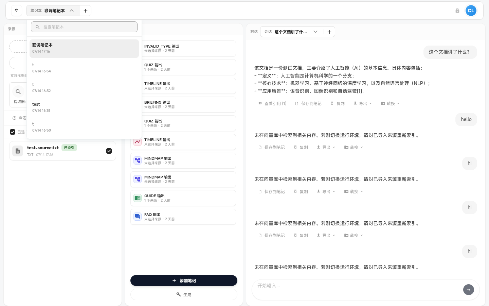

# 笔记本（Notebooks）

笔记本的创建、切换、重命名与删除。

---

### `notebook-switcher`

- **名称:** 笔记本切换器
- **位置:** 顶栏左侧
- **入口:** 点击当前笔记本名称
- **操作:** 下拉选择已有笔记本、显示当前笔记本标题
- **Server:** `GET /v2/notebooks`
- **代码:** `apps/web/src/features/workspace/domains/notebooks/NotebookSwitcher.tsx`、`useNotebooks.ts`
- **截图:** `screenshots/notebook-switcher.png` ✅
  

> NOTE: 待盘点

---

### `notebook-create`

- **名称:** 新建笔记本
- **位置:** 切换器 / 引导横幅 / 命令面板
- **入口:** 「新建笔记本」、`Ctrl+N`、引导 CTA
- **操作:** 输入名称创建；可选从模板创建（`template_id` query）
- **Server:** `POST /v2/notebooks`
- **代码:** `apps/web/src/features/workspace/domains/notebooks/useNotebooks.ts`、`layout/WorkspaceLayout.tsx`
- **截图:** `screenshots/notebook-create.png`（待截图）

> NOTE: 待盘点

---

### `notebook-rename`

- **名称:** 重命名笔记本
- **位置:** 笔记本切换器或管理 UI
- **入口:** 编辑笔记本名称
- **操作:** 提交新名称 PATCH
- **Server:** `PATCH /v2/notebooks/:nid`
- **代码:** `apps/web/src/features/workspace/domains/notebooks/useNotebooks.ts`
- **截图:** `screenshots/notebook-rename.png`（待截图）

> NOTE: 待盘点

---

### `notebook-delete`

- **名称:** 删除笔记本
- **位置:** 笔记本管理 UI
- **入口:** 删除确认操作
- **操作:** 级联删除会话、来源、输出等
- **Server:** `DELETE /v2/notebooks/:nid`
- **代码:** `apps/web/src/features/workspace/domains/notebooks/useNotebooks.ts`
- **截图:** `screenshots/notebook-delete.png`（待截图）

> NOTE: 待盘点

---

### `notebook-switch`

- **名称:** 切换活动笔记本
- **位置:** 全局状态 `activeNotebookId`
- **入口:** 切换器选择、命令面板「切换笔记本」
- **操作:** 切换后重新加载会话、来源、输出等域数据
- **Server:** `GET /v2/notebooks/:nid`（按需）
- **代码:** `apps/web/src/features/workspace/shared/state/workspaceStore.ts`、`domains/notebooks/useNotebooks.ts`
- **截图:** `screenshots/notebook-switch.png`（待截图）

> NOTE: 待盘点
