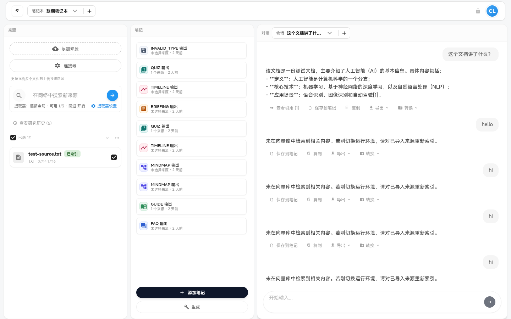

# 消息与对话（Messages / Chat）

对话面板、发送、流式、斜杠命令与消息级操作。

---

### `chat-panel`

- **名称:** 对话面板
- **位置:** 工作区中间栏（chat 模块）/ 移动端对话 Tab
- **入口:** 默认可见模块
- **操作:** 展示消息列表、输入区、预设与引用
- **Server:** `GET /v2/notebooks/:nid/sessions/:sid/messages`、`POST /v2/qa/stream`
- **代码:** `apps/web/src/features/workspace/domains/messages/ChatPanel.tsx`、`useChat.ts`
- **截图:** `screenshots/chat-panel.png` ✅
  

> NOTE: 待盘点

---

### `chat-send-message`

- **名称:** 发送消息
- **位置:** 对话面板底部输入框
- **入口:** 发送按钮或 `Ctrl+Enter`
- **操作:** 创建 user message → 触发 QA 流式回复
- **Server:** `POST /v2/notebooks/:nid/sessions/:sid/messages`、`POST /v2/qa/stream`
- **代码:** `apps/web/src/features/workspace/domains/messages/useChat.ts`
- **截图:** `screenshots/chat-send-message.png`（待截图）

> NOTE: 待盘点

---

### `chat-stop-streaming`

- **名称:** 停止流式生成
- **位置:** 对话面板输入区（生成中）
- **入口:** 流式回复进行时显示停止按钮
- **操作:** AbortController 中断 SSE / fetch
- **Server:** （客户端中断 `POST /v2/qa/stream`）
- **代码:** `apps/web/src/features/workspace/domains/messages/useChat.ts`
- **截图:** `screenshots/chat-stop-streaming.png`（待截图）

> NOTE: 待盘点

---

### `chat-slash-commands`

- **名称:** 斜杠命令菜单
- **位置:** 输入框上方弹出层
- **入口:** 输入 `/` 触发命令补全
- **操作:** 选择 `/prompt:<name>` 等预设命令插入输入
- **Server:** `GET /v2/commands`
- **代码:** `apps/web/src/features/workspace/domains/messages/ChatPanel.tsx`、`shared/hooks/useCommands.ts`
- **截图:** `screenshots/chat-slash-commands.png`（待截图）

> NOTE: 待盘点

---

### `chat-retry-send`

- **名称:** 重试发送
- **位置:** 失败消息旁操作
- **入口:** 发送失败后的重试按钮
- **操作:** 重新提交上一条用户消息或 QA 请求
- **Server:** `POST /v2/qa/stream`
- **代码:** `apps/web/src/features/workspace/domains/messages/useChat.ts`
- **截图:** `screenshots/chat-retry-send.png`（待截图）

> NOTE: 待盘点

---

### `chat-retry-load-messages`

- **名称:** 重试加载消息
- **位置:** 消息列表错误状态
- **入口:** 加载失败时显示重试
- **操作:** 重新 `GET` 分页消息列表
- **Server:** `GET /v2/notebooks/:nid/sessions/:sid/messages`
- **代码:** `apps/web/src/features/workspace/domains/messages/useChat.ts`
- **截图:** `screenshots/chat-retry-load-messages.png`（待截图）

> NOTE: 待盘点

---

### `chat-message-copy`

- **名称:** 复制消息
- **位置:** 消息气泡操作菜单
- **入口:** 右键或操作按钮「复制」
- **操作:** 复制消息纯文本到剪贴板
- **Server:** —
- **代码:** `apps/web/src/features/workspace/domains/messages/ChatPanel.tsx`
- **截图:** `screenshots/chat-message-copy.png`（待截图）

> NOTE: 待盘点

---

### `chat-message-save-to-note`

- **名称:** 保存消息到笔记
- **位置:** 助手消息操作
- **入口:** 「保存到 Studio」类操作
- **操作:** 将消息内容写入 Studio 手动笔记或 Output
- **Server:** `POST /v2/outputs`（视实现路径）
- **代码:** `apps/web/src/features/workspace/domains/messages/useChat.ts`
- **截图:** `screenshots/chat-message-save-to-note.png`（待截图）

> NOTE: 待盘点

---

### `chat-message-export`

- **名称:** 导出单条消息
- **位置:** 消息操作菜单
- **入口:** 导出为文件
- **操作:** 导出 Markdown / 纯文本片段
- **Server:** —
- **代码:** `apps/web/src/features/workspace/domains/messages/ChatPanel.tsx`
- **截图:** `screenshots/chat-message-export.png`（待截图）

> NOTE: 待盘点

---

### `chat-session-export`

- **名称:** 导出整个会话
- **位置:** 命令面板 / 会话菜单
- **入口:** 「导出当前会话（Markdown/JSON，含引用）」
- **操作:** 下载 QA 导出（含 citations）
- **Server:** `GET /v2/qa/export`
- **代码:** `apps/web/src/features/workspace/shared/evidenceExport.ts`、`layout/WorkspaceLayout.tsx`
- **截图:** `screenshots/chat-session-export.png`（待截图）

> NOTE: 待盘点

---

### `chat-convert-to-source`

- **名称:** 会话转为来源
- **位置:** 消息/会话操作菜单
- **入口:** 「转为来源」
- **操作:** 将会话消息 chunk + embed 为新 source
- **Server:** `POST /v2/notebooks/:nid/sessions/:sid/convert-to-source`
- **代码:** `apps/web/src/features/workspace/domains/messages/useChat.ts`
- **截图:** `screenshots/chat-convert-to-source.png`（待截图）

> NOTE: 待盘点

---

### `chat-convert-to-output`

- **名称:** 会话转为 Output
- **位置:** 消息/会话操作菜单
- **入口:** 「转为 Output」
- **操作:** 生成 paragraph / bullets / structured 类型 Output
- **Server:** `POST /v2/notebooks/:nid/sessions/:sid/convert-to-output`
- **代码:** `apps/web/src/features/workspace/domains/messages/useChat.ts`
- **截图:** `screenshots/chat-convert-to-output.png`（待截图）

> NOTE: 待盘点

---

### `chat-citations`

- **名称:** 对话引用（Citations）
- **位置:** 消息内 `[N]` 标记、引用弹出层
- **入口:** 点击引用编号
- **操作:** 展示引用来源片段（来自消息/QA 载荷中的 citations）
- **Server:** 无独立 citations HTTP（c73 已删）；数据随 `POST .../qa` / messages 下发
- **代码:** `apps/web/src/features/workspace/shared/components/citations/`（`CitationMark.tsx`、`CitationPopover.tsx`）
- **截图:** `screenshots/chat-citations.png`（待截图）

> NOTE: 2026-07-20 — 不以 `GET /v2/citations*` / context 为依赖；嵌入 citations 仍 active

---

### `chat-typing-indicator`

- **名称:** 输入中 / 生成中指示器
- **位置:** 消息列表底部
- **入口:** QA 流式 pending 时
- **操作:** 显示加载动画或「正在思考」
- **Server:** `POST /v2/qa/stream`（流式阶段）
- **代码:** `apps/web/src/features/workspace/domains/messages/ChatPanel.tsx`、`useChat.ts`
- **截图:** `screenshots/chat-typing-indicator.png`（待截图）

> NOTE: 待盘点
