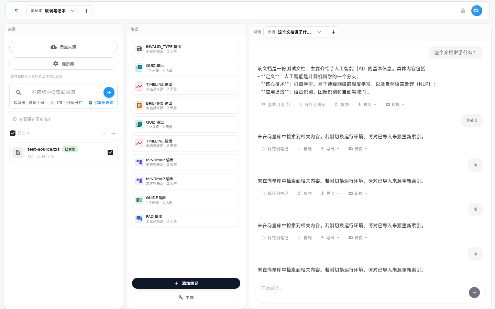

# 来源（Sources）

来源面板、导入、搜索、标签、连接器与详情。

---

### `sources-panel`

- **名称:** 来源面板
- **位置:** 工作区左侧栏（sources 模块）
- **入口:** 默认可见 / `Ctrl+1`
- **操作:** 列表展示来源、搜索、筛选、批量操作入口
- **Server:** `GET /v2/notebooks/:nid/sources`
- **代码:** `apps/web/src/features/workspace/domains/sources/SourcesPanel.tsx`、`components/SourcesPanelView.tsx`、`useSources.ts`
- **截图:** `screenshots/sources-panel.png` ✅
  

> NOTE: 待盘点

---

### `source-upload`

- **名称:** 上传文件来源
- **位置:** 来源面板工具栏 / 拖拽区
- **入口:** 「上传」、命令面板「导入来源: 上传文件」
- **操作:** 多文件上传 PDF/文本等，触发解析与嵌入管线
- **Server:** `POST /sources/upload`
- **代码:** `apps/web/src/features/workspace/domains/sources/useSources.ts`、`shared/uploadTypes.ts`
- **截图:** `screenshots/source-upload.png`（待截图）

> NOTE: 待盘点

---

### `source-add-from-url`

- **名称:** 从 URL 添加来源
- **位置:** 添加来源对话框
- **入口:** 「从 URL」、命令面板
- **操作:** 输入 URL，选择抓取模式，创建 processing source
- **Server:** `POST /v2/notebooks/:nid/sources/from-url`
- **代码:** `apps/web/src/features/workspace/domains/sources/components/AddSourceFromUrlDialog.tsx`（或等效）、`layout/WorkspaceLayout.tsx`
- **截图:** `screenshots/source-add-from-url.png`（待截图）

> NOTE: 待盘点

---

### `source-web-search-fast`

- **名称:** 快速网页搜索
- **位置:** 来源面板搜索框
- **入口:** 输入关键词搜索（fast 模式）
- **操作:** 调用 SearXNG 返回结果列表
- **Server:** `POST /v2/notebooks/:nid/sources/search`（`mode: fast`）
- **代码:** `apps/web/src/features/workspace/domains/sources/useSources.ts`
- **截图:** `screenshots/source-web-search-fast.png`（待截图）

> NOTE: 待盘点

---

### `source-web-search-deep-toggle`

- **名称:** 深度搜索切换
- **位置:** 来源搜索区
- **入口:** 深度研究 / deep search 开关
- **操作:** 切换搜索深度或关联 Deep Research 流程
- **Server:** `POST /v2/notebooks/:nid/sources/search`、`POST /v2/research`
- **代码:** `apps/web/src/features/workspace/domains/sources/components/SourcesPanelView.tsx`
- **截图:** `screenshots/source-web-search-deep-toggle.png`（待截图）

> NOTE: 待盘点

---

### `search-results-queue`

- **名称:** 搜索结果队列
- **位置:** 来源面板下方或侧栏
- **入口:** 搜索完成后
- **操作:** 暂存待添加的搜索结果、批量选择
- **Server:** —
- **代码:** `apps/web/src/features/workspace/domains/sources/SearchResultsQueue.tsx`、`SearchResultCard.tsx`
- **截图:** `screenshots/search-results-queue.png`（待截图）

> NOTE: 待盘点

---

### `add-search-results-dialog`

- **名称:** 添加搜索结果对话框
- **位置:** 模态对话框
- **入口:** 从队列确认添加
- **操作:** 将选中 URL 批量创建为来源
- **Server:** `POST /v2/notebooks/:nid/sources/from-url`（批量）
- **代码:** `apps/web/src/features/workspace/domains/sources/AddSearchResultDialog.tsx`
- **截图:** `screenshots/add-search-results-dialog.png`（待截图）

> NOTE: 待盘点

---

### `source-select-for-rag`

- **名称:** 选择来源用于 RAG
- **位置:** 来源列表复选框
- **入口:** 勾选来源
- **操作:** 限制 QA / 生成时 `source_ids` 范围
- **Server:** `POST /v2/qa`（body.source_ids）
- **代码:** `apps/web/src/features/workspace/domains/sources/useSources.ts`、`shared/state/workspaceStore.ts`
- **截图:** `screenshots/source-select-for-rag.png`（待截图）

> NOTE: 待盘点

---

### `source-sort-filter`

- **名称:** 来源排序与筛选
- **位置:** 来源面板工具栏
- **入口:** 排序/状态筛选控件
- **操作:** 按时间、名称、状态过滤列表
- **Server:** `GET /v2/notebooks/:nid/sources`（query 参数）
- **代码:** `apps/web/src/features/workspace/domains/sources/components/SourcesPanelView.tsx`
- **截图:** `screenshots/source-sort-filter.png`（待截图）

> NOTE: 待盘点

---

### `source-tags-batch`

- **名称:** 来源标签批量管理
- **位置:** 标签侧栏 / 批量工具
- **入口:** 标签 CRUD、分配到来源
- **操作:** 创建/编辑/删除标签；批量打标
- **Server:** `GET/POST/PATCH/DELETE /v2/notebooks/:nid/sources/tags*`、`POST/DELETE .../tags/:tid/sources`
- **代码:** `apps/web/src/features/workspace/domains/sources/useSources.ts`
- **截图:** `screenshots/source-tags-batch.png`（待截图）

> NOTE: 待盘点

---

### `source-batch-delete`

- **名称:** 批量删除来源
- **位置:** 来源面板批量操作
- **入口:** 多选后「删除」
- **操作:** 批量删除选中来源
- **Server:** `POST /v2/notebooks/:nid/sources/batch/delete`
- **代码:** `apps/web/src/features/workspace/domains/sources/useSources.ts`
- **截图:** `screenshots/source-batch-delete.png`（待截图）

> NOTE: 待盘点

---

### `source-batch-reembed`

- **名称:** 批量重新嵌入
- **位置:** 来源面板批量操作
- **入口:** 多选后「重新嵌入」
- **操作:** 对选中来源重新 chunk + embed
- **Server:** `POST /v2/notebooks/:nid/sources/batch/re-embed`
- **代码:** `apps/web/src/features/workspace/domains/sources/useSources.ts`
- **截图:** `screenshots/source-batch-reembed.png`（待截图）

> NOTE: 待盘点

---

### `source-single-reembed`

- **名称:** 单条重新嵌入
- **位置:** 来源项操作菜单
- **入口:** 单个来源「重新嵌入」
- **操作:** 触发单来源 re-embed 任务
- **Server:** `POST /sources/:id/re-embed`
- **代码:** `apps/web/src/features/workspace/domains/sources/useSources.ts`
- **截图:** `screenshots/source-single-reembed.png`（待截图）

> NOTE: 待盘点

---

### `source-detail-dialog`

- **名称:** 来源详情对话框
- **位置:** 全屏/大模态
- **入口:** 点击来源项
- **操作:** 查看元数据、分块预览、单来源 QA、摘要、失败信息
- **Server:** `GET /sources/:id`、`GET /sources/:id/chunks`、`POST .../qa`、`GET .../summary`
- **代码:** `apps/web/src/features/workspace/domains/sources/SourceDetailDialog.tsx`
- **截图:** `screenshots/source-detail-dialog.png`（待截图）

> NOTE: 待盘点

---

### `source-connectors-wizard`

- **名称:** 来源连接器向导
- **位置:** 连接器对话框
- **入口:** 来源面板「连接器」
- **操作:** 绑定文件系统连接器、快照、同步检查、导入范围
- **Server:** `GET /v2/notebooks/:nid/source-connectors`、`POST .../bindings`、`POST .../snapshot`、`POST .../sync-check*`、`POST .../import-scope`
- **代码:** `apps/web/src/features/workspace/domains/sources/components/SourceConnectorsDialog.tsx`
- **截图:** `screenshots/source-connectors-wizard.png`（待截图）

> NOTE: 待盘点

---

### `extractor-policy-dialog`

- **名称:** 提取器策略对话框
- **位置:** 模态设置
- **入口:** 来源面板提取器设置
- **操作:** 配置笔记本级 extractor mode / enabled_extractors
- **Server:** `GET /v2/notebooks/:nid/extractors`、`PATCH /v2/notebooks/:nid/extractors`
- **代码:** `apps/web/src/features/workspace/domains/sources/components/ExtractorPolicyDialog.tsx`
- **截图:** `screenshots/extractor-policy-dialog.png`（待截图）

> NOTE: 待盘点

---

### `source-jump-highlight`

- **名称:** 来源跳转高亮
- **位置:** 来源列表 / 详情分块视图
- **入口:** 从引用点击跳转、`?highlight=` 深链
- **操作:** 滚动并高亮对应 chunk
- **Server:** `GET /sources/:id/chunks`
- **代码:** `apps/web/src/features/workspace/layout/WorkspaceLayout.tsx`、`domains/sources/SourceDetailDialog.tsx`
- **截图:** `screenshots/source-jump-highlight.png`（待截图）

> NOTE: 待盘点
