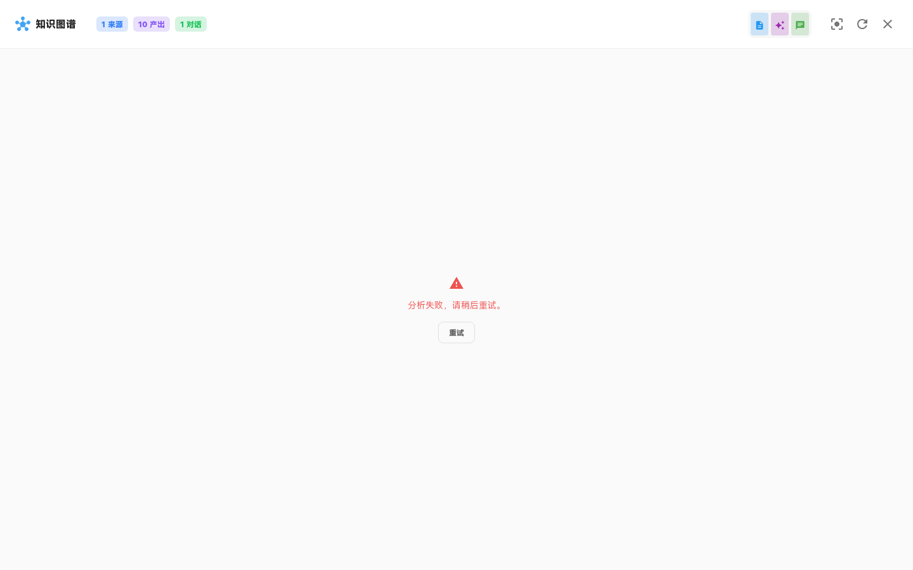

# 分析（Analysis）

知识图谱可视化（Analysis API 的消费端）。

---

### `knowledge-graph-view`

- **名称:** 知识图谱视图
- **位置:** 全屏 Overlay
- **入口:** 命令面板「打开知识图谱」、`open-graph` 快捷键绑定
- **操作:** 调用分析 API，渲染主题聚类、关系边、矛盾高亮；支持缩放平移
- **Server:** `POST /v2/analysis`
- **代码:** `apps/web/src/features/workspace/domains/analysis/KnowledgeGraphView.tsx`、`useAnalysis.ts`
- **截图:** `screenshots/knowledge-graph-view.png` ✅
  

> NOTE: 待盘点

---

> **相关孤儿 UI：** `AnalysisPanel` 已实现但未挂载，见 [`13-orphaned-and-stubs.md`](13-orphaned-and-stubs.md#analysis-panel-ui)。
