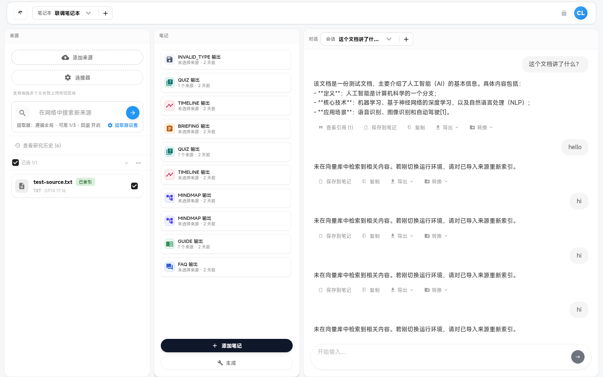

# Studio（笔记与生成）

Studio 面板、Output 列表、手动笔记、生成工具与 Slides。

---

### `studio-panel`

- **名称:** Studio 笔记面板
- **位置:** 工作区右侧栏（studio 模块）/ `Ctrl+3`
- **入口:** 默认可见模块
- **操作:** 承载 Output 列表、工具网格、查看器切换
- **Server:** `GET /v2/outputs`
- **代码:** `apps/web/src/features/workspace/domains/studio/StudioPanel.tsx`
- **截图:** `screenshots/studio-panel.png` ✅
  

> NOTE: 待盘点

---

### `studio-outputs-list`

- **名称:** Studio Output 列表
- **位置:** Studio 面板左侧/上部列表
- **入口:** Studio 加载后
- **操作:** 选择 Output、显示类型图标与标题、删除入口
- **Server:** `GET /v2/outputs`
- **代码:** `apps/web/src/features/workspace/domains/studio/StudioOutputsList.tsx`
- **截图:** `screenshots/studio-outputs-list.png`（待截图）

> NOTE: 待盘点

---

### `studio-add-manual-note`

- **名称:** 添加手动笔记
- **位置:** Studio 工具区
- **入口:** 「手动笔记」/ 空白笔记
- **操作:** 创建 PARAGRAPH 类型空 Output 供编辑
- **Server:** `POST /v2/outputs`（手动类型）
- **代码:** `apps/web/src/features/workspace/domains/studio/StudioPanel.tsx`、`studioUtils.tsx`
- **截图:** `screenshots/studio-add-manual-note.png`（待截图）

> NOTE: 待盘点

---

### `studio-generate-tools`

- **名称:** Studio 生成工具网格
- **位置:** Studio 面板工具区
- **入口:** 点击「生成」或工具卡片
- **操作:** 展示 FAQ/GUIDE/TIMELINE 等工具，触发 Output 生成队列
- **Server:** `GET /v2/workspace/tools`、`POST /v2/outputs`
- **代码:** `apps/web/src/features/workspace/domains/studio/StudioToolsGrid.tsx`、`studioUtils.tsx`
- **截图:** `screenshots/studio-generate-tools.png`（待截图）

> NOTE: 待盘点

---

### `studio-tool-config-dialog`

- **名称:** 生成工具配置对话框
- **位置:** 模态对话框
- **入口:** 选择工具后配置 quantity/topic/difficulty 等
- **操作:** 读取 `config_schema`，提交生成请求
- **Server:** `GET /v2/workspace/tools/:id/config`、`POST /v2/outputs`
- **代码:** `apps/web/src/features/workspace/domains/studio/StudioPanel.tsx`、`domains/studio/` 内配置 UI
- **截图:** `screenshots/studio-tool-config-dialog.png`（待截图）

> NOTE: 待盘点

---

### `model-selector`

- **名称:** 模型选择器
- **位置:** Studio 生成配置 / Slides 对话框
- **入口:** 生成前选择模型
- **操作:** 列出可用 chat 模型并选择 `model_id`
- **Server:** `GET /v2/models`
- **代码:** `apps/web/src/features/workspace/domains/studio/ModelSelector.tsx`
- **截图:** `screenshots/model-selector.png`（待截图）

> NOTE: 待盘点

---

### `generation-preference`

- **名称:** 生成偏好设置
- **位置:** Studio 工具配置内
- **入口:** 数量/难度/主题等选项
- **操作:** 映射到 Output 生成 `config` 字段
- **Server:** `POST /v2/outputs`
- **代码:** `apps/web/src/features/workspace/domains/studio/StudioToolsGrid.tsx`、`studioUtils.tsx`
- **截图:** `screenshots/generation-preference.png`（待截图）

> NOTE: 待盘点

---

### `slides-studio-dialog`

- **名称:** Slides Studio 对话框
- **位置:** 全屏模态
- **入口:** 命令面板「打开 Slides Studio」、SLIDES 工具
- **操作:** 大纲/Markdown 编辑、流式生成、预览、入队
- **Server:** `POST/GET/PATCH /v2/studio/slides*`、流式 `.../outline/stream`、`.../markdown/stream`
- **代码:** `apps/web/src/features/workspace/domains/studio/SlidesStudioDialog.tsx`、`utils/slides.ts`
- **截图:** `screenshots/slides-studio-dialog.png`（待截图）

> NOTE: 待盘点
