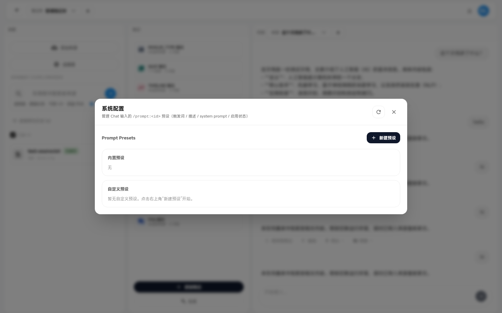
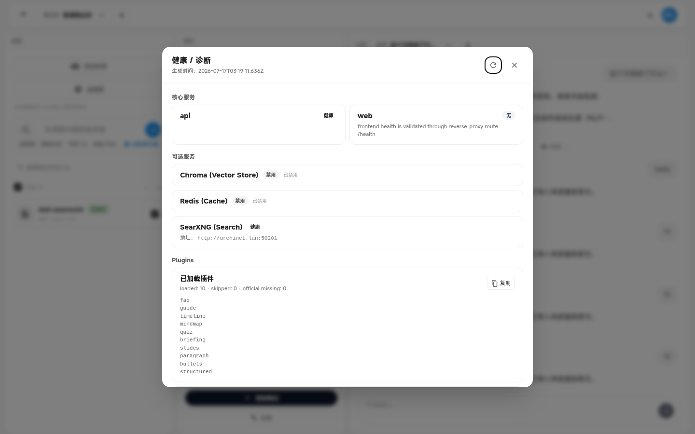

# 设置与诊断（Settings & Diagnostics）

系统配置（Prompt 预设）与健康诊断。

---

### `system-config-dialog`

- **名称:** 系统配置对话框
- **位置:** 全屏/大模态 Overlay
- **入口:** 顶栏设置入口
- **操作:** 管理自定义 Prompt 预设（CRUD）、查看内置 preset 说明、复制 system prompt
- **Server:** `GET/POST/PATCH/DELETE /v2/prompt-presets`
- **代码:** `apps/web/src/features/workspace/layout/overlays/SystemConfigDialog.tsx`、`shared/hooks/usePromptPresets.ts`
- **截图:** `screenshots/system-config-dialog.png` ✅
  

> NOTE: 待盘点

---

### `diagnostics-dialog`

- **名称:** 健康 / 诊断对话框
- **位置:** 模态 Overlay
- **入口:** 命令面板「健康 / 诊断」、顶栏入口
- **操作:** 展示后端/前端/可选服务（SearXNG 等）健康状态；复制诊断 JSON
- **Server:** `GET /health`、`GET /health/dependencies`
- **代码:** `apps/web/src/features/workspace/layout/overlays/DiagnosticsDialog.tsx`、`layout/hooks/useDependencyHealth.ts`
- **截图:** `screenshots/diagnostics-dialog.png` ✅
  

> NOTE: 待盘点
