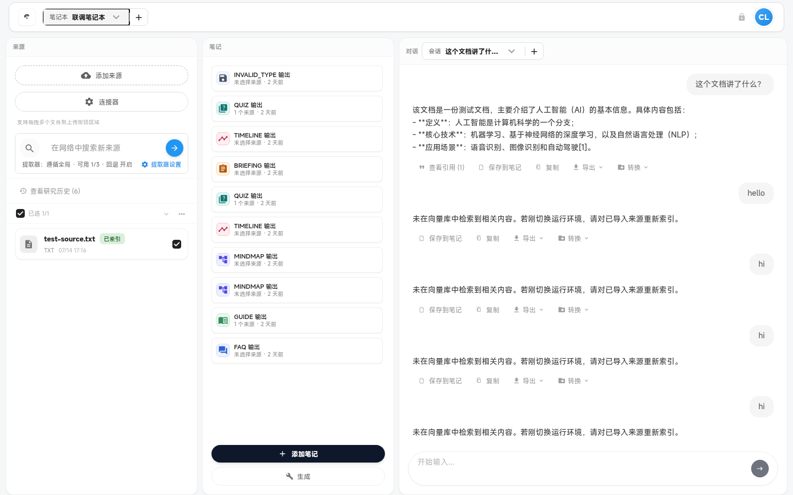

# 命令面板（Command Palette）

全局命令搜索与快速操作。

---

### `command-palette`

- **名称:** 命令面板
- **位置:** 居中模态（`Ctrl+K`）
- **入口:** 顶栏按钮、`Ctrl+K`、引导横幅
- **操作:** 模糊搜索命令、Enter 执行
- **Server:** 部分命令间接调用各 API
- **代码:** `apps/web/src/features/workspace/layout/modular-canvas/CommandPalette.tsx`、`layout/WorkspaceLayout.tsx`（`cmdPaletteCommands`）
- **截图:** `screenshots/command-palette.png` ✅
  

## 内置命令列表

| 命令 ID                                          | 标签                                 |
| ------------------------------------------------ | ------------------------------------ |
| `create-notebook`                                | 新建笔记本                           |
| `switch-notebook-{id}`                           | 切换笔记本: {title}                  |
| `import-sources-upload`                          | 导入来源: 上传文件                   |
| `import-sources-url`                             | 导入来源: 从 URL                     |
| `import-sources-search`                          | 导入来源: 搜索                       |
| `start-session`                                  | 开始会话                             |
| `export-qa-markdown`                             | 导出当前会话（Markdown，含引用）     |
| `export-qa-json`                                 | 导出当前会话（JSON，含引用）         |
| `export-output-markdown`                         | 导出当前 Output（Markdown，含引用）  |
| `export-output-json`                             | 导出当前 Output（JSON，含引用）      |
| `open-slides-studio` / `recover-slides-workflow` | 打开 Slides Studio / Slides 诊断     |
| `open-diagnostics`                               | 健康 / 诊断                          |
| `shortcut-help`                                  | 快捷键帮助                           |
| `add-{widgetId}` / `remove-{widgetId}`           | 添加/移除模块（sources/chat/studio） |
| `toggle-lock`                                    | 锁定/解锁布局                        |
| `session-search`                                 | 切换会话                             |

> NOTE: 待盘点
