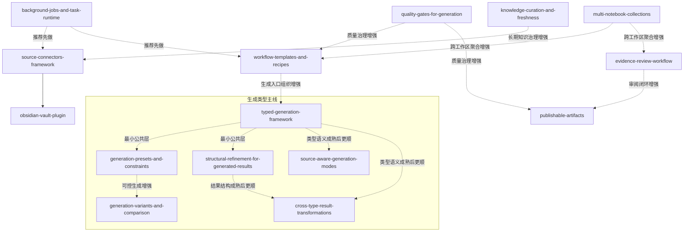

# OpenSpec Changes Overview

## 长期路线重排

### 规划原则

- 按 **能力层** 组织长期路线：平台底座层 / 产品工作流层 / 治理与质量层
- 按 **波次** 安排实际推进顺序，避免把所有 change 串成硬依赖链
- 每一波都至少包含一个用户可感知的主线项
- 强依赖尽量少，只保留必要的宿主 → 样板关系
- 当前阶段**不改各 change 的用户视角定义**，只重排优先级与相互关系
- 路线推进只按工件完整度、依赖清晰度、语义稳定度与 `openspec validate` 状态衡量，不使用时间窗口或交付产能口径

### Agent-Native 进度口径

- **工件完整度**：`proposal.md`、`design.md`、`tasks.md` 与必要的 `specs/.../spec.md` 是否齐备。
- **依赖清晰度**：硬前置是否明确，是否避免把推荐顺序误写成阻塞链。
- **语义稳定度**：核心承诺、非目标、可延后项是否稳定，是否还能独立推进。
- **校验状态**：`openspec validate <change>` 是否通过，且与 roadmap / dispatch 叙述一致。

### 三层结构

#### 平台底座层

- `background-jobs-and-task-runtime`
- `source-connectors-framework`
- `typed-generation-framework`

负责：宿主能力、异步运行时、扩展框架、通用契约。

#### 产品工作流层

- `workflow-templates-and-recipes`
- `generation-presets-and-constraints`
- `structural-refinement-for-generated-results`
- `generation-variants-and-comparison`
- `obsidian-vault-plugin`
- `evidence-review-workflow`
- `publishable-artifacts`
- `cross-type-result-transformations`
- `multi-notebook-collections`

负责：用户可感知的任务流、接入样板、审阅、产物与更大的工作空间。

#### 治理与质量层

- `quality-gates-for-generation`
- `knowledge-curation-and-freshness`
- `source-aware-generation-modes`

负责：结果质量、知识健康、长期维护与治理能力。

### 四波次安排

#### Wave 1：起步体验 + 异步底座

- `background-jobs-and-task-runtime` — 伴随底座
- `workflow-templates-and-recipes` — 产品主线
- `quality-gates-for-generation` — 轻量治理伴随项
- `typed-generation-framework` — 生成公共底座
- `generation-presets-and-constraints` — 生成主线增强
- `structural-refinement-for-generated-results` — 结果改良主线
- `generation-variants-and-comparison` — 候选观察项

目标：
- 先解决“更容易开始做事”
- 同时把长任务、基础质量信号和生成类型最小公共层先垫上
- 让右侧生成入口从“多个按钮”逐步走向“清晰类型 + 可控生成 + 可持续改良”

进入条件：
- 起步路径、异步语义、基础质量信号与生成类型公共词汇仍未形成可直接交给实现 agent 的稳定工件组合。
- 生成类型、控制项和结果改良之间的接口关系还没有写清楚。
- 当前最值得优先收敛的抽象仍是“如何开始一项工作”和“如何生成更可用的第一版结果”。

退出条件：
- `workflow-templates-and-recipes`、`background-jobs-and-task-runtime`、`quality-gates-for-generation`、`typed-generation-framework` 至少达到可实现状态，且 `openspec validate` 通过。
- `generation-presets-and-constraints` 与 `structural-refinement-for-generated-results` 的边界已经稳定，不再反向改写 Wave 1 的公共词汇。
- Wave 2 可以直接消费 Wave 1 在任务入口、长任务模型、生成类型与结果基础结构上的语义，而不是重新定义它们。

说明：
- `workflow-templates-and-recipes` 不要求完全等 `background-jobs-and-task-runtime` 完成后再开始。
- `generation-presets-and-constraints` 与 `structural-refinement-for-generated-results` 更适合在 `typed-generation-framework` 的最小公共词汇稳定后继续推进。
- `generation-variants-and-comparison` 保留为观察项，不阻塞 Wave 1 核心退出条件。

#### Wave 2：知识接入主线

- `source-connectors-framework` — 平台主线
- `obsidian-vault-plugin` — 首个验证样板
- `knowledge-curation-and-freshness` — 接入后的长期治理增强
- `source-aware-generation-modes` — 来源策略观察项

目标：
- 把知识接入做成可扩展宿主能力
- 用 Obsidian 验证“大 vault + 选择性导入 + 显式 sync_check”模型
- 在接入稳定后逐步引入知识健康治理与按生成类型分层的来源使用语义

进入条件：
- Wave 1 的工件已经稳定到足以承接导入、扫描与同步检查这类长链路流程。
- 下一层最需要被统一的抽象已经从“如何开始工作”转为“如何把外部知识接入系统，以及不同生成类型如何使用来源”。
- `source-connectors-framework` 被明确为宿主层 change，而不是被样板插件反向定义。

退出条件：
- `source-connectors-framework` 已定义稳定的 connector 宿主语义，`obsidian-vault-plugin` 也已经按该语义完成样板验证。
- `knowledge-curation-and-freshness` 与 `source-aware-generation-modes` 都可以建立在稳定的 binding / snapshot / `sync_check` 和生成类型语义之上。
- Wave 3 不需要回头改写知识对象边界、来源使用基础语义或导入后的对象模型。

说明：
- 本波仅保留一个明确强依赖：`source-connectors-framework -> obsidian-vault-plugin`。
- `knowledge-curation-and-freshness` 与 `source-aware-generation-modes` 都更适合建立在稳定的 binding / sync 语义之上。

#### Wave 3：可信结果闭环

- `evidence-review-workflow` — 审阅主线
- `publishable-artifacts` — 结果沉淀与正式产物增强
- `cross-type-result-transformations` — 后置演化项

目标：
- 让结果不只是“生成出来”，还能被审、被确认、被沉淀
- 在结果和类型模型稳定后，允许部分结果继续跨类型演化

进入条件：
- 起步、接入与生成类型主线已经形成稳定对象语义，结果层不再需要回头借上游 change 补定义。
- 当前最需要收敛的抽象已经变成结果状态、证据关系、正式产物生命周期，以及哪些结果演化路径值得被支持。
- “站内持续工作优先于导出离开”已经是上游工件中的稳定前提，而不是待讨论问题。

退出条件：
- `evidence-review-workflow` 与 `publishable-artifacts` 都达到可实现状态，且结果状态机与产物生命周期彼此兼容。
- 结果可以作为持续工作对象存在，具备证据、状态、引用与演化语义，而不是一次性 output。
- 若启动 `cross-type-result-transformations`，它也应建立在稳定类型框架与结果结构之上，而不是反向重写它们；同时 Wave 4 可以在不重写结果模型的前提下继续放大空间层。

说明：
- `publishable-artifacts` 可以消费 review 能力。
- `cross-type-result-transformations` 视为本波中的后置演化项，不应阻塞 `evidence-review-workflow` 与 `publishable-artifacts` 的主线推进。
- 这三项不应形成反向硬绑定，避免一个变更拖住整波节奏。

#### Wave 4：空间放大

- `multi-notebook-collections` — 后置扩展项

目标：
- 把工作空间从单 notebook 放大到更高层次的聚合容器

进入条件：
- 前三波已经把 notebook 内的任务起步、知识接入、结果审阅与产物沉淀语义固定下来。
- 跨 notebook 的核心对象关系已经能在现有工件中被清楚表达，而不需要重新打开前几波的基本定义。
- 当前剩余的主要抽象空白已经是更大的空间层，而不是 notebook 内部模型本身。

退出条件：
- `multi-notebook-collections` 达到可实现状态，且 collection 与 notebook 的边界稳定清晰。
- 跨 notebook 检索、导航和状态语义已经足够清楚，不会明显稀释现有 notebook 模型。
- 我们获得了一个更大但仍可控的空间层，而不是引入新的“万能容器”混乱。

说明：
- 该变更会放大检索边界、导航复杂度和状态范围
- 适合在前几波核心模型更稳后再推进

## Change 角色标记

| Change | 层级 | 波次 | 角色 |
|---|---|---:|---|
| `background-jobs-and-task-runtime` | 平台底座层 | Wave 1 | 伴随底座 |
| `workflow-templates-and-recipes` | 产品工作流层 | Wave 1 | 产品主线 |
| `quality-gates-for-generation` | 治理与质量层 | Wave 1 | 轻量治理伴随项 |
| `typed-generation-framework` | 平台底座层 | Wave 1 | 生成公共底座 |
| `generation-presets-and-constraints` | 产品工作流层 | Wave 1 | 生成主线增强 |
| `structural-refinement-for-generated-results` | 产品工作流层 | Wave 1 | 结果改良主线 |
| `generation-variants-and-comparison` | 产品工作流层 | Wave 1 | 候选观察项 |
| `source-connectors-framework` | 平台底座层 | Wave 2 | 平台主线 |
| `obsidian-vault-plugin` | 产品工作流层 | Wave 2 | 首个验证样板 |
| `knowledge-curation-and-freshness` | 治理与质量层 | Wave 2 | 接入后的治理增强 |
| `source-aware-generation-modes` | 治理与质量层 | Wave 2 | 来源策略观察项 |
| `evidence-review-workflow` | 产品工作流层 | Wave 3 | 审阅主线 |
| `publishable-artifacts` | 产品工作流层 | Wave 3 | 结果沉淀增强 |
| `cross-type-result-transformations` | 产品工作流层 | Wave 3 | 后置演化项 |
| `multi-notebook-collections` | 产品工作流层 | Wave 4 | 后置扩展项 |

## 当前主线判断

- 第一产品起步主线：`workflow-templates-and-recipes`
- 第一生成公共底座：`typed-generation-framework`
- 第一生成增强主线：`generation-presets-and-constraints`
- 第一结果改良主线：`structural-refinement-for-generated-results`
- 第一伴随底座：`background-jobs-and-task-runtime`
- 第一轻量治理伴随项：`quality-gates-for-generation`
- 第二平台主线：`source-connectors-framework`
- 第二验证样板：`obsidian-vault-plugin`

这条路线的核心思路是：
- 先让用户**更容易开始做事**
- 同时让右侧生成入口变得**类型清晰、可控、可持续改良**
- 再让系统**更容易持续接入和延续工作**
- 最后再把结果的可信闭环和更大工作空间逐步抬上来

## 面向 Agent 的任务推进顺序

说明：
- 以下“任务”默认指把对应 change 推进到**可交给实现 agent**的状态：`proposal.md`、`design.md`、`specs/.../spec.md`、`tasks.md` 齐备，边界清晰，可独立落地。
- 除 `source-connectors-framework -> obsidian-vault-plugin` 外，其余都按“推荐顺序”理解，不把它们写成硬阻塞链。
- 观察项与后置项也可以推进，但默认不进入第一批主线分发。

| 序号 | Agent 任务包 | 目标 change | 主要产出 | 硬前置 | 并行建议 |
|---|---|---|---|---|---|
| 1 | 固定起步路径模型 | `workflow-templates-and-recipes` | 明确模板 / recipe 的入口形态、任务起步路径与边界定义 | 无 | 可与 2/3 并行 |
| 2 | 固定生成类型最小公共层 | `typed-generation-framework` | 明确生成类型、输出结构、控制面与完成语义的最小公共词汇 | 无 | 可与 1/3 并行，但不建议与 4/5 同时主开 |
| 3 | 固定通用异步语义 | `background-jobs-and-task-runtime` | 明确后台任务 lifecycle / progress / cancel / retry / history 的统一语义 | 无 | 可与 1/2 并行 |
| 4 | 固定可控生成体系 | `generation-presets-and-constraints` | 明确各生成类型的高价值预设、约束与控制项边界 | 无硬前置，建议在 2 最小词汇稳定后 | 可与 5 并行 |
| 5 | 固定结果结构化改良 | `structural-refinement-for-generated-results` | 明确结果结构单元、refinement 动作与局部改写边界 | 无硬前置，建议在 2 最小词汇稳定后 | 可与 4 并行 |
| 6 | 固定基础质量门 | `quality-gates-for-generation` | 明确最小可复用的质量信号与接入位置 | 无 | 建议在 2/4/5 语义初稳后插入 |
| 7 | 固定多版本比较能力 | `generation-variants-and-comparison` | 明确候选结果、比较视图与选择语义 | 无硬前置，建议在 4/5 后 | 作为观察项推进 |
| 8 | 固定 connector 宿主契约 | `source-connectors-framework` | 明确 connector 发现、binding、snapshot、import_scope、`sync_check` 的宿主语义 | 无强前置 | 建议在 1/3 初稳后推进 |
| 9 | 做首个官方接入样板 | `obsidian-vault-plugin` | 用 Obsidian 验证大 vault、子集选择与显式 `sync_check` 模型 | `source-connectors-framework` | 不建议拆成独立体系并行 |
| 10 | 固定接入后治理接口 | `knowledge-curation-and-freshness` | 明确 freshness、重复检测、维护建议与接入对象的关系 | 无强前置，建议在 8/9 后 | 可在 9 后半段启动 |
| 11 | 固定按类型使用来源语义 | `source-aware-generation-modes` | 明确不同生成类型的来源使用模式与约束边界 | 无硬前置，建议在 2 和 8 语义稳定后 | 作为观察项推进 |
| 12 | 固定结果审阅状态机 | `evidence-review-workflow` | 明确 citation / evidence 的审阅状态、转移条件与工作流边界 | 无强前置 | 建议在 5 和 10 语义稳定后启动 |
| 13 | 固定正式产物生命周期 | `publishable-artifacts` | 明确正式产物的沉淀、继续编辑、引用、追踪与演化语义 | 无强前置，建议在 12 后 | 可在 12 边界稳定后启动 |
| 14 | 固定跨类型结果演化 | `cross-type-result-transformations` | 明确不同结果类型之间的转换路径与演化边界 | 无硬前置，建议在 2/5/13 稳定后 | 明确后置，不建议抢主线 |
| 15 | 固定更大空间层边界 | `multi-notebook-collections` | 明确 collection 与 notebook 的关系、空间边界与不该吞掉的语义 | 无强前置，建议最后 | 不建议与 8/12/14 同期主开 |

## Agent 分发规则

- 一个 agent 一次只负责一个 change，不把两个 change 混在一个任务里推进。
- 每个任务包结束后先做工件校验与一致性检查，再决定是否启动下一个任务包，避免错误方向在后续 change 中级联放大。
- 优先先补齐 OpenSpec 工件，再交给实现 agent 落代码；不要在边界不清时直接进入实现。
- 只有 `source-connectors-framework -> obsidian-vault-plugin` 视为硬前置，其余一律按“推荐顺序 / 推荐并行”处理。
- Wave 1 采用双主线并行时，`typed-generation-framework` 负责生成公共词汇，`workflow-templates-and-recipes` 负责任务起步入口，两者互相消费，但不互相改写核心定义。
- 若目标 change 在 README 中被标记为“候选观察项”或“后置演化项”，默认先确认其上游语义已经稳定，再决定是否继续补齐工件。
- 若上游 change 的核心承诺或边界发生变化，优先回到当前 change 重写边界，不连带重写整条路线。

### 可立即启动的分发批次

- **批次 A：现在就可以分发**
  - `workflow-templates-and-recipes`
  - `typed-generation-framework`
  - `background-jobs-and-task-runtime`
  - 说明：这是当前最稳的首批组合，分别覆盖任务起步入口、生成公共词汇与长任务底座。
- **批次 B：批次 A 初稳后立即补开**
  - `quality-gates-for-generation`
  - `generation-presets-and-constraints`
  - `structural-refinement-for-generated-results`
  - `source-connectors-framework`
  - 说明：这一批开始把“更可控生成”“继续把结果改好”“外部知识接入”接到稳定底层之上。
- **批次 C：按触发条件补开**
  - `generation-variants-and-comparison`：在 `generation-presets-and-constraints` 与 `structural-refinement-for-generated-results` 的边界稳定后再决定是否补开。
  - `obsidian-vault-plugin`：在 `source-connectors-framework` 的宿主契约稳定后补开。
  - `knowledge-curation-and-freshness`：在接入对象与 `sync_check` 语义稳定后补开。
  - `source-aware-generation-modes`：在生成类型语义与来源接入语义同时稳定后补开。
  - `evidence-review-workflow`：在结果结构与来源对象边界稳定后补开。
  - `publishable-artifacts`：在审阅状态语义稳定后补开。
- **批次 D：明确后置**
  - `cross-type-result-transformations`
  - `multi-notebook-collections`
  - 说明：这两项都建立在上游对象模型已经稳定的前提上，不建议抢在前面主开。

如果本轮只准备启动第一批 agent，就按 `workflow-templates-and-recipes`、`typed-generation-framework`、`background-jobs-and-task-runtime` 的顺序直接分发。

## Agent Dispatch 清单

### 通用交付要求

- 只推进目标 change 的 OpenSpec 工件，不实现业务代码。
- 先阅读 `openspec/changes/README.md`，再阅读目标 change 目录下已有工件。
- 若目标 change 当前只有 `proposal.md`，本轮默认目标是补齐 `design.md`、`tasks.md` 与必要的 `specs/.../spec.md`。
- 若目标 change 已经存在多份工件，本轮默认目标是收口边界、补齐遗漏、去掉不确定项，而不是推翻重写。
- 全部文档使用中文，不保留任何未决占位。
- 结束前运行 `openspec validate <change>`，并汇报新增或修改了哪些工件。

### 任务卡

| 序号 | 目标 change | 当前状态 | 本轮 agent 目标 | 完成定义 |
|---|---|---|---|---|
| 1 | `workflow-templates-and-recipes` | 仅有 `proposal.md` | 补齐起步路径模型的设计、任务和 delta specs | 可直接交给实现 agent，且 `openspec validate` 通过 |
| 2 | `typed-generation-framework` | 仅有 `proposal.md` | 补齐生成类型最小公共词汇、设计、任务和 delta specs | 生成类型、输出类型、控制面与完成语义边界稳定，且可被后续 change 消费 |
| 3 | `background-jobs-and-task-runtime` | 仅有 `proposal.md` | 补齐统一异步语义的设计、任务和 delta specs | runtime 边界清晰，不绑定单一业务流程 |
| 4 | `generation-presets-and-constraints` | 仅有 `proposal.md` | 在公共词汇稳定后补齐预设与约束体系的设计、任务和 delta specs | 可控生成能力清晰，但不反向定义生成类型框架 |
| 5 | `structural-refinement-for-generated-results` | 仅有 `proposal.md` | 在公共词汇稳定后补齐结构化改良的设计、任务和 delta specs | 结果结构单元与 refinement 动作清晰，但不重新发明结果类型模型 |
| 6 | `quality-gates-for-generation` | 仅有 `proposal.md` | 补齐最小质量门模型，明确接入位置和非目标 | 质量门可以复用，不写成单一输出专用规则 |
| 7 | `generation-variants-and-comparison` | 仅有 `proposal.md` | 在不抬升为主线前提下补齐多版本比较的设计、任务和 delta specs | 比较与选择语义清晰，但不要求所有生成都默认走多 variant |
| 8 | `source-connectors-framework` | 仅有 `proposal.md` | 补齐 connector 宿主契约与 delta specs | binding / snapshot / import_scope / `sync_check` 语义清晰 |
| 9 | `obsidian-vault-plugin` | 已有 proposal / design / tasks / specs，处于 in-progress | 审阅并收口现有工件，使其成为官方样板而非特制系统 | 与 connector framework 对齐，无额外特权模型 |
| 10 | `knowledge-curation-and-freshness` | 仅有 `proposal.md` | 补齐接入后治理接口与长期维护边界 | freshness / duplicate / maintenance suggestion 语义清晰 |
| 11 | `source-aware-generation-modes` | 仅有 `proposal.md` | 在来源与类型语义稳定后补齐来源模式的设计、任务和 delta specs | 来源模式清晰，但不把内部策略术语硬暴露成产品概念 |
| 12 | `evidence-review-workflow` | 仅有 `proposal.md` | 补齐结果审阅状态机与流转边界 | 审阅状态可用，但不演化成重审批系统 |
| 13 | `publishable-artifacts` | 仅有 `proposal.md` | 补齐正式产物生命周期设计 | 强调站内沉淀与演化，不退化成导出优化项目 |
| 14 | `cross-type-result-transformations` | 仅有 `proposal.md` | 在类型框架与结果结构稳定后补齐跨类型演化的设计、任务和 delta specs | 转换路径有限、可控、可解释，不反向改写上游模型 |
| 15 | `multi-notebook-collections` | 仅有 `proposal.md` | 补齐更大空间层的边界定义 | collection 成为工作现场，但不吞掉 notebook 语义 |

### 可直接投递的 Prompt 模板

**1. `workflow-templates-and-recipes`**

```text
你负责推进 `openspec/changes/workflow-templates-and-recipes/` 的 OpenSpec 工件，不实现代码。先阅读 `openspec/changes/README.md` 和该 change 的 `proposal.md`，对齐“更容易开始做事”的产品主线；补齐 `design.md`、`tasks.md` 和必要的 `specs/.../spec.md`，把模板 / recipe 的入口形态、任务起步路径、非目标与可延后项写清楚，不留未决项。最后运行 `openspec validate workflow-templates-and-recipes`，并用中文汇报修改的工件与完成定义。
```

**2. `typed-generation-framework`**

```text
你负责推进 `openspec/changes/typed-generation-framework/` 的 OpenSpec 工件，不实现代码。先阅读 `openspec/changes/README.md`，尤其是“生成类型新 Proposal 筛选”“主 Roadmap 内部顺序”和 Wave 1 相关段落，再阅读该 change 的 `proposal.md`；补齐 `design.md`、`tasks.md` 和必要的 `specs/.../spec.md`，先固定最小公共词汇：生成类型、输入要求、输出结构、控制面、完成语义，以及它和输出类型的关系边界。不要把某个具体生成类型的特例直接写成公共框架。最后运行 `openspec validate typed-generation-framework`，并用中文汇报修改结果。
```

**3. `background-jobs-and-task-runtime`**

```text
你负责推进 `openspec/changes/background-jobs-and-task-runtime/` 的 OpenSpec 工件，不实现代码。先阅读 `openspec/changes/README.md` 和该 change 的 `proposal.md`，补齐 `design.md`、`tasks.md` 和必要的 `specs/.../spec.md`，把后台任务的 lifecycle、progress、cancel、retry、history 统一语义写清楚，强调这是通用底座而不是某个业务流程的私有实现。最后运行 `openspec validate background-jobs-and-task-runtime`，并用中文汇报修改结果。
```

**4. `generation-presets-and-constraints`**

```text
你负责推进 `openspec/changes/generation-presets-and-constraints/` 的 OpenSpec 工件，不实现代码。先阅读 `openspec/changes/README.md`，尤其是“主 Roadmap 内部顺序”和 Wave 1 相关段落，再阅读该 change 的 `proposal.md`；若 `typed-generation-framework` 的公共词汇已经稳定，就显式消费那套词汇；若尚未稳定，只记录依赖与边界，不擅自重写公共术语。补齐 `design.md`、`tasks.md` 和必要的 `specs/.../spec.md`，明确每类生成的高价值控制项、预设与约束边界，强调它回答的是“如何更可控生成”，而不是“什么是生成类型”。最后运行 `openspec validate generation-presets-and-constraints`，并用中文汇报修改结果。
```

**5. `structural-refinement-for-generated-results`**

```text
你负责推进 `openspec/changes/structural-refinement-for-generated-results/` 的 OpenSpec 工件，不实现代码。先阅读 `openspec/changes/README.md`，尤其是“主 Roadmap 内部顺序”和 Wave 1 相关段落，再阅读该 change 的 `proposal.md`；若 `typed-generation-framework` 的公共词汇已经稳定，就消费那套词汇；若尚未稳定，不要重新发明结果类型模型。补齐 `design.md`、`tasks.md` 和必要的 `specs/.../spec.md`，把结果结构单元、可执行 refinement 动作、局部改写与整篇重生成的边界写清楚，强调它回答的是“已有结果如何继续变好”。最后运行 `openspec validate structural-refinement-for-generated-results`，并用中文汇报修改结果。
```

**6. `quality-gates-for-generation`**

```text
你负责推进 `openspec/changes/quality-gates-for-generation/` 的 OpenSpec 工件，不实现代码。先阅读 `openspec/changes/README.md` 和该 change 的 `proposal.md`，补齐 `design.md`、`tasks.md` 和必要的 `specs/.../spec.md`，明确最小可复用的质量信号、接入位置、非目标与可延后项，确保它服务多个结果类型而不是绑定单一输出。最后运行 `openspec validate quality-gates-for-generation`，并用中文汇报修改结果。
```

**7. `generation-variants-and-comparison`**

```text
你负责推进 `openspec/changes/generation-variants-and-comparison/` 的 OpenSpec 工件，不实现代码。先阅读 `openspec/changes/README.md`，尤其是“生成类型新 Proposal 筛选”和 Wave 1 相关段落，再阅读该 change 的 `proposal.md`；在不把它抬成主线的前提下，补齐 `design.md`、`tasks.md` 和必要的 `specs/.../spec.md`，把多 variant 的候选结果、比较视图与选择语义写清楚，并明确哪些场景值得进入多版本流程、哪些仍保持单结果默认。最后运行 `openspec validate generation-variants-and-comparison`，并用中文汇报修改结果。
```

**8. `source-connectors-framework`**

```text
你负责推进 `openspec/changes/source-connectors-framework/` 的 OpenSpec 工件，不实现代码。先阅读 `openspec/changes/README.md` 和该 change 的 `proposal.md`，补齐 `design.md`、`tasks.md` 和必要的 `specs/.../spec.md`，把 connector 的宿主契约写清楚：发现、binding、snapshot、import_scope、sync_check，以及哪些能力属于宿主、哪些不应该下放给单个 connector。最后运行 `openspec validate source-connectors-framework`，并用中文汇报修改结果。
```

**9. `obsidian-vault-plugin`**

```text
你负责继续收口 `openspec/changes/obsidian-vault-plugin/` 的 OpenSpec 工件，不实现代码。先阅读 `openspec/changes/README.md`、该 change 现有的 `proposal.md`、`design.md`、`tasks.md` 与 `specs/.../spec.md`，确认它严格作为 `source-connectors-framework` 的首个官方样板，而不是独立特制系统；补齐遗漏、消除不确定项，把大 vault、子集选择、显式 `sync_check` 的模型讲清楚。最后运行 `openspec validate obsidian-vault-plugin`，并用中文汇报修改结果。
```

**10. `knowledge-curation-and-freshness`**

```text
你负责推进 `openspec/changes/knowledge-curation-and-freshness/` 的 OpenSpec 工件，不实现代码。先阅读 `openspec/changes/README.md` 和该 change 的 `proposal.md`，补齐 `design.md`、`tasks.md` 和必要的 `specs/.../spec.md`，把 freshness、重复检测、维护建议与接入后对象边界之间的关系写清楚，强调这是治理增强而不是自动接管整理。最后运行 `openspec validate knowledge-curation-and-freshness`，并用中文汇报修改结果。
```

**11. `source-aware-generation-modes`**

```text
你负责推进 `openspec/changes/source-aware-generation-modes/` 的 OpenSpec 工件，不实现代码。先阅读 `openspec/changes/README.md`，尤其是“生成类型新 Proposal 筛选”和 Wave 2 相关段落，再阅读该 change 的 `proposal.md`；只有在 `typed-generation-framework` 与接入语义已经稳定的前提下，才继续补齐 `design.md`、`tasks.md` 和必要的 `specs/.../spec.md`。把不同生成类型的来源使用模式、citation 预期和来源展示边界写清楚，但不要把内部策略术语硬暴露成产品概念。最后运行 `openspec validate source-aware-generation-modes`，并用中文汇报修改结果。
```

**12. `evidence-review-workflow`**

```text
你负责推进 `openspec/changes/evidence-review-workflow/` 的 OpenSpec 工件，不实现代码。先阅读 `openspec/changes/README.md` 和该 change 的 `proposal.md`，补齐 `design.md`、`tasks.md` 和必要的 `specs/.../spec.md`，把 citation / evidence 的审阅状态、状态转移条件、工作流边界与非目标写清楚，确保它是正式审阅流程而不是重型审批系统。最后运行 `openspec validate evidence-review-workflow`，并用中文汇报修改结果。
```

**13. `publishable-artifacts`**

```text
你负责推进 `openspec/changes/publishable-artifacts/` 的 OpenSpec 工件，不实现代码。先阅读 `openspec/changes/README.md` 和该 change 的 `proposal.md`，补齐 `design.md`、`tasks.md` 和必要的 `specs/.../spec.md`，把正式产物的沉淀、继续编辑、引用、追踪与演化语义写清楚，明确它的重点是站内持续工作，不要把它写成“导出体验优化”项目。最后运行 `openspec validate publishable-artifacts`，并用中文汇报修改结果。
```

**14. `cross-type-result-transformations`**

```text
你负责推进 `openspec/changes/cross-type-result-transformations/` 的 OpenSpec 工件，不实现代码。先阅读 `openspec/changes/README.md`，尤其是“生成类型新 Proposal 筛选”“主 Roadmap 内部顺序”和 Wave 3 相关段落，再阅读该 change 的 `proposal.md`；只有在 `typed-generation-framework`、`structural-refinement-for-generated-results` 与 `publishable-artifacts` 的语义已经稳定后，才继续补齐 `design.md`、`tasks.md` 和必要的 `specs/.../spec.md`。把跨类型演化的有限路径、保留内容、丢弃内容和非目标写清楚，不要反向重写上游类型模型。最后运行 `openspec validate cross-type-result-transformations`，并用中文汇报修改结果。
```

**15. `multi-notebook-collections`**

```text
你负责推进 `openspec/changes/multi-notebook-collections/` 的 OpenSpec 工件，不实现代码。先阅读 `openspec/changes/README.md` 和该 change 的 `proposal.md`，补齐 `design.md`、`tasks.md` 和必要的 `specs/.../spec.md`，把 collection 与 notebook 的关系、空间边界、导航与检索语义、不该吞掉的 notebook 能力写清楚，确保它是更大的工作现场而不是万能容器。最后运行 `openspec validate multi-notebook-collections`，并用中文汇报修改结果。
```

## 每个 Wave 的首开 Change

| Wave | 建议首开 | 原因 |
|---|---|---|
| Wave 1 | `workflow-templates-and-recipes` + `typed-generation-framework` | Wave 1 是唯一建议双首开的波次：前者定义任务起步入口，后者定义生成类型公共词汇；其后再打开 `generation-presets-and-constraints` 与 `structural-refinement-for-generated-results`。 |
| Wave 2 | `source-connectors-framework` | 先定宿主契约，才能避免 `obsidian-vault-plugin` 演化成特制接入系统，也才能让来源模式建立在稳定接入语义上。 |
| Wave 3 | `evidence-review-workflow` | 先定义结果的审阅状态与确认语义，再决定哪些结果值得沉淀为正式产物，以及哪些跨类型演化路径值得支持。 |
| Wave 4 | `multi-notebook-collections` | 本波只有一个核心 change，本身就是空间层放大的定义入口。 |

说明：
- Wave 1 虽然建议双首开，但只有 `typed-generation-framework` 有权定义生成公共词汇。
- `workflow-templates-and-recipes` 负责任务起步入口，不反向重写生成类型体系。

## 依赖关系图



**阅读方式**
- 实线：较强依赖，前者更像后者的前置或宿主层。
- 虚线：不是硬依赖，但如果先做前者，后者会更顺、更完整。
- 分组框：只表示主题簇，方便阅读，不代表组内 proposal 必须整体串行推进。

## 推荐指数

说明：
- 推荐指数衡量的是“值得推进程度”，不等同于“首开顺序”。
- 实际首开与分发顺序，以“当前主线判断”“面向 Agent 的任务推进顺序”“每个 Wave 的首开 Change”和“可立即启动的分发批次”为准。

| Proposal | 推荐指数 | 判断 |
|---|---:|---|
| `workflow-templates-and-recipes` | 9.5/10 | 最快提升产品价值，最容易被用户感知，仍然是最稳的产品起点。 |
| `generation-presets-and-constraints` | 9.4/10 | 最直接提升“按意图生成”的能力，和右侧生成入口的产品价值最贴近。 |
| `typed-generation-framework` | 9.2/10 | 是生成类型体系的最小公共层，越晚统一，后续类型优化越容易继续碎片化。 |
| `structural-refinement-for-generated-results` | 9.1/10 | 非常贴近高频真实需求，能把“重新生成”升级为“继续把结果改好”。 |
| `source-connectors-framework` | 8.9/10 | 平台杠杆仍然很大，但在当前产品焦点下略低于生成类型主线。 |
| `background-jobs-and-task-runtime` | 8.8/10 | 是长流程和大任务的公共底座，越晚做迁移成本越高。 |
| `obsidian-vault-plugin` | 8.6/10 | 作为 `source-connectors-framework` 的首个官方验证样板很有价值，但不应脱离框架单独推进。 |
| `quality-gates-for-generation` | 8.3/10 | 对生成类型扩展和后续质量治理很重要，但更适合作为伴随护栏逐步增强。 |
| `generation-variants-and-comparison` | 8.0/10 | 能缓解单次命中不稳的问题，但会增加成本、UI 复杂度和结果选择负担。 |
| `source-aware-generation-modes` | 7.8/10 | 方向是对的，但更像一层策略语义，适合在类型框架与控制项稳定后再抬高优先级。 |
| `publishable-artifacts` | 7.8/10 | 能增强结果沉淀，但当前不应盖过生成类型本身的深度优化。 |
| `evidence-review-workflow` | 7.6/10 | 很适合高可信场景，但交互成本较高，建议放在 review / publish 体系中一起考虑。 |
| `knowledge-curation-and-freshness` | 7.4/10 | 长期价值高，但更像知识库成熟阶段的治理能力。 |
| `cross-type-result-transformations` | 7.2/10 | 长期很有想象力，但建立在类型框架、结果结构和 refinement 语义都稳定之后。 |
| `multi-notebook-collections` | 7.0/10 | 很有潜力，但会同时拉高检索、导航和状态复杂度，适合后置。 |

## 生成类型新 Proposal 筛选

说明：
- 这一组 proposal 围绕右侧“生成”按钮对应的生成类型体系，不再按“导出”问题来理解。
- 这里的分类只决定它们是否进入主 roadmap 继续推进，不等于立刻进入实现。
- 分类标准仍然采用 agent-native 口径：是否贴近当前产品主线、是否边界清晰、是否能独立推进、是否会过早引入高耦合抽象。

### 主 Roadmap

| Proposal | 判断 | 原因 |
|---|---|---|
| `typed-generation-framework` | 纳入主 roadmap | 这是后续所有生成类型优化的最小公共层，越晚统一，右侧生成入口越容易继续膨胀成特例集合。 |
| `generation-presets-and-constraints` | 纳入主 roadmap | 最直接提升“按意图生成”的能力，用户可感知价值强，也最符合“AI 功能产品”而不是“agent 主导产品”的方向。 |
| `structural-refinement-for-generated-results` | 纳入主 roadmap | 直接解决“生成不完全命中但也没必要整篇重来”的高频问题，是把结果做得更好用、更可持续的关键能力。 |

### 候选观察区

| Proposal | 判断 | 原因 |
|---|---|---|
| `generation-variants-and-comparison` | 放入候选观察区 | 它确实能缓解单次命中不稳的问题，但会明显增加成本、UI 复杂度和结果选择负担，适合在控制项与 refinement 稳定后再判断是否抬升。 |
| `source-aware-generation-modes` | 放入候选观察区 | 方向是对的，但它更像一层策略语义，需要先观察生成类型、质量门和来源使用方式是否已经稳定到值得独立成 change。 |

### 暂缓区

| Proposal | 判断 | 原因 |
|---|---|---|
| `cross-type-result-transformations` | 放入暂缓区 | 这是很有想象力的长期方向，但它建立在类型框架、结果结构和 refinement 语义已经稳定的前提上，现在过早推进很容易把类型边界重新搅乱。 |

### 当前推荐顺序

- 先推进：`typed-generation-framework`
- 紧接着推进：`generation-presets-and-constraints`
- 然后推进：`structural-refinement-for-generated-results`
- 暂不进入主线：`generation-variants-and-comparison`、`source-aware-generation-modes`
- 明确后置：`cross-type-result-transformations`

## 主 Roadmap 内部顺序

### 推荐推进方式

| 顺位 | Proposal | 建议动作 | 说明 |
|---|---|---|---|
| 1 | `typed-generation-framework` | 最先主开 | 先固定最小公共词汇：生成类型、输入要求、输出结构、控制面、完成语义。后续两项都应消费这层，而不是重写它。 |
| 2 | `generation-presets-and-constraints` | 在 1 的最小词汇稳定后启动 | 它直接提升“按意图生成”的能力，但不应该反向定义生成类型本身。 |
| 3 | `structural-refinement-for-generated-results` | 在 1 稳定后启动，可与 2 并行收敛 | 它依赖结果结构和局部单元语义，但不要求等 2 全部完成后再开始。 |

### 并行边界

- `typed-generation-framework` 主开期间，其他两项只适合做问题收集和边界草图，不适合先定最终术语。
- 当 `typed-generation-framework` 的最小公共词汇稳定后，`generation-presets-and-constraints` 与 `structural-refinement-for-generated-results` 可以并行推进。
- `generation-presets-and-constraints` 负责回答“同一种生成类型如何更可控”，不负责重定义结果结构。
- `structural-refinement-for-generated-results` 负责回答“已有结果如何继续变好”，不负责重定义生成类型或预设体系。

### 最小冻结点

- `typed-generation-framework`
  - 冻结“什么是生成类型”与“类型最小契约”
  - 冻结生成类型与输出类型的关系边界
- `generation-presets-and-constraints`
  - 冻结每类生成的高价值控制项集合
  - 冻结哪些约束属于产品显式控制，哪些仍保留为内部策略
- `structural-refinement-for-generated-results`
  - 冻结结果结构单元与可执行 refinement 动作集合
  - 冻结哪些改良属于局部改写，哪些仍应回到重新生成

### 不允许的反向依赖

- 不允许 `generation-presets-and-constraints` 反向定义 `typed-generation-framework` 的核心术语。
- 不允许 `structural-refinement-for-generated-results` 为了支持局部改良而重新发明一套结果类型模型。
- 不允许为了追求短期效果，把某个具体生成类型的特例直接写回公共框架。

### Agent 分发建议

- 先分发一个 agent 收敛 `typed-generation-framework`。
- 在它的核心词汇稳定后，再分发两个 agent 分别推进 `generation-presets-and-constraints` 与 `structural-refinement-for-generated-results`。
- 后两个 agent 的工作要求是“消费公共词汇”，不是“争夺公共词汇定义权”。

## 每个 Change 的边界定义

### `background-jobs-and-task-runtime`

- **核心承诺**
  - 提供统一的后台任务生命周期、进度、取消、重试与历史语义。
  - 让长任务不再各自维护一套异步状态模型。
- **非目标**
  - 不在本 change 中统一所有业务工作流本身。
  - 不要求一次性迁移所有现有异步能力。
- **可延后项**
  - 任务优先级调度、配额、公平性策略。
  - 跨 notebook / 跨用户级的任务编排视图。

### `workflow-templates-and-recipes`

- **核心承诺**
  - 让用户更容易开始做事，用模板/recipe 作为高价值入口。
  - 把现有能力组织成清晰的任务起步路径。
- **非目标**
  - 不在本 change 中解决所有底层能力统一问题。
  - 不把模板系统扩展成通用自动化编排引擎。
- **可延后项**
  - 模板市场、模板分享、模板评分与推荐系统。
  - 模板内复杂条件分支与多阶段自动化。

### `quality-gates-for-generation`

- **核心承诺**
  - 为结果增加统一质量信号，尽早发现证据不足、结构不完整和质量回退。
  - 给插件扩展与新输出类型提供稳定质量门。
- **非目标**
  - 不试图在本 change 中定义“绝对正确”的内容质量标准。
  - 不把质量门做成对所有结果一刀切的硬阻断系统。
- **可延后项**
  - 更复杂的模型评估、人工反馈闭环、自动回滚策略。
  - 按行业/场景定制化质量模板。

### `source-connectors-framework`

- **核心承诺**
  - 把外部知识源接入统一为宿主框架能力，而不是一个个专用导入功能。
  - 提供连接器发现、binding、snapshot、import_scope、sync_check 的稳定宿主语义。
- **非目标**
  - 不在本 change 中把所有现有来源接入都重写成 connector。
  - 不允许每个 connector 自带整套工作流 UI。
- **可延后项**
  - 更复杂的 connector 权限体系。
  - 多租户 connector 管理和 connector catalog 运营能力。

### `obsidian-vault-plugin`

- **核心承诺**
  - 作为 `source-connectors-framework` 的首个官方验证样板，证明大 vault 的快照、选择性导入和显式 `sync_check` 模型可行。
  - 复用宿主框架，而不是另起一套特制流程。
- **非目标**
  - 不把 Obsidian 做成独立于框架之外的特殊系统。
  - 不在本 change 中覆盖所有 Obsidian 生态特性。
- **可延后项**
  - 更深的 Obsidian 特有语法/生态集成。
  - 更复杂的 vault 筛选、可视化和高级同步策略。

### `knowledge-curation-and-freshness`

- **核心承诺**
  - 给长期知识库增加 freshness、重复检测和维护建议。
  - 帮用户持续维护知识健康，而不是只做一次性导入。
- **非目标**
  - 不在本 change 中自动接管所有维护动作。
  - 不承诺以零误报方式识别 stale / duplicate 内容。
- **可延后项**
  - 更智能的自动整理策略。
  - 基于时间、使用频率、外部信号的综合健康评分。

### `evidence-review-workflow`

- **核心承诺**
  - 把 citation / evidence 审阅做成正式工作流，而不是零散查看动作。
  - 让结果可以进入“待审 / 已审 / 存疑 / 需修订”等更可信的状态。
- **非目标**
  - 不把 Crystalith 变成重型审批流系统。
  - 不要求所有结果都必须经过审阅才能继续使用。
- **可延后项**
  - 多角色审阅、审批人分工、审阅 SLA。
  - 更复杂的审阅统计和多角色审阅队列。

### `publishable-artifacts`

- **核心承诺**
  - 让结果从一次性 output 升级为可沉淀、可管理的正式产物。
  - 强调产物生命周期，而不是仅仅增加更多导出按钮。
- **非目标**
  - 不把“导出体验优化”作为唯一目标。
  - 不在本 change 中做全套外部发布渠道集成。
- **可延后项**
  - 多渠道发布、外链分享、外部协作审阅。
  - 更完整的版本树和发布审批流程。

### `multi-notebook-collections`

- **核心承诺**
  - 在 notebook 之上提供更高层次的聚合容器，让跨 notebook 工作成为一等能力。
  - 让 collection 成为更大的工作现场，而不是简单标签分组。
- **非目标**
  - 不在本 change 中同时重做全部导航和权限系统。
  - 不把 collection 做成新的“万能容器”去吞掉 notebook 语义。
- **可延后项**
  - 更复杂的跨 collection 视图、智能聚类和协作边界。
  - collection 级模板、审阅和发布联动。


### `typed-generation-framework`

- **核心承诺**
  - 把“生成类型”提升为一等产品对象，固定最小公共词汇：生成类型、输入要求、输出结构、控制面与完成语义。
  - 为后续的控制项、质量门、结果改良和类型扩展提供稳定公共层。
- **非目标**
  - 不在本 change 中一次性做深所有具体生成类型。
  - 不把输出渲染类型、结果展示形态与生成类型完全混成一个模型。
- **可延后项**
  - 更复杂的类型继承、类型组合与类型市场机制。
  - 面向外部插件的完整生成类型注册生态。

### `generation-presets-and-constraints`

- **核心承诺**
  - 为不同生成类型提供明确、可理解、可复用的预设与约束体系。
  - 让右侧生成入口从“能生成”升级为“能按意图生成”。
- **非目标**
  - 不在本 change 中反向定义“什么是生成类型”。
  - 不把所有内部生成策略都暴露成用户可见配置项。
- **可延后项**
  - 更复杂的用户级预设共享、评分和推荐。
  - 按行业、角色或组织场景的高级约束模板。

### `structural-refinement-for-generated-results`

- **核心承诺**
  - 让生成后的结果可以围绕已有内容做结构化改良，而不是只能整篇重生成。
  - 固定结果结构单元与 refinement 动作边界，让结果具备持续打磨能力。
- **非目标**
  - 不在本 change 中重新发明一套结果类型模型。
  - 不承诺所有生成类型都立即拥有同样丰富的 refinement 动作集合。
- **可延后项**
  - 更细粒度的结构级差异比较与批量改良。
  - 更复杂的多步 refinement 链路与改良历史可视化。

### `generation-variants-and-comparison`

- **核心承诺**
  - 让同一生成类型可以产生多个候选结果，并支持可理解的比较与选择。
  - 帮用户从“不断重试”转向“比较后选择更合适的结果”。
- **非目标**
  - 不要求所有生成动作默认都走多 variant 流程。
  - 不在本 change 中替用户自动决定哪一个版本一定最好。
- **可延后项**
  - 更复杂的差异解释、自动聚类与推荐选优。
  - 多 variant 的批量 refinement 与合并策略。

### `source-aware-generation-modes`

- **核心承诺**
  - 为不同生成类型定义清楚的来源使用模式，让来源依赖方式可理解、可解释。
  - 让检索、citation、来源展示与生成约束之间形成一致语义。
- **非目标**
  - 不把所有内部策略术语直接原样暴露给用户。
  - 不承诺每种生成类型都只能对应一种固定来源模式。
- **可延后项**
  - 更复杂的混合来源模式与模式自动切换。
  - 更精细的模式级观测、分析与回归诊断。

### `cross-type-result-transformations`

- **核心承诺**
  - 让一种生成结果可以在站内演化为另一种生成类型，而不是每次都从头开始。
  - 建立结果类型之间有限、可控、可解释的转换路径。
- **非目标**
  - 不承诺所有生成类型之间都可以直接互转。
  - 不在本 change 中追求一次性解决所有结果演化场景。
- **可延后项**
  - 更复杂的多步转换链、转换质量评估与回退能力。
  - 更丰富的转换预览、转换建议和跨类型版本树。
