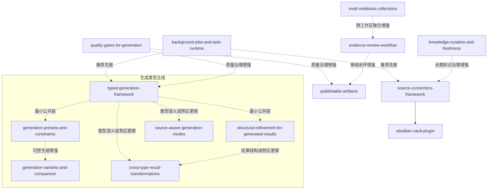

# OpenSpec Changes — Agent 操作手册

## 你的角色

你是负责推进 OpenSpec change 工件的 agent。你**只推进规格工件**（proposal / design / tasks / specs），**不实现业务代码**。全部文档使用中文。

## 工作循环

每次启动时执行以下循环，直到没有可推进的 change 或收到停止指令。

```
┌─→ 1. 查状态
│   2. 选任务（按优先级队列）
│   3. 执行（读工件 → 收口边界 → 补齐遗漏 → 去掉不确定项）
│   4. 校验（openspec validate <change>）
│   5. 汇报（修改了什么、当前状态）
└─← 6. 决策：继续下一个 / 等待指导 / 全部完成
```

### 步骤 1：查状态

```bash
openspec list --json
openspec validate --changes --json
```

用 CLI 输出判断每个 change 的工件完整度和校验状态，不依赖本文件中的任何快照数据。

### 步骤 2：选任务

从下方「优先级队列」中，选择**序号最小且进入条件已满足**的 change。如果有多个同序号的 change 可并行，优先选队列中靠前的。

跳过条件：
- 该 change 的硬前置尚未完成
- 该 change 的软前置中有标记为"建议先稳定"的上游 change 仍处于早期状态

### 步骤 3：执行

1. 阅读目标 change 目录下所有已有工件（proposal.md、design.md、tasks.md、specs/）
2. 阅读本文件中该 change 的「边界定义」
3. 对照边界定义，收口工件：
   - 核心承诺是否已在 design / specs 中体现
   - 非目标是否已明确排除
   - 是否存在未决占位或模糊描述
   - 是否违反了「禁止的反向依赖」
4. 补齐遗漏、去掉不确定项，不推翻重写

### 步骤 4：校验

```bash
openspec validate <change-name>
```

### 步骤 5：汇报

用中文说明：修改了哪些文件、解决了什么问题、是否通过校验。

### 步骤 6：决策

- 如果队列中还有可推进的 change → 回到步骤 1
- 如果下一个 change 的进入条件不满足 → 汇报阻塞原因，等待指导
- 如果所有 change 都已完成 → 汇报整体状态

---

## 优先级队列

一个 agent 一次只推进一个 change。序号越小优先级越高。同一波次内可并行，但不建议跨波次并行。

### Wave 1：生成公共层 + 异步底座

| 序号 | Change | 角色 | 硬前置 | 进入条件 |
|---:|---|---|---|---|
| 1 | `typed-generation-framework` | 生成公共底座 | 无 | 随时可开始 |
| 2 | `background-jobs-and-task-runtime` | 异步底座 | 无 | 随时可开始，可与 #1 并行 |
| 3 | `generation-presets-and-constraints` | 可控生成增强 | 无 | 建议在 #1 最小公共词汇稳定后 |
| 4 | `structural-refinement-for-generated-results` | 结果改良 | 无 | 建议在 #1 最小公共词汇稳定后，可与 #3 并行 |
| 5 | `quality-gates-for-generation` | 轻量治理伴随 | 无 | 建议在 #1 和 #3/#4 语义初稳后 |
| 6 | `generation-variants-and-comparison` | 观察项 | 无 | 建议在 #3/#4 边界稳定后，非主线 |

**Wave 1 退出条件：** #1/#2/#5 至少达到可实现状态且校验通过；#3/#4 边界稳定，不再反向改写 #1 的公共词汇。

### Wave 2：知识接入主线

| 序号 | Change | 角色 | 硬前置 | 进入条件 |
|---:|---|---|---|---|
| 7 | `source-connectors-framework` | 平台主线 | 无 | 建议在 #2 初稳后 |
| 8 | `obsidian-vault-plugin` | 首个验证样板 | **#7** | #7 宿主契约稳定后 |
| 9 | `knowledge-curation-and-freshness` | 接入后治理 | 无 | 建议在 #7/#8 后 |
| 10 | `source-aware-generation-modes` | 观察项 | 无 | 建议在 #1 和 #7 语义稳定后，非主线 |

**Wave 2 退出条件：** #7 宿主语义稳定，#8 按该语义完成样板验证；Wave 3 不需要回头改写知识对象边界。

### Wave 3：可信结果闭环

| 序号 | Change | 角色 | 硬前置 | 进入条件 |
|---:|---|---|---|---|
| 11 | `evidence-review-workflow` | 审阅主线 | 无 | 建议在 #4 和 #9 语义稳定后 |
| 12 | `publishable-artifacts` | 结果沉淀 | 无 | 建议在 #11 边界稳定后 |
| 13 | `cross-type-result-transformations` | 后置演化项 | 无 | 建议在 #1/#4/#12 稳定后，明确后置 |

**Wave 3 退出条件：** #11/#12 可实现，结果状态机与产物生命周期兼容；结果可作为持续工作对象存在。

### Wave 4：空间放大

| 序号 | Change | 角色 | 硬前置 | 进入条件 |
|---:|---|---|---|---|
| 14 | `multi-notebook-collections` | 后置扩展 | 无 | 建议在前三波核心模型稳定后 |

---

## 禁止的反向依赖

- `generation-presets-and-constraints` 不得反向定义 `typed-generation-framework` 的核心术语
- `structural-refinement-for-generated-results` 不得为支持局部改良而重新发明结果类型模型
- 任何 change 不得把某个具体生成类型的特例直接写回公共框架
- `obsidian-vault-plugin` 不得脱离 `source-connectors-framework` 的宿主契约独立定义接入语义
- 下游 change 只消费上游公共词汇的扩展位，不反向写回

---

## 通用执行规则

- 一次只推进一个 change，不混合推进
- 每个 change 完成后先校验再决定下一步，避免错误级联
- 优先收口已有工件，不推翻重写
- 不保留任何未决占位或模糊描述
- 观察项和后置项可以推进，但需先确认上游语义已稳定
- 若上游 change 的核心承诺发生变化，优先回到当前 change 重写边界，不连带重写整条路线
- `typed-generation-framework` 负责生成公共词汇定义，其它 Wave 1 change 只消费或扩展

---

## 三层架构

### 平台底座层

`background-jobs-and-task-runtime` · `source-connectors-framework` · `typed-generation-framework`

宿主能力、异步运行时、扩展框架、通用契约。

### 产品工作流层

`generation-presets-and-constraints` · `structural-refinement-for-generated-results` · `generation-variants-and-comparison` · `obsidian-vault-plugin` · `evidence-review-workflow` · `publishable-artifacts` · `cross-type-result-transformations` · `multi-notebook-collections`

用户可感知的任务流、接入样板、审阅、产物与更大的工作空间。

### 治理与质量层

`quality-gates-for-generation` · `knowledge-curation-and-freshness` · `source-aware-generation-modes`

结果质量、知识健康、长期维护与治理能力。

---

## 依赖关系图



- 实线 `-->` ：硬依赖（前者是后者的前置或宿主层）
- 虚线 `-.->` ：软依赖（先做前者，后者会更顺）
- 分组框：主题簇，不代表必须串行

---

## 每个 Change 的边界定义

### `typed-generation-framework`

- **核心承诺**
  - 把"生成类型"提升为一等产品对象，固定最小公共词汇：生成类型、输入要求、输出结构、控制面与完成语义
  - 为后续的控制项、质量门、结果改良和类型扩展提供稳定公共层
- **非目标**
  - 不一次性做深所有具体生成类型
  - 不把输出渲染类型、结果展示形态与生成类型混成一个模型
- **可延后项**
  - 更复杂的类型继承、类型组合与类型市场机制
  - 面向外部插件的完整生成类型注册生态

### `background-jobs-and-task-runtime`

- **核心承诺**
  - 提供统一的后台任务生命周期、进度、取消、重试与历史语义
  - 让长任务不再各自维护一套异步状态模型
- **非目标**
  - 不统一所有业务工作流本身
  - 不要求一次性迁移所有现有异步能力
- **可延后项**
  - 任务优先级调度、配额、公平性策略
  - 跨 notebook / 跨用户级的任务编排视图

### `generation-presets-and-constraints`

- **核心承诺**
  - 为不同生成类型提供明确、可理解、可复用的预设与约束体系
  - 让右侧生成入口从"能生成"升级为"能按意图生成"
- **非目标**
  - 不反向定义"什么是生成类型"
  - 不把所有内部生成策略都暴露成用户可见配置项
- **可延后项**
  - 更复杂的用户级预设共享、评分和推荐
  - 按行业、角色或组织场景的高级约束模板

### `structural-refinement-for-generated-results`

- **核心承诺**
  - 让生成后的结果可以围绕已有内容做结构化改良，而不是只能整篇重生成
  - 固定结果结构单元与 refinement 动作边界，让结果具备持续打磨能力
- **非目标**
  - 不重新发明一套结果类型模型
  - 不承诺所有生成类型都立即拥有同样丰富的 refinement 动作集合
- **可延后项**
  - 更细粒度的结构级差异比较与批量改良
  - 更复杂的多步 refinement 链路与改良历史可视化

### `quality-gates-for-generation`

- **核心承诺**
  - 为结果增加统一质量信号，尽早发现证据不足、结构不完整和质量回退
  - 给插件扩展与新输出类型提供稳定质量门
- **非目标**
  - 不定义"绝对正确"的内容质量标准
  - 不把质量门做成对所有结果一刀切的硬阻断系统
- **可延后项**
  - 更复杂的模型评估、人工反馈闭环、自动回滚策略
  - 按行业/场景定制化质量模板

### `generation-variants-and-comparison`

- **核心承诺**
  - 让同一生成类型可以产生多个候选结果，并支持可理解的比较与选择
  - 帮用户从"不断重试"转向"比较后选择更合适的结果"
- **非目标**
  - 不要求所有生成动作默认都走多 variant 流程
  - 不替用户自动决定哪一个版本一定最好
- **可延后项**
  - 更复杂的差异解释、自动聚类与推荐选优
  - 多 variant 的批量 refinement 与合并策略

### `source-connectors-framework`

- **核心承诺**
  - 把外部知识源接入统一为宿主框架能力，而不是一个个专用导入功能
  - 提供连接器发现、binding、snapshot、import_scope、sync_check 的稳定宿主语义
- **非目标**
  - 不把所有现有来源接入都重写成 connector
  - 不允许每个 connector 自带整套工作流 UI
- **可延后项**
  - 更复杂的 connector 权限体系
  - 多租户 connector 管理和 connector catalog 运营能力

### `obsidian-vault-plugin`

- **核心承诺**
  - 作为 `source-connectors-framework` 的首个官方验证样板，证明大 vault 的快照、选择性导入和显式 sync_check 模型可行
  - 复用宿主框架，而不是另起一套特制流程
- **非目标**
  - 不把 Obsidian 做成独立于框架之外的特殊系统
  - 不覆盖所有 Obsidian 生态特性
- **可延后项**
  - 更深的 Obsidian 特有语法/生态集成
  - 更复杂的 vault 筛选、可视化和高级同步策略

### `knowledge-curation-and-freshness`

- **核心承诺**
  - 给长期知识库增加 freshness、重复检测和维护建议
  - 帮用户持续维护知识健康，而不是只做一次性导入
- **非目标**
  - 不自动接管所有维护动作
  - 不承诺以零误报方式识别 stale / duplicate 内容
- **可延后项**
  - 更智能的自动整理策略
  - 基于时间、使用频率、外部信号的综合健康评分

### `source-aware-generation-modes`

- **核心承诺**
  - 为不同生成类型定义清楚的来源使用模式，让来源依赖方式可理解、可解释
  - 让检索、citation、来源展示与生成约束之间形成一致语义
- **非目标**
  - 不把所有内部策略术语直接原样暴露给用户
  - 不承诺每种生成类型都只能对应一种固定来源模式
- **可延后项**
  - 更复杂的混合来源模式与模式自动切换
  - 更精细的模式级观测、分析与回归诊断

### `evidence-review-workflow`

- **核心承诺**
  - 把 citation / evidence 审阅做成正式工作流，而不是零散查看动作
  - 让结果可以进入"待审 / 已审 / 存疑 / 需修订"等更可信的状态
- **非目标**
  - 不把 Crystalith 变成重型审批流系统
  - 不要求所有结果都必须经过审阅才能继续使用
- **可延后项**
  - 多角色审阅、审批人分工、审阅 SLA
  - 更复杂的审阅统计和多角色审阅队列

### `publishable-artifacts`

- **核心承诺**
  - 让结果从一次性 output 升级为可沉淀、可管理的正式产物
  - 强调产物生命周期，而不是仅仅增加更多导出按钮
- **非目标**
  - 不把"导出体验优化"作为唯一目标
  - 不做全套外部发布渠道集成
- **可延后项**
  - 多渠道发布、外链分享、外部协作审阅
  - 更完整的版本树和发布审批流程

### `cross-type-result-transformations`

- **核心承诺**
  - 让一种生成结果可以在站内演化为另一种生成类型，而不是每次都从头开始
  - 建立结果类型之间有限、可控、可解释的转换路径
- **非目标**
  - 不承诺所有生成类型之间都可以直接互转
  - 不追求一次性解决所有结果演化场景
- **可延后项**
  - 更复杂的多步转换链、转换质量评估与回退能力
  - 更丰富的转换预览、转换建议和跨类型版本树

### `multi-notebook-collections`

- **核心承诺**
  - 在 notebook 之上提供更高层次的聚合容器，让跨 notebook 工作成为一等能力
  - 让 collection 成为更大的工作现场，而不是简单标签分组
- **非目标**
  - 不同时重做全部导航和权限系统
  - 不把 collection 做成新的"万能容器"去吞掉 notebook 语义
- **可延后项**
  - 更复杂的跨 collection 视图、智能聚类和协作边界
  - collection 级模板、审阅和发布联动
