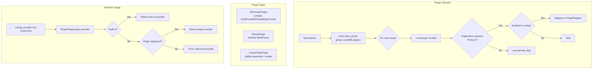
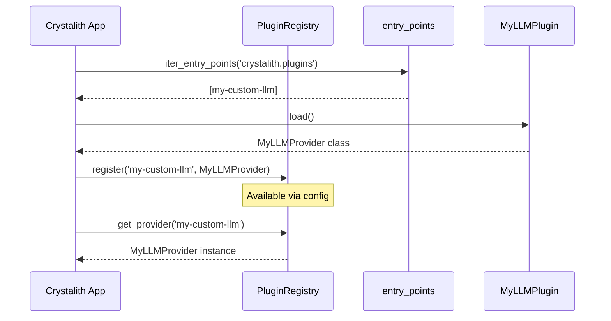

## Context

Crystalith 当前通过工厂模式管理 AI provider、parser、extractor 等组件，但所有实现都硬编码在核心包中。社区或高级用户无法在不 fork 代码的情况下添加自定义实现。

## Goals / Non-Goals

- Goals:
  - 提供标准化的插件接口和发现机制
  - 支持 AI provider、parser、output type 三类插件
  - 利用 Python setuptools entry_points 作为发现机制
  - 保持向后兼容，内置实现不受影响
- Non-Goals:
  - 不实现热加载（需重启生效）
  - 不建设插件市场/分发平台
  - 不支持前端插件（仅后端）

## Decisions

- Decision: 使用 Python entry_points 作为插件发现机制
- Alternatives considered:
  - 文件系统扫描（plugins/ 目录）→ 灵活但管理困难
  - 配置文件中指定模块路径 → 不够标准化
  - stevedore 库 → 功能完善但引入额外依赖

## Risks / Trade-offs

- 插件质量不可控 → 通过合规性测试工具缓解
- 插件版本兼容性 → 接口定义版本号，不兼容时警告
- 性能影响 → 插件加载仅在启动时，运行时与内置实现一致

## Architecture Flow

## Acceptance Criteria

- [ ] **AC-1**: PluginRegistry 在 `shared/plugins/` 下定义
- [ ] **AC-2**: 插件通过 `pyproject.toml` 的 `[project.entry-points."crystalith.plugins"]` 注册
- [ ] **AC-3**: 现有 AI provider（`shared/ai/`）和 parser（`shared/parsers/`）作为内置实现不受影响
- [ ] **AC-4**: `features/models/service.py` 的 GET /v1/models 返回结果包含插件注册的 provider
- [ ] **AC-5**: 示例插件包可 pip install 后被系统发现和加载
- [ ] **AC-6**: `just test` 通过

## Open Questions

- 是否需要插件的依赖隔离（虚拟环境）？
- 是否支持插件之间的依赖声明？
