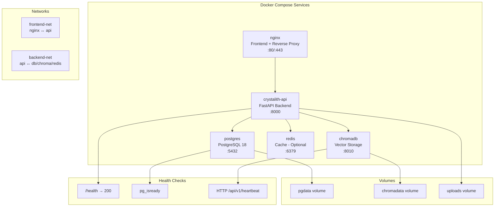

## Context

Crystalith 在 dockers/ 目录下有基础 Docker 配置，但不适合生产部署。生产环境需要健康检查、资源管理、数据持久化和安全加固。

## Goals / Non-Goals

- Goals:
  - 一键部署（docker compose up -d）
  - 数据持久化和安全的 secrets 管理
  - 最小化镜像体积和攻击面
  - 健康检查支持容器编排自动恢复
- Non-Goals:
  - 不配置 Kubernetes manifests（可作为后续扩展）
  - 不配置 CI/CD 自动部署（由 enhance-ci-pipeline-v2 覆盖）
  - 不配置 HTTPS / TLS（由反向代理处理）

## Decisions

- Decision: 使用 Docker Compose 作为编排工具（单机部署）
- Alternatives considered:
  - Kubernetes → 对单机部署过于复杂
  - Docker Swarm → 社区支持减少
  - 裸机部署 → 环境依赖复杂

- Decision: 后端使用 Python slim 镜像 + 多阶段构建
- Decision: 前端使用 Nginx 静态服务

## Risks / Trade-offs

- 单机部署无法水平扩展 → 满足初期需求，后续可迁移到 K8s
- PostgreSQL 容器性能不如专用数据库 → 对中小规模足够，大规模建议外部托管数据库

## Architecture Flow

```mermaid
flowchart TD
    subgraph "Multi-stage Build: Backend"
        A1[python:3.12-slim<br>Builder Stage] --> A2[Install uv + deps]
        A2 --> A3[Copy source code]
        A3 --> A4[python:3.12-slim<br>Runtime Stage]
        A4 --> A5[Copy only venv + src<br>Non-root user]
        A5 --> A6["HEALTHCHECK /health"]
    end

    subgraph "Multi-stage Build: Frontend"
        B1[node:22-slim<br>Build Stage] --> B2[pnpm install + build]
        B2 --> B3[nginx:alpine<br>Serve Stage]
        B3 --> B4[Copy dist/ to /usr/share/nginx/html]
        B4 --> B5[Custom nginx.conf<br>SPA routing + gzip]
    end
```

## Acceptance Criteria

- [ ] **AC-1**: `docker-compose.prod.yml` 可在仅安装 Docker + Docker Compose 的环境上 `docker compose up -d` 一键启动
- [ ] **AC-2**: 后端 Dockerfile 继承现有 `dockers/` 中的模式（如有），使用 `uv` 安装依赖
- [ ] **AC-3**: `.env.example` 包含所有必要变量（DATABASE_URL, OPENAI_API_KEY 等），注释说明每个变量用途
- [ ] **AC-4**: 后端镜像最终大小 < 500MB（`docker images` 验证）
- [ ] **AC-5**: `docker compose down && docker compose up -d` 后数据完好（volume 持久化验证）
- [ ] **AC-6**: 后端容器以非 root 用户运行（`docker exec ... id` 验证）
- [ ] **AC-7**: 手动验证：从零启动完整服务栈，上传 source、发送消息、生成 output 均正常

## Open Questions

- 是否需要自动 HTTPS（Let's Encrypt / Caddy）？
- 是否需要备份定时任务容器？
