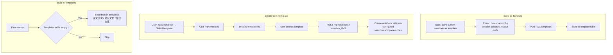

## 1. 模板数据模型
- [ ] 1.1 设计 template 表结构（id, name, description, config_json, is_builtin, created_at）
- [ ] 1.2 定义模板配置 schema（包含 session 预设、输出类型偏好等）
- [ ] 1.3 创建数据库迁移

## 2. 后端 API
- [ ] 2.1 添加模板 CRUD API（创建、列表、获取、更新、删除）
- [ ] 2.2 添加 "从模板创建 notebook" API
- [ ] 2.3 添加 "保存当前 notebook 为模板" API
- [ ] 2.4 实现系统内置模板的初始化（首次启动时创建）
- [ ] 2.5 编写模板 API 的测试

## 3. 前端 UI
- [ ] 3.1 新建 notebook 对话框添加 "从模板创建" 选项
- [ ] 3.2 模板选择列表（内置 + 自定义模板）
- [ ] 3.3 "保存为模板" 操作（在 notebook 菜单中）
- [ ] 3.4 模板管理页面（列表、删除、编辑描述）
- [ ] 3.5 编写前端交互测试

## 4. 内置模板
- [ ] 4.1 "论文研究" 模板（预配置 research session、学术输出类型）
- [ ] 4.2 "项目文档" 模板（预配置多 session、guide/FAQ 输出类型）
- [ ] 4.3 "知识收集" 模板（预配置 source 分类、briefing 输出类型）

## 5. 验证
- [ ] 5.1 验证从模板创建 notebook 后配置正确
- [ ] 5.2 验证保存和恢复模板的完整性
- [ ] 5.3 验证内置模板在首次启动时正确创建

## Architecture Flow

## Acceptance Criteria

- [ ] **AC-1**: template 表在 `shared/db/models/` 下定义，遵循现有 model 命名和结构
- [ ] **AC-2**: 模板 API 在 `features/` 下新建 `templates/` feature slice（遵循 feature-sliced 模式）
- [ ] **AC-3**: 从模板创建 notebook 时，`features/notebooks/service.py` 的 create 方法接受 template_id 参数
- [ ] **AC-4**: 前端模板选择使用现有的 `LayerProvider` 管理弹窗层级
- [ ] **AC-5**: `just test` 和 `pnpm test` 通过
- [ ] **AC-6**: 手动验证：首次启动时内置模板存在，从模板创建 notebook 后预配置正确
