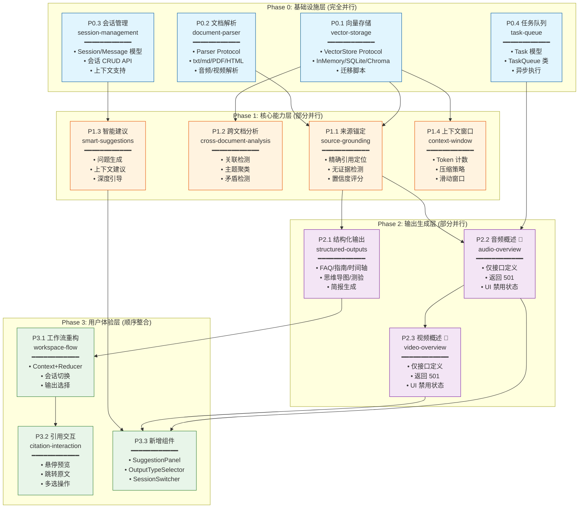

## Phase 0: 基础设施层（可完全并行）

### P0.1 向量存储抽象 [Agent A]
- [x] 0.1.1 定义 `VectorStore` Protocol（add/search/remove/entries）
- [x] 0.1.2 重构 `InMemoryVectorIndex` 实现 `VectorStore` 接口
- [x] 0.1.3 实现 `SQLiteVectorStore`（使用 sqlite-vss）
- [x] 0.1.4 添加向量存储配置项（provider/path）
- [x] 0.1.5 编写向量存储单元测试
- [x] 0.1.6 编写迁移脚本（InMemory → SQLite）

### P0.2 文档解析器 [Agent B]
- [x] 0.2.1 定义 `Parser` Protocol（parse → list[Chunk]）
- [x] 0.2.2 实现 `TextParser`（迁移现有 txt/markdown 逻辑）
- [x] 0.2.3 实现 `PDFParser`（使用 pypdf/pdfplumber）
- [x] 0.2.4 实现 `HTMLParser`（使用 beautifulsoup4）
- [x] 0.2.5 实现 `ParserFactory`（根据 MIME 类型选择解析器）
- [x] 0.2.6 扩展 `Source` 模型（parser_type, metadata）
- [x] 0.2.7 编写解析器单元测试

### P0.3 会话管理 [Agent C]
- [x] 0.3.1 设计 `Session` 模型（id, notebook_id, title, created_at）
- [x] 0.3.2 设计 `Message` 模型（id, session_id, role, content, citations）
- [x] 0.3.3 实现会话 CRUD API（/v1/notebooks/{id}/sessions）
- [x] 0.3.4 实现消息 CRUD API（/v1/sessions/{id}/messages）
- [x] 0.3.5 重构 QA API 支持会话上下文
- [x] 0.3.6 编写会话管理单元测试

### P0.4 任务队列 [Agent D]
- [x] 0.4.1 设计 `Task` 模型（id, type, status, payload, result）
- [x] 0.4.2 实现 `TaskQueue` 类（enqueue/dequeue/status）
- [x] 0.4.3 实现任务状态 API（/v1/tasks/{id}）
- [x] 0.4.4 集成到提炼生成流程
- [x] 0.4.5 编写任务队列单元测试

---

## Phase 1: 核心能力层（依赖 Phase 0，内部可并行）

### P1.1 来源锚定增强 [依赖 P0.1, P0.2]
- [x] 1.1.1 增强引用生成逻辑（精确到段落/页码）
- [x] 1.1.2 实现来源验证机制（检查引用有效性）
- [x] 1.1.3 实现无证据检测（置信度阈值）
- [x] 1.1.4 优化引用格式（支持多种展示样式）
- [x] 1.1.5 编写来源锚定测试

### P1.2 跨文档分析 [依赖 P0.1]
- [x] 1.2.1 实现多源关联检测（相似度聚类）
- [x] 1.2.2 实现主题聚类（基于向量相似度）
- [x] 1.2.3 实现矛盾检测（对立观点识别）
- [x] 1.2.4 实现关联分析 API（/v1/notebooks/{id}/analysis）
- [x] 1.2.5 编写跨文档分析测试

### P1.3 智能建议 [依赖 P0.3]
- [x] 1.3.1 实现问题生成策略（基于文档内容）
- [x] 1.3.2 实现上下文感知建议（基于会话历史）
- [x] 1.3.3 实现深度问题引导（苏格拉底式）
- [x] 1.3.4 实现建议 API（/v1/notebooks/{id}/suggestions）
- [x] 1.3.5 编写智能建议测试

### P1.4 上下文窗口 [依赖 P0.1]
- [x] 1.4.1 实现 Token 计数（tiktoken）
- [x] 1.4.2 实现上下文压缩策略（摘要/截断）
- [x] 1.4.3 实现滑动窗口管理
- [x] 1.4.4 添加上下文窗口配置项
- [x] 1.4.5 编写上下文窗口测试

---

## Phase 2: 输出生成层（依赖 Phase 1，内部可并行）

### P2.1 结构化输出扩展 [依赖 P1.1]
- [x] 2.1.1 扩展 `OutputType` 枚举（FAQ/GUIDE/TIMELINE/MINDMAP/QUIZ/BRIEFING）
- [x] 2.1.2 定义 `OutputGenerator` Protocol
- [x] 2.1.3 实现 `FAQGenerator`（问答对提取）
- [x] 2.1.4 实现 `GuideGenerator`（学习指南生成）
- [x] 2.1.5 实现 `TimelineGenerator`（时间轴提取）
- [x] 2.1.6 实现 `MindmapGenerator`（思维导图生成）
- [x] 2.1.7 实现 `QuizGenerator`（测验题生成）
- [x] 2.1.8 实现 `BriefingGenerator`（简报生成）
- [x] 2.1.9 扩展输出 API（/v1/notebooks/{id}/outputs）
- [x] 2.1.10 编写结构化输出测试

### P2.2 音频概述 [仅接口预留，暂不实现]
- [x] 2.2.1 定义 AudioOverview Pydantic 模型（请求/响应）
- [x] 2.2.2 实现 API 端点（返回 501 Not Implemented）
- [x] 2.2.3 前端添加禁用状态的 UI 入口
- [x] 2.2.4 编写接口定义测试

### P2.3 视频概述 [仅接口预留，暂不实现]
- [x] 2.3.1 定义 VideoOverview Pydantic 模型（请求/响应）
- [x] 2.3.2 实现 API 端点（返回 501 Not Implemented）
- [x] 2.3.3 前端添加禁用状态的 UI 入口
- [x] 2.3.4 编写接口定义测试

---

## Phase 3: 用户体验层（依赖所有 Phase）

### P3.1 工作流重构
- [x] 3.1.1 重构 `WorkspaceContext`（全局状态管理）
- [x] 3.1.2 实现 `workspaceReducer`（状态更新逻辑）
- [x] 3.1.3 拆分 `useWorkspace` hook
- [x] 3.1.4 优化输入→对话→输出流程
- [x] 3.1.5 实现会话切换 UI
- [x] 3.1.6 实现输出类型选择 UI
- [x] 3.1.7 编写前端单元测试

### P3.2 引用交互增强
- [x] 3.2.1 实现引用悬停预览（Tooltip）
- [x] 3.2.2 实现跳转到原文（高亮定位）
- [x] 3.2.3 实现多选操作栏增强
- [x] 3.2.4 实现引用来源可视化
- [x] 3.2.5 编写引用交互测试

### P3.3 新增组件
- [x] 3.3.1 实现 `AudioPlayer` 组件
- [x] 3.3.2 实现 `VideoPlayer` 组件
- [x] 3.3.3 实现 `SuggestionPanel` 组件
- [x] 3.3.4 实现 `OutputTypeSelector` 组件
- [x] 3.3.5 实现 `SessionSwitcher` 组件

### P3.4 端到端测试（已移除）
当前需求变动较快，E2E 测试先移除，后续稳定后再恢复。

---

## 依赖关系图

### 文本拓扑图

```
Phase 0 (并行)
├── P0.1 向量存储 ─────┬──→ P1.1 来源锚定 ──→ P2.1 结构化输出
├── P0.2 文档解析 ─────┤                    ├──→ P2.2 音频概述 ──→ P2.3 视频概述
├── P0.3 会话管理 ─────┼──→ P1.3 智能建议
└── P0.4 任务队列 ─────┴──→ P1.2 跨文档分析
                       └──→ P1.4 上下文窗口

Phase 1 (部分并行)
├── P1.1 来源锚定
├── P1.2 跨文档分析
├── P1.3 智能建议
└── P1.4 上下文窗口

Phase 2 (部分并行)
├── P2.1 结构化输出 (完整实现)
├── P2.2 音频概述 (仅接口)
└── P2.3 视频概述 (仅接口)

Phase 3 (顺序)
├── P3.1 工作流重构
├── P3.2 引用交互增强
└── P3.3 新增组件
```

### Mermaid 拓扑图



### 详细依赖矩阵

| 任务 | 依赖 | 被依赖 | 可并行 | 预估工时 |
|------|------|--------|--------|----------|
| **Phase 0** |
| P0.1 向量存储 | 无 | P1.1, P1.2, P1.4 | ✅ 与 P0.2/P0.3/P0.4 | 3-4 天 |
| P0.2 文档解析 | 无 | P1.1 | ✅ 与 P0.1/P0.3/P0.4 | 4-5 天 |
| P0.3 会话管理 | 无 | P1.3 | ✅ 与 P0.1/P0.2/P0.4 | 2-3 天 |
| P0.4 任务队列 | 无 | P2.2 | ✅ 与 P0.1/P0.2/P0.3 | 2-3 天 |
| **Phase 1** |
| P1.1 来源锚定 | P0.1, P0.2 | P2.1, P2.2 | ✅ 与 P1.2/P1.3/P1.4 | 3-4 天 |
| P1.2 跨文档分析 | P0.1 | 无 | ✅ 与 P1.1/P1.3/P1.4 | 3-4 天 |
| P1.3 智能建议 | P0.3 | P3.3 | ✅ 与 P1.1/P1.2/P1.4 | 2-3 天 |
| P1.4 上下文窗口 | P0.1 | 无 | ✅ 与 P1.1/P1.2/P1.3 | 2-3 天 |
| **Phase 2** |
| P2.1 结构化输出 | P1.1 | P3.1 | ✅ 与 P2.2/P2.3 | 4-5 天 |
| P2.2 音频概述 🚧 | 无 | 无 | ✅ 仅接口 | 0.5 天 |
| P2.3 视频概述 🚧 | 无 | 无 | ✅ 仅接口 | 0.5 天 |
| **Phase 3** |
| P3.1 工作流重构 | P2.1 | P3.2 | ❌ 等待 P2.1 | 3-4 天 |
| P3.2 引用交互 | P3.1 | 无 | ❌ 等待 P3.1 | 2-3 天 |
| P3.3 新增组件 | P1.3 | 无 | ⚠️ 部分并行 | 2-3 天 |

### 推荐调度方案

#### 方案 A：4 人并行（最快）

```
Week 1-2 (Phase 0):
  Agent A: P0.1 向量存储
  Agent B: P0.2 文档解析
  Agent C: P0.3 会话管理
  Agent D: P0.4 任务队列

Week 3-4 (Phase 1):
  Agent A: P1.1 来源锚定 (等待 P0.1, P0.2)
  Agent B: P1.2 跨文档分析 (等待 P0.1)
  Agent C: P1.3 智能建议 (等待 P0.3)
  Agent D: P1.4 上下文窗口 (等待 P0.1)

Week 5-6 (Phase 2):
  Agent A: P2.1 结构化输出 (等待 P1.1)
  Agent B: P2.2 + P2.3 音视频接口 (仅定义，0.5天) + 支援 P2.1
  Agent C: P3.3 新增组件 (可提前开始)
  Agent D: 支援 P2.1

Week 7-8 (Phase 3):
  全员: P3.1 → P3.2
```

#### 方案 B：2 人并行（平衡）

```
Week 1-2:
  Agent A: P0.1 向量存储 → P0.3 会话管理
  Agent B: P0.2 文档解析 → P0.4 任务队列

Week 3-4:
  Agent A: P1.1 来源锚定 → P1.4 上下文窗口
  Agent B: P1.2 跨文档分析 → P1.3 智能建议

Week 5-6:
  Agent A: P2.1 结构化输出
  Agent B: P2.2 音频概述 → P2.3 视频概述

Week 7-8:
  Agent A: P3.1 工作流重构 → P3.2 引用交互
  Agent B: P3.3 新增组件
```

#### 方案 C：单人顺序（最小冲突）

```
Week 1: P0.1 向量存储
Week 2: P0.2 文档解析 + P0.3 会话管理
Week 3: P0.4 任务队列 + P1.1 来源锚定
Week 4: P1.2 跨文档分析 + P1.3 智能建议
Week 5: P1.4 上下文窗口 + P2.1 结构化输出
Week 6: P2.2 音频概述
Week 7: P2.3 视频概述 + P3.1 工作流重构
Week 8: P3.2 引用交互 + P3.3 新增组件
```

### 关键路径分析

**关键路径**（决定最短完成时间）：
```
P0.1 → P1.1 → P2.1 → P3.1 → P3.2
向量存储 → 来源锚定 → 结构化输出 → 工作流重构 → 引用交互
```

**次关键路径**（音视频功能）：
```
P0.4 → P2.2 → P2.3 → P3.3
任务队列 → 音频概述 → 视频概述 → 新增组件
```

### 冲突最小化建议

1. **代码文件隔离**：
   - Phase 0 各模块在独立目录：`vector_storage/`, `parsers/`, `sessions/`, `tasks/`
   - Phase 1 各模块在独立目录：`grounding/`, `analysis/`, `suggestions/`, `context/`
   - Phase 2 各模块在独立目录：`outputs/`, `audio/`, `video/`

2. **数据库迁移协调**：
   - P0.1 负责向量表
   - P0.3 负责 sessions/messages 表
   - P0.4 负责 tasks 表
   - 使用 Alembic 分支管理迁移

3. **API 路由隔离**：
   - 各模块使用独立的 router 文件
   - 统一在 `app.py` 中注册

4. **前端组件隔离**：
   - Phase 3 组件在独立文件
   - 使用 Context 隔离状态

## 验收标准

### Phase 0 完成标准
- [x] 向量存储支持持久化，重启后数据保留
- [x] 支持上传 PDF 文件并正确解析
- [x] 支持创建会话并保存消息历史
- [x] 任务队列支持异步执行和状态查询

### Phase 1 完成标准
- [x] 引用精确到段落/页码
- [x] 能够检测多文档间的关联
- [x] 能够生成上下文相关的建议问题
- [x] 上下文窗口不超过配置限制

### Phase 2 完成标准
- [x] 支持生成 FAQ、学习指南、时间轴、思维导图、测验、简报
- [x] 音频概述 API 返回 501，前端入口禁用并提示“即将推出”
- [x] 视频概述 API 返回 501，前端入口禁用并提示“即将推出”

### Phase 3 完成标准
- [x] 前端状态管理清晰，无冗余状态
- [x] 引用交互流畅，支持悬停预览
