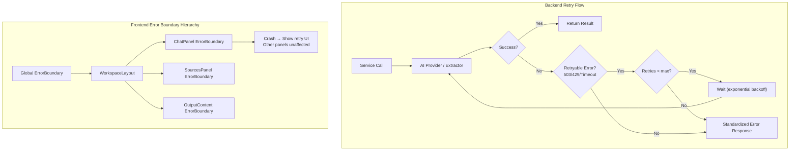
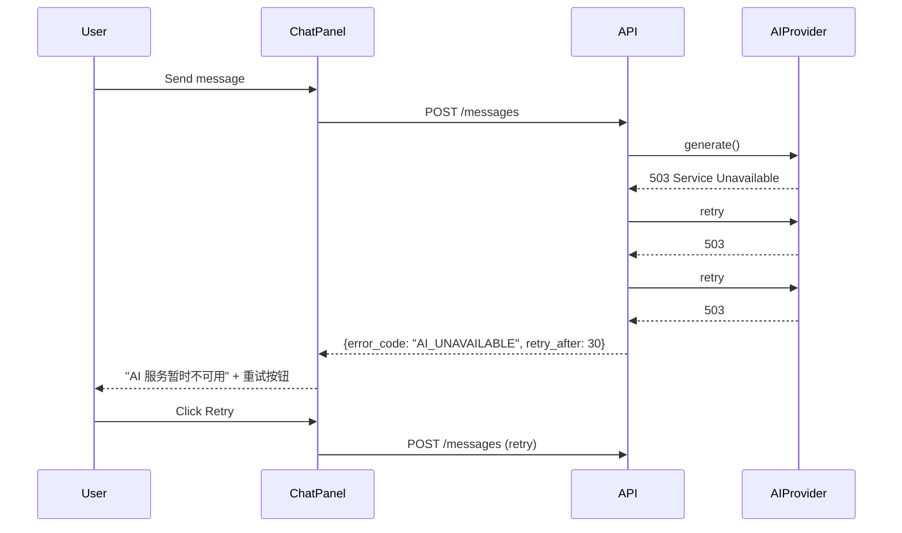

## 1. 前端错误边界
- [x] 1.1 创建全局 ErrorBoundary 组件（捕获未处理异常，显示友好提示）
- [x] 1.2 为各领域面板添加独立 ErrorBoundary（ChatPanel、SourcesPanel、OutputContent 等）
- [x] 1.3 ErrorBoundary 支持 "重试" 操作（重新挂载子组件）
- [x] 1.4 编写 ErrorBoundary 的单元测试

## 2. 前端操作重试
- [x] 2.1 消息发送失败时显示 retry 按钮
- [x] 2.2 输出生成失败时显示 retry 按钮
- [x] 2.3 Source 上传/URL 抓取失败时显示 retry 按钮
- [x] 2.4 编写重试交互的测试

## 3. 后端重试策略
- [x] 3.1 实现通用的 retry decorator（支持 exponential backoff、最大重试次数、可重试异常类型）
- [x] 3.2 AI provider 调用添加重试（网络超时、速率限制）
- [x] 3.3 Embedding 调用添加重试
- [x] 3.4 Web extraction 调用添加重试
- [x] 3.5 编写重试逻辑的单元测试

## 4. 后端错误标准化
- [x] 4.1 定义标准化错误响应 schema（error_code, message, details, retry_after）
- [x] 4.2 统一各 feature 的错误响应格式
- [x] 4.3 编写错误响应格式的验证测试

## 5. 验证
- [x] 5.1 模拟 AI provider 不可用，验证重试和降级行为
- [x] 5.2 验证前端 ErrorBoundary 在组件崩溃时正确显示
- [x] 5.3 验证 retry 按钮的交互流畅性

## Architecture Flow

## Acceptance Criteria

- [x] **AC-1**: retry decorator 兼容现有 `features/*/service.py` 中的 async 方法，可通过 `@with_retry(max_retries=3)` 装饰
- [x] **AC-2**: 标准化错误响应 schema 在 `shared/` 下定义，所有 `HTTPException` 改用此 schema（而非字符串 detail）
- [x] **AC-3**: 前端 `api/setup.ts` 的 error interceptor 正确解析新的标准化错误格式
- [x] **AC-4**: 前端 ErrorBoundary 在 ChatPanel 子组件抛出异常时，仅 ChatPanel 区域显示错误 UI
- [x] **AC-5**: `just test`（后端）和 `pnpm test`（前端）通过
- [x] **AC-6**: 手动测试：断开 AI provider 连接后发送消息，出现友好错误提示和重试按钮
