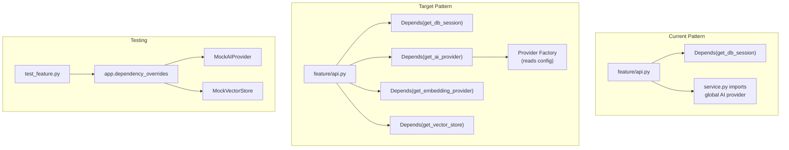

## 1. 依赖注入基础
- [x] 1.1 定义核心依赖的 FastAPI Depends 提供函数（get_db_session, get_ai_provider, get_embedding_provider, get_vector_store）
- [x] 1.2 创建依赖注册模块，统一管理所有可注入依赖
- [x] 1.3 编写依赖提供函数的单元测试

## 2. Feature 层迁移
- [x] 2.1 迁移 notebooks service 使用注入的 db session
- [x] 2.2 迁移 sources service 使用注入的 embedding provider 和 vector store
- [x] 2.3 迁移 messages/qa service 使用注入的 AI provider
- [x] 2.4 迁移其余 feature services
- [x] 2.5 验证各 API 端点功能正常

## 3. 测试改进
- [x] 3.1 创建测试专用的 dependency_overrides fixture
- [x] 3.2 将现有测试中的 mock 改为使用 dependency_overrides
- [x] 3.3 验证测试通过率不下降

## 4. 验证
- [x] 4.1 所有 API 端点功能回归测试
- [x] 4.2 验证通过 dependency_overrides 可以轻松替换任意依赖
- [x] 4.3 验证 provider 切换（如 OpenAI → Ollama）仅需更改配置

## Architecture Flow

## Acceptance Criteria

- [x] **AC-1**: 依赖提供函数定义在 `shared/deps.py`，与现有 `get_db_session`（`shared/db/deps.py`）风格一致
- [x] **AC-2**: `get_ai_provider`、`get_embedding_provider`、`get_vector_store` 从 `request.app.state` 获取实例（与现有 `get_db_session` 从 `request.app.state.db` 的模式一致）
- [x] **AC-3**: 各 feature service 不再通过模块顶层导入获取 provider 实例
- [x] **AC-4**: 测试中通过 `app.dependency_overrides[get_ai_provider] = lambda: mock_provider` 替换依赖
- [x] **AC-5**: `just test` 通过，所有现有测试无回归
