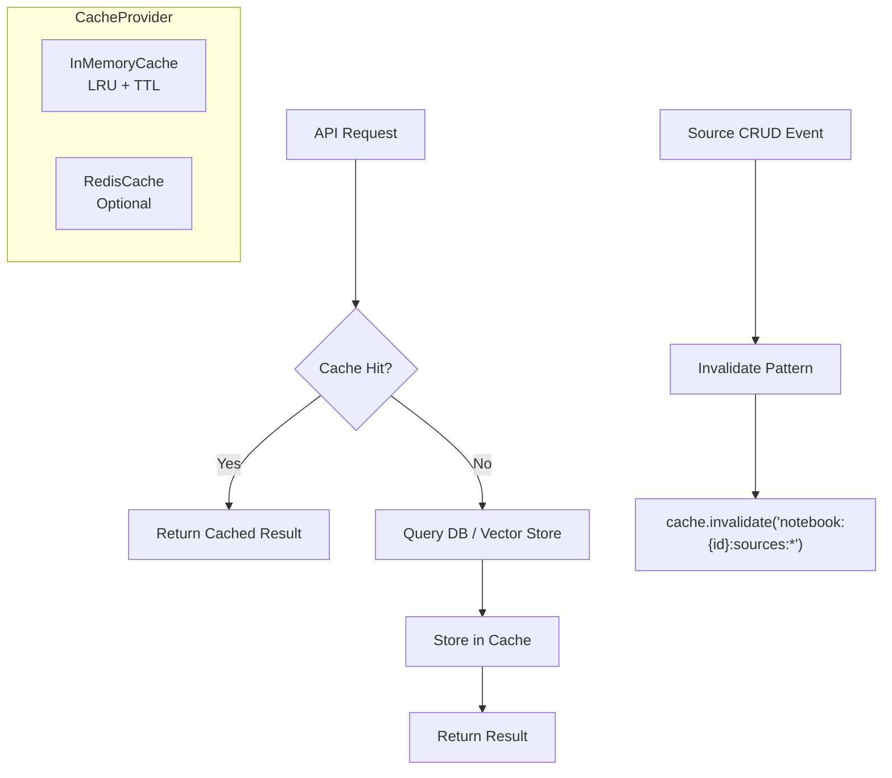

## Context

Crystalith 后端当前所有读取请求直接命中数据库/向量存储，缺乏缓存机制。随着 notebook 内 source 数量增加，列表查询和 chunk 检索的延迟逐渐成为瓶颈。

## Goals / Non-Goals

- Goals:
  - 提供统一的缓存抽象，降低后端对数据库/向量存储的直接依赖频率
  - 支持内存缓存（默认，零配置）和 Redis（可选，生产环境推荐）
  - 缓存失效策略清晰，不出现脏数据
- Non-Goals:
  - 不缓存 SSE 流式响应
  - 不做分布式缓存一致性（单实例场景优先）

## Decisions

- Decision: 采用 Provider 模式实现缓存层，与现有 AI Provider / VectorStore Provider 模式一致
- Alternatives considered:
  - 直接使用 `functools.lru_cache` → 无法控制失效，不适合数据库查询
  - 使用 `cachetools` → 可行但无法扩展到 Redis

## Risks / Trade-offs

- 内存缓存在重启后丢失 → 可接受，冷启动后自动重建
- 缓存失效遗漏可能导致脏数据 → 通过 source 变更事件驱动失效来缓解

## Architecture Flow

## Acceptance Criteria

以下验收项基于现有代码结构验证：

- [x] **AC-1**: `CacheProvider` Protocol 定义在 `shared/` 下，与 `VectorStore`（`shared/vector_storage/interfaces.py`）和 `EmbeddingProvider`（`shared/ai/interfaces.py`）遵循相同的 Protocol 模式
- [x] **AC-2**: 缓存 key 生成规则覆盖 `features/notebooks/service.py`、`features/sources/service.py` 的列表查询
- [x] **AC-3**: Source 的 CRUD 操作（`features/sources/service.py` 中的 create/delete）触发缓存失效
- [x] **AC-4**: `config/schema.json` 更新包含 cache 配置段的 JSON Schema
- [x] **AC-5**: `just test` 通过，无缓存相关回归
- [x] **AC-6**: 缓存命中率可通过 `log.info("cache_hit", key=...) / log.info("cache_miss", key=...)` 日志观察（使用现有 `cl-logs` 的 structlog 风格）

## Open Questions

- 是否需要为 AI 响应提供缓存？（相同 prompt + 相同 context 的去重）
