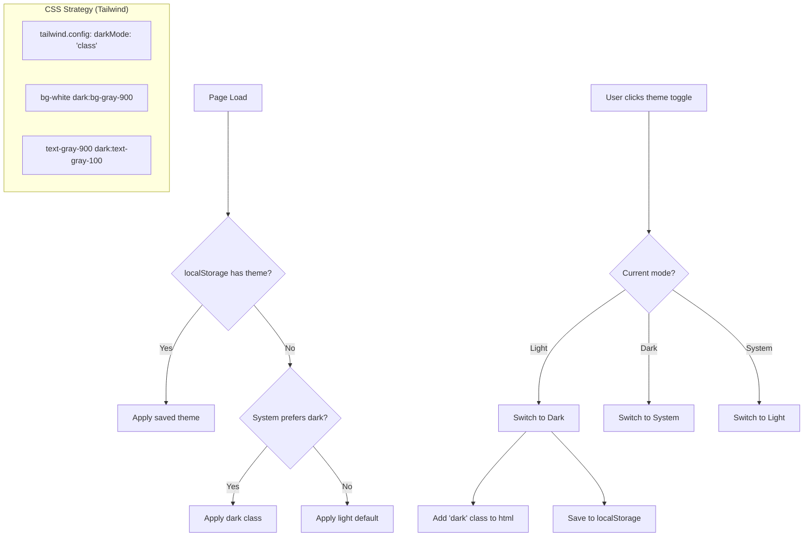

## 1. 主题基础设施
- [x] 1.1 配置 Tailwind CSS dark mode（class 策略）
- [x] 1.2 定义深色/浅色模式的 CSS 变量（背景、文字、边框、阴影等）
- [x] 1.3 创建 useTheme hook（获取/切换主题、持久化到 localStorage）
- [x] 1.4 实现系统偏好检测（prefers-color-scheme）
- [x] 1.5 编写 useTheme hook 的测试

## 2. 组件适配
- [x] 2.1 全局基础样式适配（body 背景、默认文字色）
- [x] 2.2 WorkspaceLayout 和面板容器适配
- [x] 2.3 ChatPanel（消息气泡、输入框）适配
- [x] 2.4 SourcesPanel（列表项、详情面板）适配
- [x] 2.5 OutputContent 和各类输出查看器适配
- [x] 2.6 对话框、弹窗、toast 组件适配
- [x] 2.7 图表/知识图谱组件适配

## 3. 主题切换控件
- [x] 3.1 WorkspaceHeader 添加主题切换按钮（太阳/月亮图标）
- [x] 3.2 下拉菜单选择模式（浅色/深色/系统）
- [x] 3.3 切换时平滑过渡动画

## 4. 验证
- [x] 4.1 所有页面在深色模式下无可读性问题
- [x] 4.2 主题切换时无闪烁（Flash of Wrong Theme）
- [x] 4.3 刷新后主题偏好正确恢复
- [x] 4.4 系统偏好变化时自动响应

## Architecture Flow

## Acceptance Criteria

- [x] **AC-1**: Tailwind 配置（`frontend/web/tailwind.config.*`）设置 `darkMode: 'class'`
- [x] **AC-2**: 全局样式（`frontend/web/src/app/index.css` / `tailwind.css`）定义深色模式 CSS 变量
- [x] **AC-3**: `useTheme` hook 在 `shared/` 下定义，返回 `{ theme, setTheme, resolvedTheme }`
- [x] **AC-4**: 主题切换按钮在 `WorkspaceHeader`（`features/workspace/layout/WorkspaceHeader.tsx`）中
- [x] **AC-5**: 页面加载脚本在 `<head>` 中执行（防止 Flash of Wrong Theme），在 `index.html` 中添加
- [x] **AC-6**: `pnpm run build` 成功，`pnpm test` 通过
- [x] **AC-7**: 手动验证：5 个以上页面/面板在深色模式下文本对比度满足 WCAG AA 标准（4.5:1）
