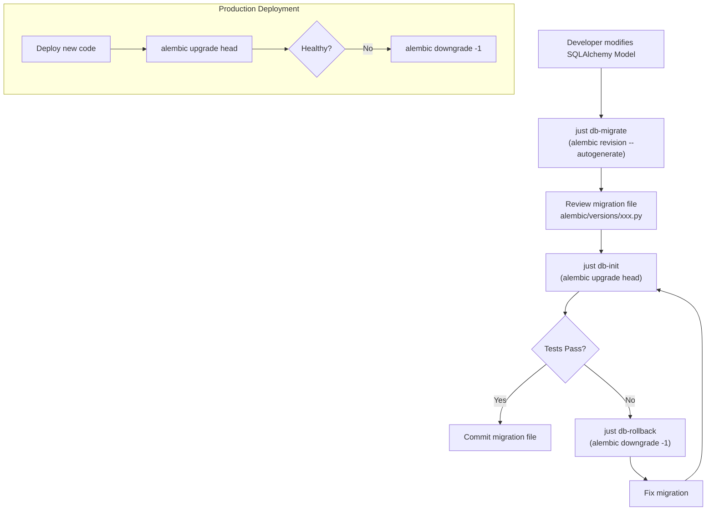

## 1. Alembic 集成
- [x] 1.1 添加 alembic 依赖
- [x] 1.2 初始化 alembic 配置（alembic.ini + env.py）
- [x] 1.3 配置 alembic 使用项目的 async SQLAlchemy engine
- [x] 1.4 验证 alembic 能正确连接数据库

## 2. 初始迁移
- [x] 2.1 基于当前 SQLAlchemy models 自动生成初始迁移文件
- [x] 2.2 验证迁移文件能在空数据库上正确执行
- [x] 2.3 验证迁移文件的 downgrade 能正确回滚

## 3. 开发工作流集成
- [x] 3.1 修改 `just db-init` 使用 alembic upgrade head
- [x] 3.2 添加 `just db-migrate` 命令（生成新迁移）
- [x] 3.3 添加 `just db-rollback` 命令（回滚上一个迁移）
- [x] 3.4 更新开发文档说明新的迁移工作流

## 4. 验证
- [x] 4.1 在全新 SQLite 数据库上运行 migrate 后验证 schema 正确
- [x] 4.2 在已有数据的数据库上运行 migrate 后验证数据完整
- [x] 4.3 验证 rollback 后 schema 恢复到上一版本

## Architecture Flow

## Acceptance Criteria

- [x] **AC-1**: `alembic.ini` 和 `env.py` 配置使用项目现有的 `AsyncDBManager`（`shared/db/deps.py`）的 engine
- [x] **AC-2**: 初始迁移文件包含所有现有 model：Notebook, Session, Message, Source, Chunk, Output, StudioSlide, ResearchSession, ResearchStep, Task
- [x] **AC-3**: `just db-init` 改为执行 `alembic upgrade head`，在全新数据库和已有数据库上均能正常工作
- [x] **AC-4**: 迁移 upgrade + downgrade 的往返测试通过
- [x] **AC-5**: `just test` 通过（测试 fixture 使用 alembic 初始化数据库）
