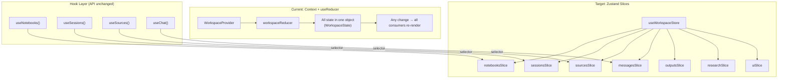
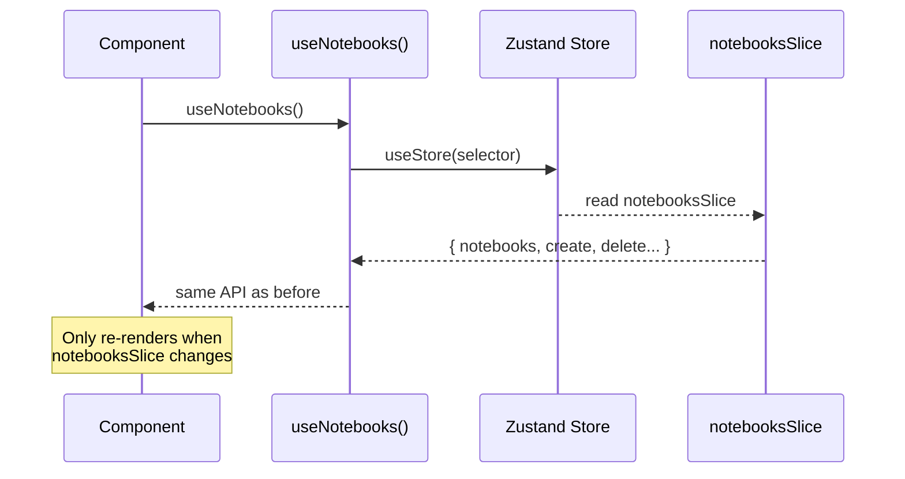

## Context

前端 WorkspaceContext 使用单一 useReducer 管理所有工作区状态。随着功能增长，reducer 已有大量 action type，且 Context value 变化会导致全量重渲染。Zustand 已作为依赖存在于项目中。

## Goals / Non-Goals

- Goals:
  - 细粒度状态订阅，减少不必要的重渲染
  - 按领域拆分状态逻辑，提高可维护性
  - 保持现有 hook 的对外接口不变，最小化组件层改动
- Non-Goals:
  - 不引入新的状态管理库（使用已有的 Zustand）
  - 不改变业务逻辑，仅迁移状态管理方式

## Decisions

- Decision: 使用 Zustand slices pattern 按领域拆分 store
- Alternatives considered:
  - 多个独立 Zustand store → 跨 store 引用不便
  - Jotai → 需要额外引入依赖，原子化模式与现有代码差异大
  - 保持 Context 但拆分为多个 Provider → 仍有 Context 的性能问题

## Risks / Trade-offs

- 迁移过程中可能出现状态不一致 → 通过逐领域迁移降低风险
- Zustand DevTools 配置需额外设置 → 开发体验短期内可能下降

## Migration Plan

1. 创建 Zustand store 骨架，与现有 Context 并存
2. 逐领域迁移：先迁移最独立的（notebooks），再迁移有依赖的（sessions 依赖 notebooks）
3. 所有领域迁移完成后移除 Context
4. 全面回归测试

## Architecture Flow

## Acceptance Criteria

- [ ] **AC-1**: `workspaceReducer.ts` 被删除，`WorkspaceContext.tsx` 和 `WorkspaceProvider` 被移除
- [ ] **AC-2**: 新的 Zustand store 定义在 `shared/state/` 目录下，每个 slice 独立文件
- [ ] **AC-3**: 现有 domain hooks（`useNotebooks`, `useSessions`, `useSources`, `useChat` 等）的对外接口（返回类型和方法签名）保持不变
- [ ] **AC-4**: React DevTools Profiler 显示：source 列表变化时，ChatPanel 不触发重渲染
- [ ] **AC-5**: `pnpm test` 通过，无前端回归
- [ ] **AC-6**: `pnpm run build` 成功，无 TypeScript 类型错误

## Open Questions

- 是否保留 SWR 用于服务端状态，Zustand 仅管理客户端状态？
