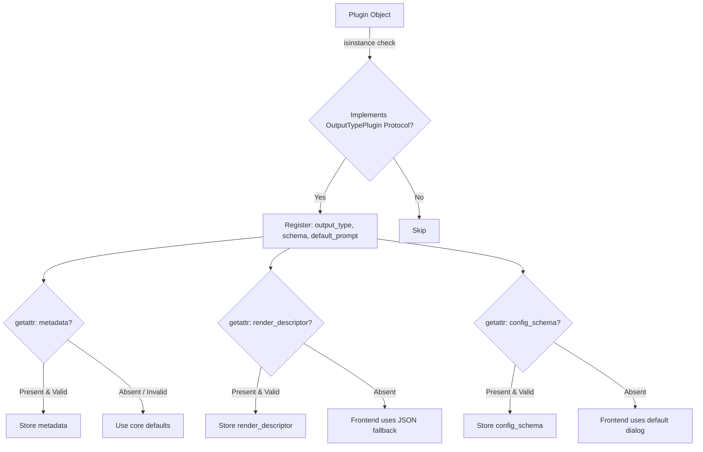
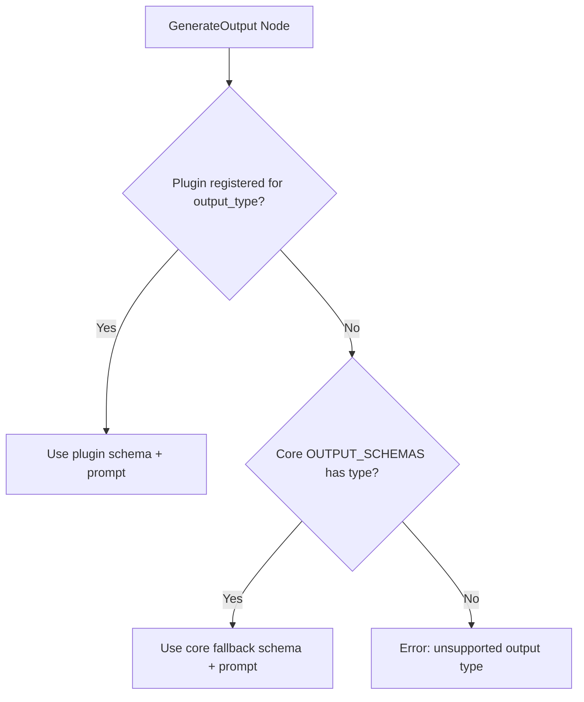
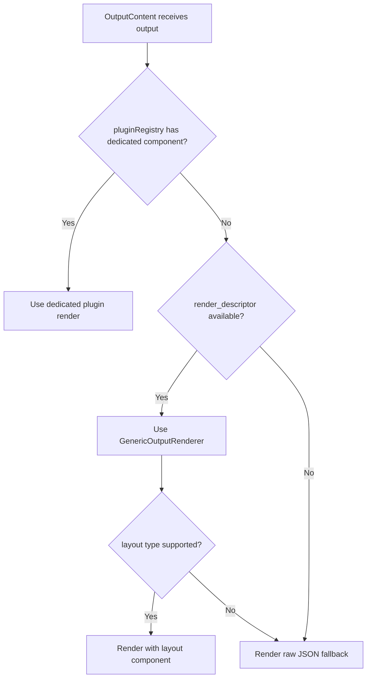
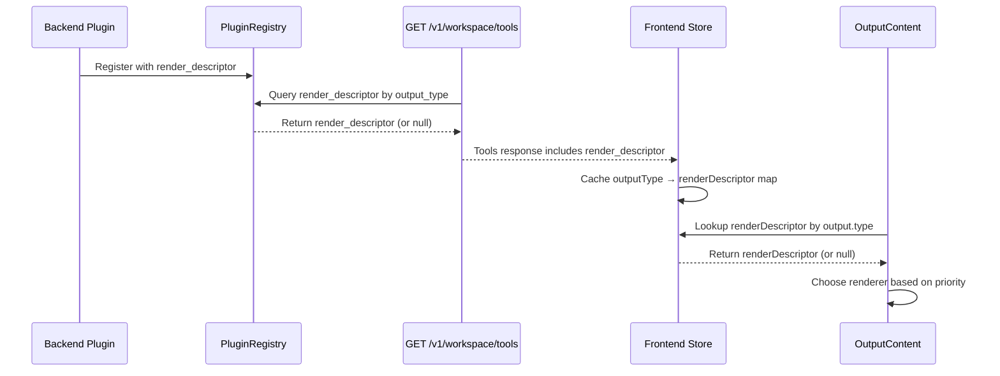

## Context

Crystalith 的 `OutputTypePlugin` 接口已在 `add-plugin-architecture` 中设计，但从未有实际实现。当前 10 种输出类型全部硬编码在核心模块中。本次重构将部分输出类型提取为独立插件包，验证插件机制并降低核心耦合度。

### 约束
- **DB 枚举约束**：`OutputType` 枚举存储在数据库中，插件不能新增枚举值，只能覆盖已有类型的 schema/prompt
- **向后兼容**：核心保留 fallback schema，即使插件未安装也能正常工作
- **前端渐进增强**：前端新增通用渲染器支持插件输出类型，但内置类型继续使用专用组件

## Goals / Non-Goals

### Goals
- 增强 `OutputTypePlugin` 扩展属性支持（metadata、render_descriptor、config_schema）
- 提取 QUIZ、TIMELINE、MINDMAP 为独立插件包
- 核心保留 fallback schema 确保向后兼容
- 验证插件覆盖机制端到端可用
- 前端新增通用渲染器，支持根据 render_descriptor 渲染任意插件输出
- 更新 copier 模板支持 OutputTypePlugin

### Non-Goals
- 不移除核心中的 fallback schema（Phase 2 考虑）
- 不修改 DB 枚举机制
- 不提取 SLIDES（有独立生成流程）
- 不提取 PARAGRAPH/BULLETS/STRUCTURED（核心精炼功能）
- 不支持前端动态加载外部 JS 组件（安全和复杂度考虑）
- 不重构 RefinePanel 的渲染逻辑（仅处理核心精炼类型）

## Architecture Overview

### 插件扩展属性检测



### 输出生成 Schema 选择优先级



### 前端渲染优先级



### render_descriptor 数据流



### 插件包结构与依赖关系

```mermaid
graph LR
    subgraph Core["Core (crystalith)"]
        A[OutputType Enum]
        B[OUTPUT_SCHEMAS fallback]
        C[PluginRegistry]
        D[render_types.py models]
    end

    subgraph Plugin["Plugin Package (e.g. crystalith-output-quiz)"]
        E[Custom Schema]
        F[default_prompt]
        G[metadata]
        H[render_descriptor]
        I[config_schema]
    end

    Plugin -->|entry_points| C
    Plugin -.->|optional import| D
    Plugin -.X|MUST NOT import| B
    C -->|plugin priority| A
    B -->|fallback| A
```

## Decisions

### Decision 1：插件优先级策略

插件 schema/prompt 优先于核心 fallback。这是 `output_graph.py` 已有的逻辑，只需确保其正确工作。

### Decision 2：可选扩展属性的检测方式

使用 `getattr()` 动态检测，而非在 Protocol 中声明。保持 `OutputTypePlugin` Protocol 不变，确保现有插件无需修改。

**替代方案**：在 Protocol 中添加可选属性 — 但 Python Protocol 属性默认必需，会破坏现有插件的 `isinstance()` 检查。

### Decision 3：插件包位置

放在 `backend/py/examples/` 下，与 `crystalith-echo-plugin` 并列。

**替代方案**：`packages/`（workspace 库，不是插件）、独立仓库（过早拆分）。

### Decision 4：提取哪些输出类型

QUIZ（列表型）、TIMELINE（事件型）、MINDMAP（树型）— 三种不同 schema 结构，充分验证插件机制。

### Decision 5：插件 schema 独立性

插件包自定义 schema，不依赖核心 `output_schemas.py`。核心 schema 作为 fallback 保留。

**替代方案**：插件从核心导入 — 但会导致循环依赖，违背独立性目标。

### Decision 6：前端通用渲染器方案

后端返回声明式 `render_descriptor`，前端用内置通用组件组合渲染。

**替代方案**：前端动态加载外部 JS 组件（Module Federation）— 复杂度极高，安全风险大。

### Decision 7：扩展属性模型位置

放在独立模块 `render_types.py` 中，与 `interfaces.py`（Protocol 定义）分离。插件包可以选择性导入这些轻量模型。

### Decision 8：render_descriptor 数据流

通过 workspace tools API 传递，前端缓存在 store 中。见上方序列图。

**替代方案**：在每个 output 响应中包含（冗余）、单独 API 端点（增加请求数）。

### Decision 9：通用组件集

6 种基础布局：list、cards、tree、timeline、sections、table。覆盖当前所有输出类型的渲染模式。

### Decision 10：同一 output_type 的冲突处理

后注册的插件覆盖先注册的，并记录警告日志。与前端 `pluginRegistry` 行为一致。

**替代方案**：抛出异常（过于严格）、忽略后来者（不直观）。

## Risks / Trade-offs

- **风险**：插件包与核心 schema 不同步 → 缓解：核心保留 fallback，插件包在同一仓库中维护
- **风险**：通用渲染器无法完美还原专用组件的交互体验 → 缓解：内置类型继续用专用组件
- **风险**：`getattr()` 检测不如 Protocol 类型安全 → 缓解：compliance.py 在注册时校验
- **Trade-off**：保留 fallback schema → 核心代码量不减少，但保证向后兼容
- **Trade-off**：render_descriptor 表达能力有限 → 覆盖 80% 场景，复杂场景可贡献专用前端组件
- **Trade-off**：插件自定义 schema 导致代码重复 → 保证插件独立性和可独立演进

## Open Questions

- Phase 2 是否应该移除核心 fallback schema？
- render_descriptor 是否需要支持条件渲染？
- 通用渲染器是否需要支持自定义样式变量？
- render_types.py 是否需要发布为独立轻量包？
