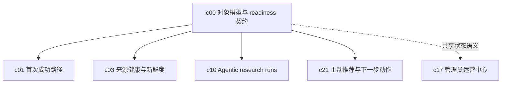

## Why

现在项目里已经有 notebook、source、session、task、research、output、template 这些对象了，但它们的边界、状态和“下一步该干什么”还分散在不同接口和页面里。前面的产品提案越往上长，这个问题就越容易放大，最后会变成 onboarding 一套语义、长任务一套语义、治理和移动端又是一套语义。

## What Changes

- 定义一套统一的 Workspace 对象模型，收口 notebook、source、session、run、artifact、template 等核心对象的职责边界。
- 定义统一的 readiness / degraded / blocked / recoverable 状态词汇，让各面板和 API 不再各说各话。
- 把“对象状态”和“下一步动作”绑在一起，约定每类对象何时可继续、何时该修复、何时该升级为更正式流程。
- 为后续 onboarding、recipe、research run、治理和移动端能力提供共享地基，避免每个提案重复发明一遍状态机。

## Capabilities

### New Capabilities

- `workspace-object-model-and-readiness`: 定义 Workspace 核心对象、状态词汇、可恢复失败和下一步动作契约。

### Modified Capabilities

- `workspace-api-contract`: 需要统一对象摘要、状态、readiness 和 recommended actions 的返回语义。
- `workspace-ui-core`: 需要按统一状态词汇组织空态、异常态、恢复态和主路径提示。
- `workspace-ui-panels`: 各面板需要暴露稳定的对象状态、阻塞原因和下一步动作入口。
- `workspace-shared-ui-state`: 需要让跨面板共享状态围绕统一对象标识和 readiness 语义展开。

## Impact

- Backend：对象摘要聚合、状态映射、readiness 计算和推荐动作装配逻辑。
- Frontend：Workspace 空态、banner、状态标签、跨面板跳转和恢复路径。
- Product：这是前面多条路线的公共地基，建议优先于 `c01-first-run-success-path`、`c03-source-readiness-and-freshness-hub`、`c10-agentic-research-runs` 讨论。

## Dependency Sketch

