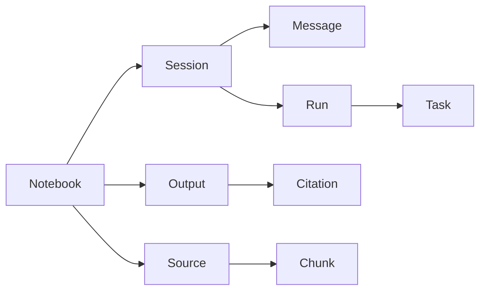

## Why

Notebook、Source、Session、Task、Output 这些对象已经贯穿了全栈：数据库、API、SSE、前端状态、SDK。它们现在能跑，但“能跑”和“跑得稳”之间差的往往就是一套统一的对象词汇与 ID 约定：字段名要一致、关系要清楚、状态要可推理。

如果不先把这层地基做扎实，后续每一个新功能都会在不同角落再发明一次“同一个概念”，最后排障靠记忆，重构靠勇气。

## What Changes

- 明确核心对象模型与关系（Notebook/Source/Session/Message/Output/Task/Run 等），把“谁拥有谁、谁引用谁”写成一张可以长期复用的图。
- 收口 ID 与字段命名：
  - 统一使用 `id` 表示本资源主键，关联字段统一为 `*_id`（例如 `notebook_id`、`session_id`）。
  - 统一“状态字段”的命名与枚举来源（例如 `status` 只来自共享枚举，而不是各模块自造字符串）。
- 引入“类型级别的防呆”：
  - Backend：为不同实体的 ID 引入 typed alias（避免把 `source_id` 当成 `session_id` 传来传去）。
  - Frontend/SDK：为 ID 引入品牌类型（branded types），让错用在编译期就炸掉。
- 明确状态机边界：哪些状态允许写入、哪些状态只读；哪些迁移是同步的、哪些迁移必须通过任务队列。

## Capabilities

### New Capabilities

- `core-domain-object-model`: 定义核心对象、ID/字段约定、关系、状态机边界与不变量。

### Modified Capabilities

- `workspace-api-contract`: API 的资源命名、字段命名、以及“对象关系可追踪”的最低要求。
- `data-and-storage`: 数据表关系、约束与状态机落地要求（外键、索引、软删除语义等）。
- `openapi-and-client-generation`: typed IDs 在生成侧的表达方式（生成 TS branded types / Python typed aliases）。
- `workspace-shared-ui-state`: 前端共享状态里对核心对象的引用约定（避免出现“半拷贝对象”导致的状态分叉）。

## Impact

- Backend：DB models / Pydantic schemas / 路由参数与响应体会更一致；长期看能明显减少“传错 id 的隐形 bug”。
- Frontend/SDK：类型更严格，接入成本会略涨，但错误会更早暴露；对后续重构更友好。
- 依赖：建议先让 `c00-workspace-object-model-and-readiness-contract` 把 readiness 词汇收口，再推进这里的 ID/对象模型细化。

## Dependency Sketch

