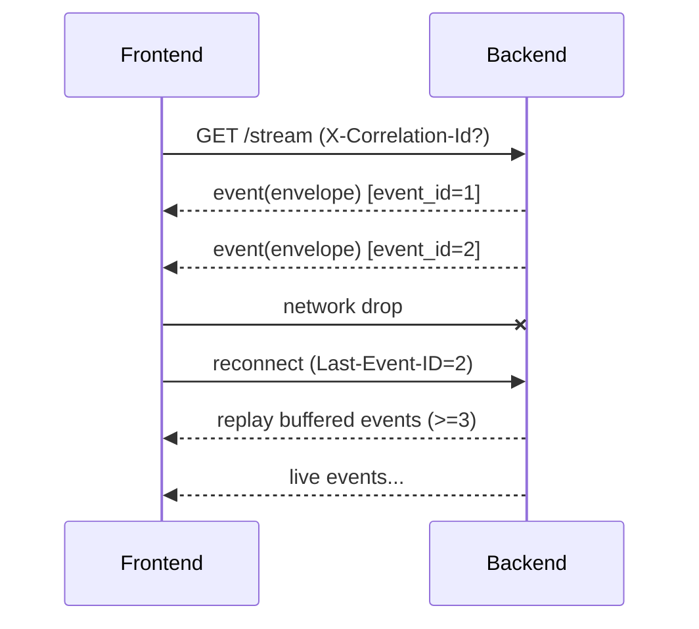

## Why

现在的 SSE 流已经覆盖了 research / QA / studio 等关键链路，但事件类型与 payload 仍偏“就地生长”：不同 endpoint 的 event 名称、字段、错误表达、心跳策略各不相同。结果是前端要写很多分支，排障也很难把“同一条链路”的事件对齐。

SSE 一旦成为主交互通道，就需要像 API 一样有契约：版本、字段、顺序、重连语义、错误码。否则它会变成一个稳定性黑洞。

## What Changes

- 定义统一的事件信封（Event Envelope），所有 SSE event 的 payload 都包一层固定字段：
  - `event_id`（单调递增或可比较）、`ts`、`kind`、`correlation_id`
  - 最小上下文：`notebook_id`/`session_id`/`run_id`（能对齐到一次动作）
  - `payload`（具体事件内容），可选 `timings`（debug 时开启）
- **BREAKING**：把现有“各自为政的 event payload”升级到统一 envelope；前端只需要写一套解析与分发。
- 明确重连与补齐策略：
  - 支持 `Last-Event-ID`（或等价参数）从断点继续。
  - 约定服务端保留一个小窗口的 event buffer（内存或持久化由实现决定，但契约先定下来）。
- 统一错误表达：SSE 的 `error` 事件 payload 与 HTTP 的 `ErrorResponse` 对齐（同一套 `code`/`message`/`correlation_id`）。

## Capabilities

### New Capabilities

- `sse-event-envelope-v2`: 统一 SSE 事件信封、事件 kind 列表、版本策略与重连语义。

### Modified Capabilities

- `chat-ui-envelope`: SSE/stream 的前端消费契约（包含重连、断点续传与错误映射）。
- `workspace-api-contract`: SSE 与 HTTP 的 error contract、correlation_id 传递要求。
- `generation-observability-and-guardrails`: 允许在事件里携带可控的 timings 与诊断字段（默认关闭）。

## Impact

- Backend：research/qa/studio 的 SSE endpoint 会统一输出结构；需要补齐 event_id 与 correlation_id。
- Frontend：EventSource/stream client 收敛成一份；UI 只关心 `kind` 与 `payload`。
- Dependencies：建议把 `c2002-request-context-and-correlation-ids` 作为底座引用（先把“同一次动作”串起来）。

## Dependency Sketch

