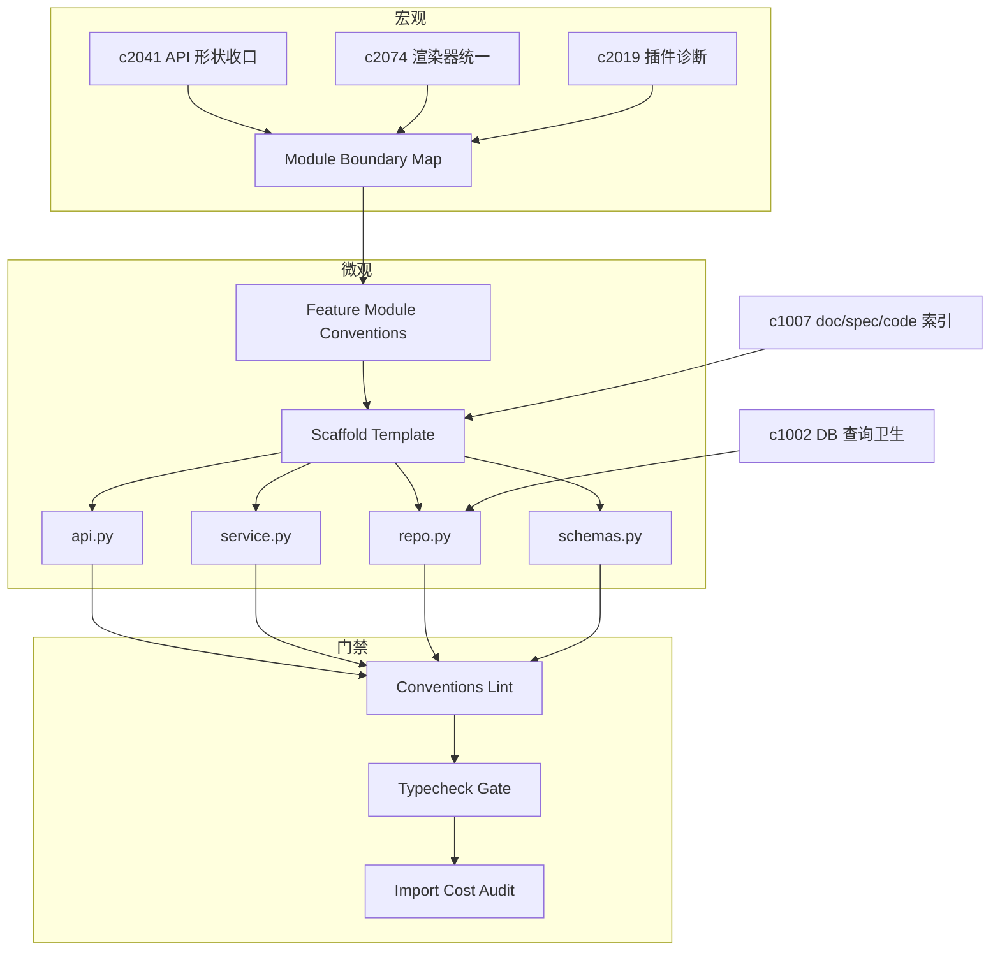

## Why

后端现在的 feature 组织方式其实挺清晰：大多有 `api_*.py`、`service.py`、`repo.py`、`schemas.py`，也能看出"路由层/业务层/数据层"的意图。但项目一旦继续扩展，最容易发生的不是写不出功能，而是"每个新功能都换一种组织法"。到最后，排查 bug 和做重构会越来越靠熟悉代码的人。

更宏观来看，proposal 越铺越多，后面真正容易拖慢推进的，往往不是缺功能，而是边界越来越糊。当前系统里 API、渲染、状态、插件和任务链路已经逐渐复杂。如果没有更明确的模块边界图，后续 change 会越来越难落——也越来越难说清楚"这次是在修哪一条边界"。

本提案从两个层面解决这个问题：

1. **宏观层**：定义可维护的模块边界图和依赖修剪语义，给重构类 proposal 提供总导航
2. **微观层**：把 backend 的 feature module 约定落成一套可执行的 scaffolding + lint + gates，让"保持一致"不靠口头提醒

> 合并说明：本提案合并了原 `module-boundary-map-and-dependency-pruning` 的全部内容。

## What Changes

### 1) 模块边界图与依赖修剪

- 定义 module boundary map，把核心模块、依赖方向和禁止跨越的边界收成一张长期可维护的结构图。
- 增加 dependency pruning 语义，识别可以被收口、下沉或剥离的耦合点。
- 支持把 boundary map 对应到 OpenSpec change 依赖，而不是停留在代码结构图层。
- 让重构提案可以更明确地说清楚"这次是在修哪一条边界"。

### 2) Backend feature module 结构约定

- 明确 backend feature module 的最小结构与职责边界：
  - `api.py`：只做路由组合与依赖注入，不做业务逻辑
  - `service.py`：业务逻辑与事务边界
  - `repo.py`：查询与持久化（把查询形状集中管理，对齐 `c1002`）
  - `schemas.py`：Pydantic/DTO 与 OpenAPI 形状（对齐 `c2041/c2165`）

### 3) Scaffold 模板生成

- 生成上述文件骨架、路由注册片段、基础测试占位
- 生成时必须写入 capability 名称与 OpenSpec change 引用（对齐 `c1007` 的 doc/spec/code link）

### 4) Conventions lint

- 禁止 api 层直接 import repo（必须通过 service）
- 禁止跨 feature 的"直接摸模型"（需要通过明确的 service 或 shared contract）
- 对明显的"共享逻辑漂移"给出重构建议（比如应该下沉到 `shared/` 或 workspace package）

### 5) 既有模块迁移收口

- 将既有 feature module 按统一结构迁移到 `api/service/repo/schemas` 约定上
- 收敛路由文件：将碎片化的 `api_*.py` 合并为更清晰的"按资源/场景分组"的路由模块（仍由 `api.py` 统一注册）
- 明确跨 feature 依赖的路径：要么走 `service`，要么下沉 `shared/`，不再靠"顺手 import"
- 对新增/改动模块强制通过（门禁 + 可读报错 + 修复建议）
- 既有模块按迁移批次推进（迁移后不再保留旧写法）

### 6) Backend type safety + static analysis gates

- 选定单一 type checker（推荐 pyright），并按目录分区（由严到松）逐步收紧
- 原则：旧债不追，但不许新增坏债；Tier 0 禁止动态属性访问；`Any` 仅允许在边界层且需有理由
- 命令入口：`cd backend/py && just typecheck`，并逐步纳入 `just check`（先本地，后 CI）

### 7) Backend startup/import cost audit + lazy loading

- dev/local 输出模块 import 耗时 top list，标注可能的重依赖来源
- 约定：禁用插件必须零 import 副作用；重依赖能力延迟到真正调用时再 import/init
- 引入轻量预算门禁：core-only 启动耗时先 warn 后 gate，并把报告入口接到 diagnostics/just 命令

### 8) 边界图与日常 guardrails 集成

- 边界图需要落到"可执行规则"——lint 检查能引用边界约束
- 边界图对应到 OpenSpec change 依赖，便于判断"某个 change 动了哪些边界"
- 把 typecheck 与启动预算作为低噪音 guardrail（先非阻断）

## Capabilities

### New Capabilities

- `module-boundary-map-and-dependency-pruning`: 定义模块边界图、依赖收口和耦合修剪规则。
- `backend-feature-module-conventions-and-migration-gates`: 定义后端 feature 结构约定、模板生成、约束 lint，以及迁移收口与一致性门禁。
- `backend-type-safety-and-static-analysis-gates`: 类型检查与静态分析门禁。
- `backend-startup-import-cost-audit-and-lazy-loading`: import profiling 输出、lazy-load 约定与预算门禁。

### Modified Capabilities

- `api-shape-consolidation-and-generated-client-slimming`: API 收口需要纳入边界图视角；schemas/DTO 的组织需要配合 API 形状收口。（`c2041`）
- `output-renderer-unification-and-plugin-bundle-splitting`: 渲染与插件分拆需要更清晰的边界约束。
- `plugin-registry-health-and-compatibility-diagnostics`: 插件诊断需要知道边界预期，而不是只看运行状态。
- `database-constraints-indexes-and-query-hygiene`: repo 层是落地查询卫生的天然位置。（`c1002`）
- `doc-spec-code-link-index-and-coverage-map`: scaffold 生成时需要写入映射，减少后续补文档成本。（`c1007`）
- `architecture-plugin-and-agent`: 补齐"禁用插件不 import"的可执行自检方式。
- `official-plugins`: 官方插件的依赖边界需要能被 audit 证明（core 不应被拖慢）。
- `quality-and-regression`: 把 typecheck 与启动预算作为低噪音 guardrail（先非阻断）。

## Impact

- Backend：新功能更容易按同一套路写；重构时更少"牵一发而动全身"；代码 review 更专注在逻辑而不是结构争论；边界图给重构提案提供导航。
- Frontend：数据访问层、渲染层和状态共享边界更清晰。
- Tooling：需要新增一个轻量 scaffold/lint 工具（不一定是大而全的框架）。
- Risk：规则太严会让人烦；需要从"最痛的几条"开始，尽量给出可读的报错与修复建议。
- Dependencies：这条线接在 `c2041`（API 形状收口）、`c2074`（渲染器统一）、`c2019`（插件诊断）后面。

## Dependency Sketch

