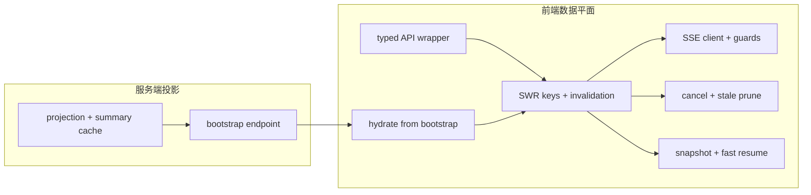

## Why

**服务端工作区状态**：若无统一的 state projection，bootstrap 只是新的聚合黑箱；若无 bootstrap，projection 仍会被前端多处重复拉取。`c2040` 与 `c2231` 所覆盖的 projection、summary cache 与首屏 hydration 本属同一层基础设施。**前端数据平面**：若 API client wrapper 不稳定，fetching 约定就不稳；若 SWR key/失效不统一，snapshot/resume 易污染状态；若取消与 SSE 生命周期分散，旧请求与旧流仍会破坏 UI。将 **工作区投影与 bootstrap** 与 **client cache、请求与流生命周期** 作为同一「工作区数据平面」推进，首屏才能一次 hydrate、后续渐进拉细节，且全局一致地处理错误、重连与恢复。

> 合并说明：本提案合并了原 `frontend-client-cache-and-request-lifecycle` 的全部内容。

## 公共合成焦点

**Bootstrap / projection** 决定首屏写入哪些实体摘要；**SWR / snapshot / SSE** 决定这些实体如何被缓存、失效与流式更新。公共约束是：bootstrap seed 的标识空间与 key registry、精确失效规则同源，避免「壳层已 hydrate、面板各自再拉一套」；typed error 与 `correlation_id` 从首屏延续到后续 fetch 与流，取消与 stale inflight 剪枝防止切 scope 后旧响应污染 UI。数据平面一次成型，而不是「后端聚合 + 前端各自为政」两叠黑箱。

## 一体化原则（公共项收口）

1. **实体 id 即缓存锚点**：projection 返回的 notebook/source/task 等摘要 id 与 SWR key builder 使用同一命名与版本前缀；bootstrap 不写「仅首屏专用」的平行 id。
2. **错误与关联贯穿**：自 bootstrap 起的每次 fetch/SSE 携带同一 `correlation_id` 策略；typed error 的 `retry_after` 与后端 Retry-After 对齐。
3. **失效图单一真相**：面板切换、写操作成功、流式完成事件走统一 invalidation 入口，snapshot resume 不绕过该入口写入陈旧切片。
4. **生命周期闭合**：路由/scope 变更时取消 in-flight HTTP 与 SSE subscription，防止旧 tab 响应覆盖新上下文。

## Merge Notes（历史合并溯源）

- 本目录历史上已合并：`workspace-state-projection-and-summary-cache`、`workspace-bootstrap-endpoint-and-hydration`。
- 本次再合并自 `c4073` 所收口的：`c2155`、`c2243`、`c2238`、`c3028`。

## What Changes

1. **统一 workspace state projection**：notebook/source/session/task/research/output 的稳定摘要视图；recent context、summary cache、局部失效与轻量重放语义。
2. **首页与驾驶舱摘要基座**：workspace home、operating cockpit、collection home 等 consumer 不再各自拼装摘要对象，统一依赖 projection + summary cache。
3. **Bootstrap 端点**：仅返回壳层与首屏必需的 seeds，不承诺覆盖全部面板全量数据。
4. **Hydration 规则**：bootstrap 结果可直接 hydrate 到 SWR cache 与 state slices；按活跃面板渐进拉细节，减少多处 spinner 与 N+1 首屏请求。
5. **稳定前端 API wrapper**：`Result<TData, ApiError>` 或等价 typed error；`error_code` / `message` / `hint` / `retry_after` / `correlation_id`。
6. **SWR key registry 与失效**：统一 key builder、精确失效、domain hooks 统一采用。
7. **SSE stream client**：统一 event envelope、连接生命周期、资源防护；多路复用与事件合并/节流。
8. **请求取消与陈旧 inflight 剪枝**：AbortSignal、scope 变更取消、陈旧响应丢弃、SSE 取消订阅生命周期。
9. **Cache snapshot 与快速恢复**：白名单 snapshot、与 build/schema 版本绑定、后台 revalidate、清理入口。

## Capabilities

### New Capabilities

- `workspace-state-projection-and-summary-cache`
- `workspace-home-and-operating-cockpit`
- `collection-home-and-navigation`
- `workspace-bootstrap-endpoint-and-hydration`
- `frontend-api-client-wrapper-and-typed-errors`
- `frontend-swr-key-registry-and-invalidation`
- `frontend-data-fetching-standardization-and-swr-adoption`
- `sse-event-schema-and-stream-client`
- `frontend-sse-connection-multiplexing-and-resource-guards`
- `sse-event-coalescing-and-ui-update-throttling`
- `frontend-request-cancellation-and-stale-inflight-pruning`
- `frontend-cache-snapshot-and-fast-resume`

### Modified Capabilities

- `workspace-api-contract`
- `workspace-ui-core`
- `workspace-shared-ui-state`
- `workspace-ui-panels`
- `output-rendering-and-typing`

## Impact

- **Backend**：稳定的 workspace aggregation / projection / bootstrap 层；error envelope、correlation id、SSE event shape 与前端消费契约更一致。
- **Frontend**：壳层 ready、home summary、首屏 hydration 与统一 client/cache/stream/request lifecycle 底座；刷新、切 panel、切 scope、弱网恢复时体验更稳。
- **Product**：回到 workspace 时入口、摘要与首屏恢复更连贯；减少旧数据、重复 try/catch 与分散重连逻辑。

## Dependency Sketch

