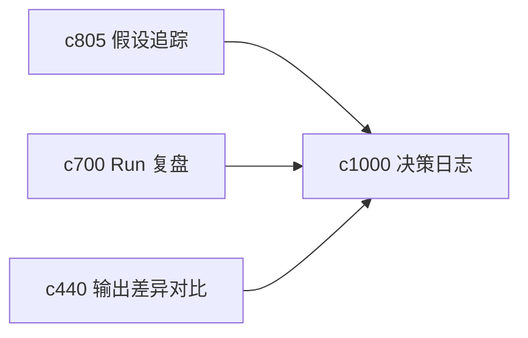

## Why

个人研究里最值钱的往往不是某个结论本身，而是“为什么当时决定这么判断，后来又为什么改了”。如果这些转折没有被单独记下来，过一段时间就只剩结果，不剩判断脉络。

## What Changes

- 定义 decision journal，把关键判断、采用方案和放弃路线收成可回看的决策记录。
- 增加 why-it-changed 语义，明确每次判断转向背后的证据变化、范围变化或表达策略变化。
- 支持决策记录挂接线程、假设、输出版本和主张地图。
- 让 journal 偏轻量，不变成负担沉重的手工文档系统。

## Capabilities

### New Capabilities
- `decision-journals-and-why-it-changed`: 定义关键决策记录和判断变化缘由。

### Modified Capabilities
- `hypothesis-tracking-and-verdict-evolution`: 假设演化需要能沉淀成决策节点。
- `run-postmortem-summaries-and-recommendation-loops`: 复盘结果需要能升级为正式决策记录。
- `output-diff-compare-and-version-review`: 版本复核需要能查看背后的决策变化。

## Impact

- Backend：会影响决策对象、变更原因和关联索引。
- Frontend：会影响线程页、版本页和决策时间线。
- Dependencies：这条线承接 `c805`、`c700`、`c440`，把“结果变化”补成“判断变化”。

