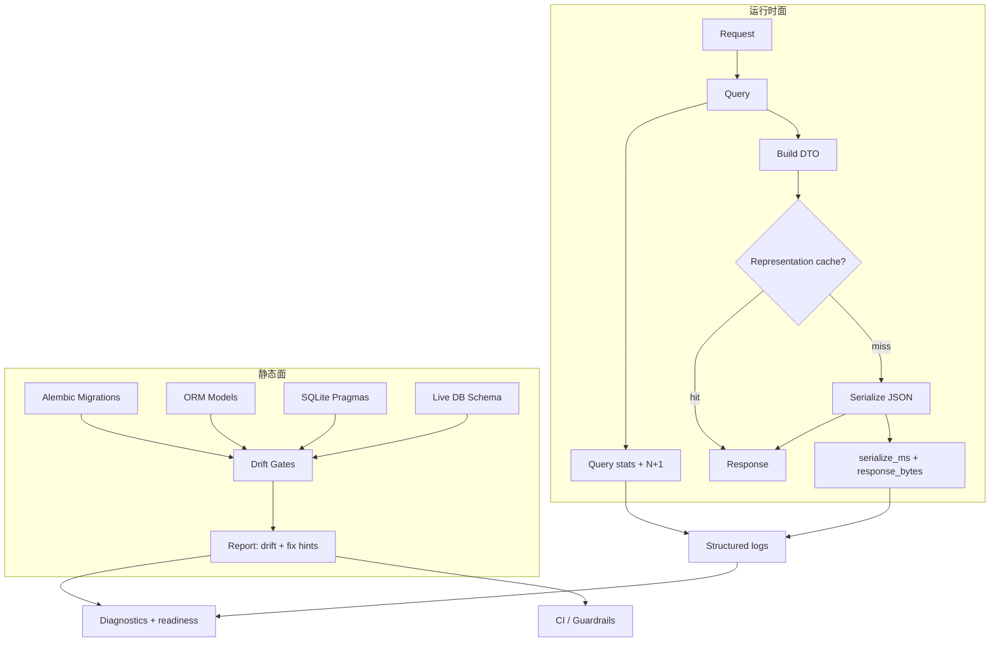

## Why

我们同时支持 SQLite（local）和 Postgres（docker/full），还在不断加新对象、新索引。只要迁移稍微漂一下，问题就会在最糟的时候爆出来：线上/本地行为不一致、数据丢失、或者某个查询突然慢到不可用。

SQLite 的好处是轻，但坏处也很现实：很多"迁移没写好/索引忘了加/约束不一致"的问题不会立刻爆炸，而是悄悄积累，直到某次升级或某个大工作区才开始疼。与其在事故后补救，不如把"迁移漂移 + SQLite 基线 + 约束/索引缺失"变成可提前发现的门禁。

但只盯静态结构还不够。有些接口"看起来 DB 很快"，用户还是觉得慢，原因常常是：多了一次查询、少了一个索引、某个列表接口从"几十条"变成"几千条"，或者 JSON 序列化和响应体构建悄悄占掉大头。这些在个人环境里尤其隐蔽——数据量慢慢涨，直到某天突然"怎么每次打开都要等半天"。

本提案把 DB 健康分为两个互补面：**结构与迁移治理**（静态，防患于未然）+ **运行时查询与响应观测**（动态，问题可追可回归），形成从约束到可见性的完整闭环。

> 合并说明：本提案合并了原 `backend-slow-query-log-and-nplus1-detectors` 的全部内容。

## What Changes

### 1) 结构层：DB 约束、索引与迁移门禁

- 定义 DB hygiene 的最低标准（可被门禁验证）：
  - 外键/唯一约束/必要索引必须显式存在（不能只靠 ORM 约定）
  - 对关键查询提供索引覆盖说明（先从 sources/sessions/outputs 等热表开始）
  - 盘点并明确核心不变量（写进 schema + 测试）：关键唯一性、revision/版本递增规则、外键删除策略与 orphan 边界
  - 建立"索引与查询形状清单"：列出 Workspace 关键列表页与后台 worker 的查询路径，补齐必要 index，并把"为什么需要"写进迁移说明
  - 统一 repo 查询 hygiene：避免 N+1、分页/排序字段约束、JSON 字段访问的可解释降级（SQLite vs 其他）
- 定义 migration drift gates（本地与 CI 都可跑）：
  - 检查项：有没有未应用迁移、head 是否一致、是否出现危险/不可回滚操作
  - 对比 ORM schema、alembic migrations、以及当前数据库的实际 schema
  - 产出可读 diff + fix hints（哪张表/哪个索引/哪条约束漂了、应该补哪条 migration）
- 明确迁移的 rollback 边界与实践约定：
  - 哪些迁移必须可逆、哪些可以不可逆但要写清楚
  - SQLite 与 PG 的差异如何处理（不做"假装一致"，而是明确差异）
- 定义 SQLite baselines：
  - 必须启用的 pragma（如 foreign_keys、journal_mode/WAL 策略、busy_timeout）
  - 哪些 pragma 只在本地生效、哪些必须被记录进诊断与自检（对齐 `c1035`）

### 2) 运行时：请求级 DB 查询统计 + N+1 检测

- 增加 request-scoped DB query stats（默认 dev/local 开启，可配置）：
  - `query_count` / `total_db_time_ms`
  - top slow queries（脱敏后）与疑似 N+1 片段
  - 关联 `correlation_id`，让前端/诊断包能直接指向一次动作
- N+1 detectors（轻量启发式）：
  - 同一请求内出现大量形状相似的查询（同 SQL 模板、不同参数）则标记为 suspected N+1
  - v1 不追求完全准确，先把"明显的坑"抓住

### 3) 运行时：响应构建与 JSON 序列化指标

- 增加 response build/serialization metrics（默认 dev/local 开启）：
  - `serialize_ms`、`response_bytes`
  - 与 `correlation_id` 关联（对齐 `c2152`）
  - 输出到结构化日志与 diagnostics（对齐 `c2166`、`c2020`）

### 4) 运行时：表示缓存（只覆盖少数高收益接口）

- 为少数 read-heavy endpoints 引入"表示缓存"（representation cache）：
  - 以资源版本/ETag 为 key 缓存已序列化的 JSON bytes
  - 只用于明确无敏感字段、且字段集合稳定的 endpoint（与 `c2240` presets 对齐）
- 明确边界：
  - 不把它做成全局魔法缓存；v1 只覆盖 bootstrap/summary 这类收益最大的接口
  - 缓存必须受 profile/config 控制，并能在 diagnostics 里看见命中率

### 5) 输出、快照与门禁

- 把 DB 结构纳入快照体系：
  - schema snapshot（表/索引/约束摘要）进入 `c2086` 的 catalog
  - drift gate 输出能被 readiness report 复用（对齐 `c1003`）
- 在 diagnostics workbench（`c2020`）展示聚合摘要：
  - 慢查询/N+1 热点
  - serialize hotspot + top endpoints
  - representation cache 命中率
- 在关键 endpoint 的回归场景里允许加预算阈值（遵循"先 warn 后 gate"策略）

## Capabilities

### New Capabilities

- `db-migration-drift-gates-and-sqlite-baselines`: 迁移漂移检查、SQLite pragma 基线、结构快照与 rollback 边界约定。
- `database-constraints-indexes-and-query-hygiene`: 定义 DB 不变量、索引清单与查询卫生规范（静态层面）。
- `backend-slow-query-log-and-nplus1-detectors`: 请求级查询统计、N+1 识别与输出边界（运行时层面）。
- `backend-json-serialization-hotspot-metrics-and-caching`: 序列化耗时/字节数指标与表示缓存边界。

### Modified Capabilities

- `data-and-storage`: 关键表的约束/索引要求、迁移策略与热点表经验阈值。
- `delivery-and-deployment`: drift check 的命令入口与 CI 挂钩方式。
- `schema-snapshot-catalog-and-regression-baselines`: DB 结构快照需要进入 catalog。（`c2086`）
- `migration-readiness-report-and-rollback-checkpoints`: readiness report 需要复用 drift gate 的结果。（`c1003`）
- `operational-baseline-checklists-and-startup-self-test`: 启动自检需要能提示"DB 基线是否符合预期"。（`c1035`）
- `large-workspace-performance-and-capacity-management`: 容量与性能诊断需要能引用"索引是否完整"。（`c2023`）
- `structured-logging-schema-redaction-and-error-sampling`（`c2166`）：确保 SQL/参数/路径被正确脱敏或摘要化，并且指标可聚合。
- `request-context-and-correlation-ids`（`c2152`）：把 query/serialize stats 和一次动作串起来。
- `dev-diagnostics-workbench`（`c2020`）：新增"慢查询/疑似 N+1 / serialize hotspot"视图。
- `http-response-caching-etag-and-client-cache-keys`（`c2237`）：ETag 与表示缓存的版本 key 需要对齐。
- `api-response-size-budgets-and-fieldset-presets`（`c2240`）：字段集合稳定后，表示缓存才安全可用。

## Impact

- Backend：新增 drift 检查入口、SQLite pragma 初始化与诊断输出；请求级查询/序列化观测；少数接口的表示缓存。
- Frontend：首屏更稳；304/ETag 命中时更干净。
- DX：当 drift 或性能退化出现时，开发者能在本地第一时间看到，而不是把锅甩给环境。
- Risk：drift gate 太严格会影响迭代速度，需要分层（warning vs blocking）；统计与缓存默认只在 dev/local 或显式开启的 profile 下启用。
- Dependencies：建议先用 `c2000` 的对象模型把核心关系定清楚，再补齐约束与索引。

## Dependency Sketch

