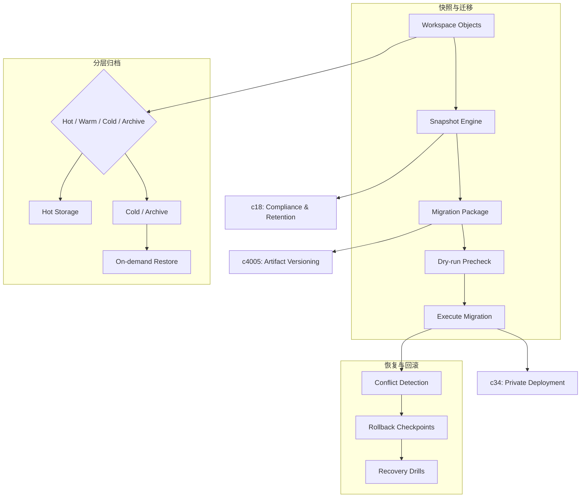

## Why

一旦 notebook、artifact、review 记录和运行历史开始变成团队资产，大家迟早会问两个很朴素的问题：出了问题能不能救回来，换环境或换版本能不能迁过去。没有备份、迁移和恢复能力，前面的协作和治理做得越完整，切换成本反而越高。

同时，随着 run、artifact、briefing、审阅记录和历史来源越来越多，系统迟早会遇到另一个现实问题：哪些对象应该一直热着，哪些对象只是留档，哪些对象应该随取随恢复。如果只有“留着”或“删掉”两种选择，既不经济，也不利于长期治理。

## What Changes

- 提供 workspace / notebook / artifact 级别的快照、导出、导入和恢复能力，而不是默认把数据库当成唯一真相。
- 引入迁移包和 dry-run 预检，让跨环境迁移、跨版本升级和灾难恢复有正式入口。
- 增加 migration readiness report + rollback checkpoints（收口到本提案）：
  - 迁移前检查关键对象、schema、索引与回归状态，避免“条件不够就硬上”
  - 在高风险变更前生成最小回滚检查点；区分可自动回退与只能人工修复的变更类型，避免制造假安全感
- 为 sources、sessions、runs、knowledge packs 和 review 历史定义最小可恢复边界，避免恢复后只剩半套数据。
- 允许管理员查看恢复影响范围、冲突对象和回滚路径，而不是直接执行黑盒操作。
- 增加 recovery drills + backup verification scenarios（收口到本提案）：
  - 用小范围、低风险方式定期演练关键恢复路径，验证备份是否完整、可读、可在合理步骤内恢复
  - drill 既服务本地个人工作区，也可作为迁移/升级前的复核动作
- 引入 hot / warm / cold / archive 等生命周期层级，让不同对象按价值和访问频率进入不同存储层：
  - 支持按 tenant、workspace、artifact 类型或时间窗口设置归档与冷存策略，而不是全局一刀切
  - 允许在需要时恢复到可读、可审或可再发布状态，并把归档状态纳入 workspace 可见语义

## Capabilities

### New Capabilities

- `workspace-backup-migration-and-recovery`: 定义快照、迁移包、恢复流程、冲突处理和回滚边界。
- `migration-readiness-report-and-rollback-checkpoints`: 定义迁移就绪报告、回滚检查点与风险分层语义。
- `recovery-drills-and-backup-verification-scenarios`: 定义恢复演练与备份有效性验证场景。
- `tiered-archive-and-cold-storage`: 定义分层存储、归档恢复、对象可见性和生命周期策略。

### Modified Capabilities

- `data-and-storage`: 需要支持快照元数据、恢复状态和迁移版本语义。
- `workspace-api-contract`: 需要提供导出、导入、恢复和预检接口。
- `delivery-and-deployment`: 需要明确跨环境迁移和灾难恢复的最小要求。
- `publishable-artifacts`: 需要定义发布产物在导出、恢复和跨环境迁移时的保真边界。
- `run-input-snapshots-and-repro-packs`: 快照包可作为恢复验证样本，且需要表达可恢复边界。（`c2018`）
- `local-cache-draft-queue-and-sync-preflight`: 本地草稿/缓存恢复需要纳入演练范围。（`c2073`）

## Impact

- Backend：快照打包、归档任务、恢复编排、版本迁移、冲突检测和回滚控制。
- Frontend/Admin：导出导入向导、归档标识/筛选、恢复预检、冲突提示和任务进度页。
- Operations：这会明显降低试点扩张、环境迁移、长期保存与故障恢复时的心理门槛与成本压力。
- Dependencies：建议接在 `compliance-retention-and-data-governance`、`artifact-versioning-and-release-channels`、`private-deployment-and-regional-data-plane` 之后讨论。

## Dependency Sketch

