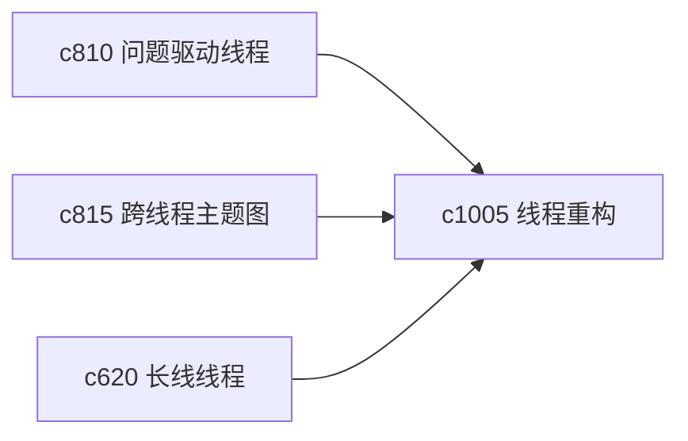

## Why

问题和线程一开始怎么切，往往并不是最终最合理的。研究做深以后，有些问题会发现其实该合并，有些大问题又必须拆开。没有线程重构能力，长期积累会越来越乱。

## What Changes

- 定义 question/thread refactor，支持问题合并、拆分和主题线程重组。
- 增加 lineage 记录，保留“这个新问题是从哪条旧线拆出来的”。
- 支持重构后带着来源、摘要、假设和 run 种子一起迁移。
- 保持重构是个人整理动作，不引入团队协作流程。

## Capabilities

### New Capabilities
- `question-merging-splitting-and-thread-refactors`: 定义问题合并拆分和线程重构语义。

### Modified Capabilities
- `question-led-research-threads-and-answer-status`: 问题线程需要支持重组。
- `cross-thread-theme-maps-and-subtopic-lattices`: 主题图需要体现线程重构 lineage。
- `long-arc-threads-and-milestone-checkpoints`: 长线线程需要能容纳重组后的里程碑迁移。

## Impact

- Backend：会影响线程 lineage、对象迁移和索引更新。
- Frontend：会影响线程管理、问题总览和主题地图。
- Dependencies：这条线承接 `c810`、`c815`、`c620`，让长期研究结构可持续调整。

