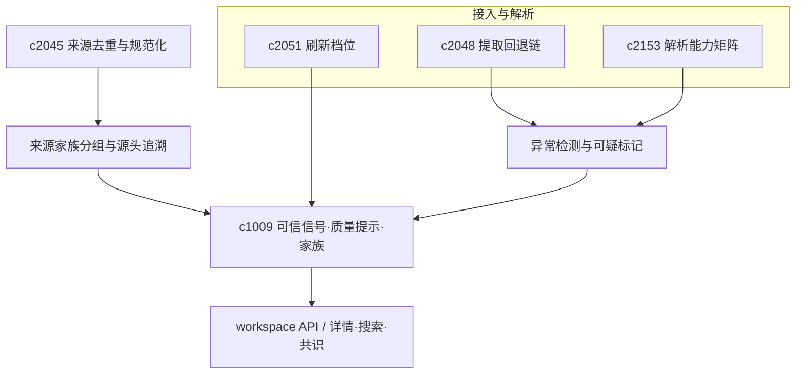

## Why

来源能抓取成功，不等于用户愿意采信：日常使用中更影响体感的是朴素判断——是否可靠、是否缺页、是否转载、正文质量是否过差。与此同时，部分导入并非彻底失败，而是**成功得很可疑**（正文骤短、标题异常、提取结果像导航页等）；若缺少异常检测，用户容易把坏内容当作正常来源继续下游使用。

更深层的问题在于：很多来源不是彼此独立的，而是同一原始材料被不同转载、摘要、改写后扩散出来。如果看不见来源家族和原点 lineage，用户很容易把**重复声音误当成多方印证**，形成假共识。

本变更将**可信与质量提示**、**接入侧异常检测**与**来源家族分组及源头追溯**统一为同一条来源质量信号链路：对内可分级，对外可理解，并进入详情、搜索、引用解释与共识判断。

> 合并说明：本提案合并了原 `ingestion-anomaly-detection-and-suspect-content-flags`、`source-family-grouping-and-origin-lineage` 的全部内容。

## What Changes

### 1. 来源可信信号（source trust signal）

- 将完整性、重复风险、提取质量与最近验证情况等收成可展示信号。
- 区分硬风险与软提示，避免所有来源都像在报警。

### 2. 质量提示（quality hint）

- 用简短、可理解的方式说明「这份来源哪里看起来不稳」。
- 让信号参与来源详情、搜索结果与引用解释，而非仅内部评分。

### 3. 接入异常检测（ingestion anomaly detection）

- 识别异常短文、重复片段、异常标题与明显脏内容等模式。
- 区分高置信异常与轻度疑点，控制误报。

### 4. 可疑内容标记（suspect content flag）

- 将可疑来源显式标出，不沉在后台分数里。
- 标记回流来源详情、批处理与重试/恢复入口。

### 5. 来源家族分组（source family grouping）

- 定义 source family grouping，把具有共同来源 lineage 的材料归为同一家族。
- 增加 origin lineage，尽量追出更靠前的源头与传播链。
- 支持家族视角影响可信度、阅读排序和主张权重。
- 区分"独立来源"与"同源转述"，避免假共识。

### 6. 契约与一致性

- 信任、异常与家族信号在 API 与 UI 上字段语义一致，便于批处理与工具链消费。

## Capabilities

### New Capabilities

- `source-trust-signals-and-quality-hints`：来源可信信号、质量提示与风险分级语义。
- `ingestion-anomaly-detection-and-suspect-content-flags`：接入异常检测、可疑内容标记与分级提示。
- `source-family-grouping-and-origin-lineage`：来源家族分组、源头 lineage 与假共识防护。

### Modified Capabilities

- `source-readiness-and-freshness`：在可用性之外扩展到可信度提示。
- `source-coverage-and-evidence-map`：覆盖图消费来源质量与可疑度信号。
- `source-ingestion-retry-recovery-and-partial-success`：异常来源具备更明确的恢复与重试入口。
- `source-deduplication-and-canonicalization-pipeline`：去重规范化需要升级到家族层。
- `consensus-outlier-detection-across-sources`：共识识别需要剔除同源幻觉。
- `workspace-api-contract`：暴露质量提示、风险字段、异常标记、家族关系与类型摘要。

## Impact

- **Backend**：来源评分与聚合、异常规则、内容诊断、来源标记、家族归并、传播链追踪与权重计算。
- **Frontend**：来源卡片、详情页、搜索结果说明、批量修复、可疑状态展示、共识视图与家族视角。
- **Dependencies**：与 `c2048`（提取回退链）、`c2153`（解析能力矩阵）、`c2051`（刷新档位）、`c2045`（去重规范化）等同属来源可信链路。

## Dependency Sketch

