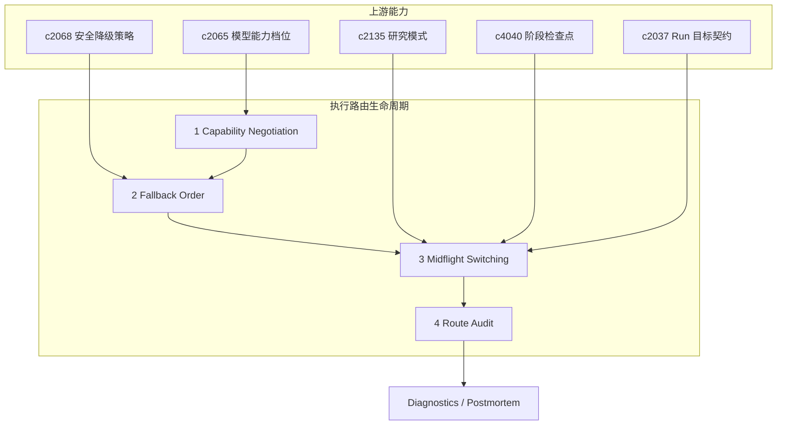

## Why

真正的执行链路通常不是单一模型或单一工具，而是一串能力协商与路由选择。只要它开始智能化，用户和开发者迟早会问：

- 这次为什么选了这个模型/工具链，而不是另一个？
- 这次为什么要降级？是能力不匹配、容量不足，还是临时故障？
- 跑到一半时发现目标太大、模式不对，能不能安全转向而不浪费已有上下文？

如果只能看到结果，看不到协商与路由决策，调试会越来越靠体感，信任也会慢慢掉。而如果中途发现方向不对只能中断重来，太浪费上下文和已完成的工作。

本提案把执行路由作为完整生命周期来治理：**执行前协商** → **执行中适应** → **事后审计**，让每一阶段的决策都可见、可解释、可复盘。

> 合并说明：本提案合并了原 `run-mode-switching-midflight-and-safe-retargeting` 的全部内容。

## What Changes

### 1) 执行前：Capability negotiation

- 在 run 开始前显式判断：当前任务更适合哪类工具/模型、是否需要降级、优先用哪条链路。
- 区分能力不匹配、容量不足和临时故障三类回退原因。

### 2) 执行前/执行中：Fallback order

- 把降级顺序和替代策略显式化，而不是隐藏在失败后的 if/else。
- 协商结果回接预算账本与 postmortem，便于复盘"为什么会走到这一步"。

### 3) 执行中：Midflight mode switching & safe retargeting

- 定义 midflight mode switching，让 run 在关键阶段能安全切换工作模式（例如从综合转为核证）。
- 增加 safe retargeting，把已有上下文和阶段产物尽量复用到新目标上。
- 支持转向时明确展示会保留什么、放弃什么、重算什么。
- 仍然保守处理高风险切换，避免造成更隐蔽的状态混乱。

### 4) 事后：Model route audit + decision explanations

- 记录模型路由与工具链协商的关键判断因素（能力/预算/兼容性/健康度）。
- 解释"为什么如此选择"，并区分建议性解释与严格因果解释，避免把启发式判断说得太像定理。
- 让审计结果回流到生成详情、预警提示、回归对比与诊断视图。

## Capabilities

### New Capabilities

- `toolchain-capability-negotiation-and-fallback-order`: 定义工具链能力协商和回退顺序。
- `run-mode-switching-midflight-and-safe-retargeting`: 定义执行中模式切换和安全转向。
- `model-route-audit-and-decision-explanations`: 定义模型路由审计、决策解释和回链语义。

### Modified Capabilities

- `model-capability-profiles-and-output-compatibility`: 需要输出可被解释的决策输入。
- `generation-fallback-strategies-and-safe-degradation`: 回退决策需要能进入路由审计。
- `research-modes-explore-verify-synthesize`: 研究模式需要支持执行中切换。
- `run-stage-checkpoints-and-approval-gates`: 阶段门需要成为模式切换点。
- `run-goal-contracts-and-success-checks`: 目标契约需要支持安全改写。
- `quality-and-regression`: 路由/协商/回退/转向解释需要进入评测与诊断。

## Impact

- Backend：会影响能力匹配、回退顺序、路由器日志、解释摘要、执行编排、阶段状态迁移和上下文复用。
- Frontend：会影响 run 配置解释、生成详情、模型提示、切换说明、结果预览与诊断视图。
- Dependencies：这条线补强 `c2065`（模型能力档位）和 `c2068`（安全降级策略），把模型层/工具链的自动化拉到可解释；同时承接 `c2135`（研究模式）、`c4040`（阶段检查点）、`c2037`（Run 目标契约），让执行过程更有弹性。

## Dependency Sketch

