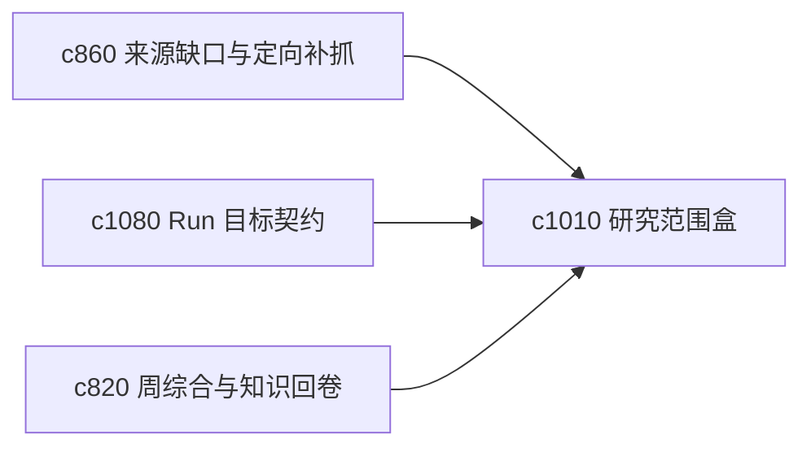

## Why

个人研究最容易失控的，不是没有方向，而是边界越来越松。没有明确的 scope box 和 stop rule，系统越强，越容易把用户推向“再补一点、再看一点、再跑一次”。

## What Changes

- 定义 scope box，明确当前研究的主题边界、时间边界和证据边界。
- 增加 stop rule，让用户能先写下“做到什么程度就先停”。
- 支持 scope box 作用到来源补抓、run 模板和周综合。
- 区分“先停因为已够用”和“先停因为当前不值得再深挖”。

## Capabilities

### New Capabilities
- `research-scope-boxes-and-stop-rules`: 定义研究范围盒和停止规则。

### Modified Capabilities
- `source-coverage-holes-and-targeted-fetch-suggestions`: 缺口建议需要受范围盒约束。
- `run-goal-contracts-and-success-checks`: 执行目标需要能引用 stop rule。
- `weekly-synthesis-and-personal-knowledge-rollups`: 周综合需要展示哪些主题主动收口了。

## Impact

- Backend：会影响边界规则、建议过滤和目标校验。
- Frontend：会影响线程设置、补抓建议和继续/停止提示。
- Dependencies：这条线接在 `c860`、`c1080`、`c820` 后面，是长期研究降噪的重要控制面。

