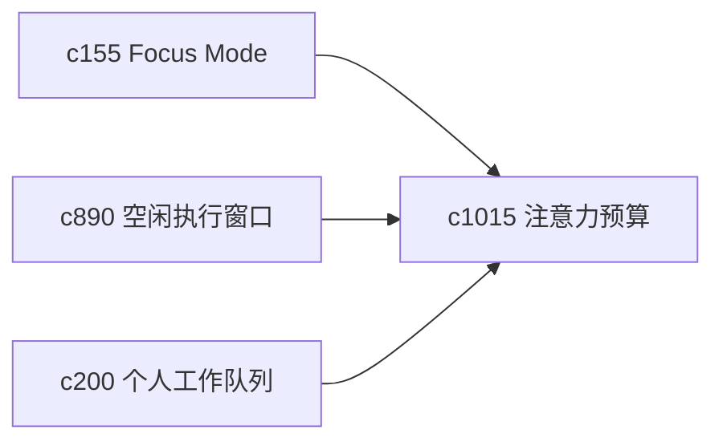

## Why

很多问题不是时间不够，而是注意力被太多小入口切碎。个人产品如果能尊重注意力预算，帮助用户在深度工作和轻量回看之间切换，价值会明显更稳。

## What Changes

- 定义 attention budget plan，把主题、线程和日常维护按注意力强度分类。
- 增加 deep work window，让系统在某些时段收起非必要提示和低优先动作。
- 支持和 focus mode、idle execution、review bucket 联动。
- 保持它是辅助节奏工具，不变成番茄钟类管理系统。

## Capabilities

### New Capabilities
- `attention-budget-plans-and-deep-work-windows`: 定义注意力预算和深度工作窗口。

### Modified Capabilities
- `workspace-focus-mode-and-distraction-pruning`: 专注模式需要能读取注意力计划。
- `background-refresh-windows-and-idle-execution`: 空闲执行需要避开深度工作窗口。
- `personal-work-queues-and-review-buckets`: 队列需要按注意力预算排序。

## Impact

- Backend：会影响优先级计划、窗口规则和提示抑制。
- Frontend：会影响专注模式、首页排序和提醒策略。
- Dependencies：这条线承接 `c155`、`c890`、`c200`，属于个人工作台节奏层的补件。

