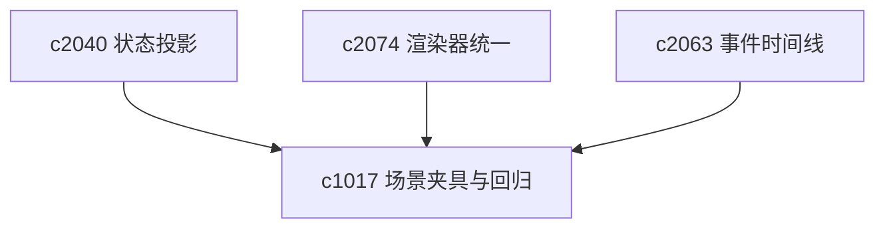

## Why

前面的提案一旦开始动到 Workspace 壳层、研究流程、输出渲染和同步状态，靠零散单测已经不太够了。现在更需要的是一组稳定、可复用的场景夹具，让重构之后还能知道主路径到底有没有被悄悄弄坏。

## What Changes

- 定义 workspace scenario fixtures，覆盖首次进入、来源接入、研究运行、输出查看、引用跳转、同步预检等关键场景。
- 增加 regression harness，把后端接口夹具、前端状态夹具和端到端主路径串起来。
- 增加 chaos fixtures（收口到本提案）：
  - 用可控方式模拟超时、重复回调、部分成功、乱序完成和恢复中断
  - 增加 recovery checks，专门验证异步管线在坏场景下是否还能收敛
  - 支持把混沌场景接到回放、smoke test 和迁移准备报告（对齐 `c2082`、`c1003`）
- 让新提案在进入实现前就知道应该挂到哪些场景上，而不是实现后再补零碎测试。
- 为长链路重构提供更像产品视角的回归信号，而不只看接口或组件局部测试。

## Capabilities

### New Capabilities
- `workspace-scenario-fixtures-and-regression-harness`: 定义工作区场景夹具、回归入口和跨层验证边界。
- `chaos-fixtures-for-async-pipelines-and-recovery`: 定义异步混沌夹具、故障模式与恢复检查语义。

### Modified Capabilities
- `quality-and-regression`: 需要从局部测试扩展到工作区主路径场景。
- `workspace-api-contract`: 接口夹具需要支持稳定录制和回放。
- `workspace-ui-core`: 主路径 UI 状态需要有稳定的测试装配面。
- `generation-observability-and-guardrails`: 关键运行信号需要能被场景回归消费。
- `real-workspace-eval-dataset-capture-and-replay`: 回放数据需要可绑定混沌模式。（`c2082`）
- `migration-readiness-report-and-rollback-checkpoints`: 迁移准备报告需要纳入恢复链路压测结果。（`c1003`）

## Impact

- Backend：会影响测试夹具、接口录制、场景数据种子和评测入口。
- Frontend：会影响 Workspace 测试装配、状态初始化和交互回放。
- Dependencies：这条线不抢产品主线，但会决定 `c2040` 到 `c2073` 这一批 change 后面能不能安全推进。

