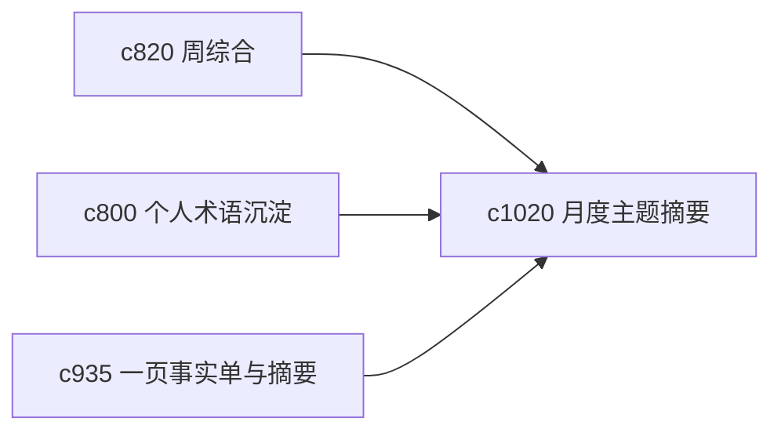

## Why

周综合适合看短期推进，但更长一些的主题需要月度级别的“地标”。否则长期研究虽然一直在做，却很难形成更高层的阶段感。

## What Changes

- 定义 monthly domain brief，把一个月内某个主题域的主要变化和新认识收成月度摘要。
- 增加 knowledge landmark，标出值得记住的阶段性结论、术语稳定点和关键转向。
- 支持月度摘要回挂到长线线程、主题图和轻量摘要产物。
- 避免生成空洞月报，重点是保留真正的认知地标。

## Capabilities

### New Capabilities
- `monthly-domain-briefs-and-knowledge-landmarks`: 定义月度主题摘要和知识地标。

### Modified Capabilities
- `weekly-synthesis-and-personal-knowledge-rollups`: 周综合需要能汇聚成月度层。
- `personal-glossary-growth-and-term-settling`: 术语稳定点需要进入地标。
- `output-fact-sheets-and-one-page-abstracts`: 一页摘要需要可作为月度封面。

## Impact

- Backend：会影响月度聚合、地标索引和摘要装配。
- Frontend：会影响主题域页、回顾页和长期地标视图。
- Dependencies：这条线接在 `c820`、`c800`、`c935` 后面，属于长期知识沉淀层的自然延伸。

