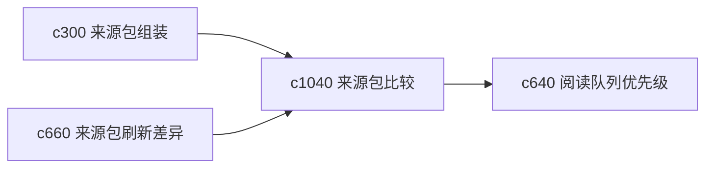

## Why

当同一主题有多组来源包时，用户会想知道哪一组更适合当前任务。现在来源包能刷新和摘要了，但还不够方便横向比较。

## What Changes

- 定义 source bundle comparison，支持多组来源包在覆盖、可信度和陈旧度上的横向对比。
- 增加 readiness ranking，帮助判断哪组来源包更适合拿来开跑、审读或成稿。
- 支持比较结果回接阅读队列和 run 目标。
- 避免把比较做成复杂评分黑盒，重点是提供清楚的差异面。

## Capabilities

### New Capabilities
- `source-bundle-comparisons-and-readiness-rankings`: 定义来源包横向比较和就绪度排序。

### Modified Capabilities
- `source-pack-assembly-and-topic-watchlists`: 来源包需要暴露可比较的摘要指标。
- `source-pack-refresh-diff-and-brief`: 刷新差异需要成为比较背景。
- `reading-queue-prioritization-and-guided-order`: 阅读队列需要能基于包比较结果生成。

## Impact

- Backend：会影响来源包对比、就绪度计算和比较摘要。
- Frontend：会影响来源包详情、比较页和启动入口。
- Dependencies：这条线承接 `c300`、`c660`、`c640`，更偏操作决策层。

