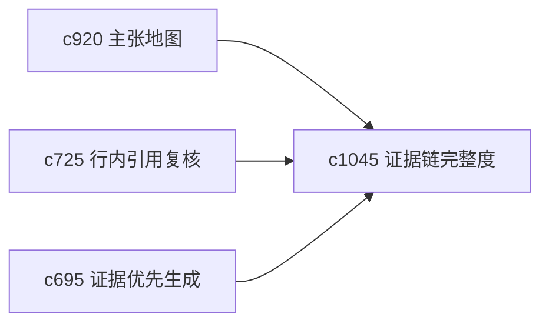

## Why

很多论证看起来成立，问题却出在证据链中某一小段特别薄。没有“弱链路”视角，用户会只看到整体还行，却看不到真正最脆的那一环。

## What Changes

- 定义 evidence chain completeness，检查一个主张从来源到段落之间的链路是否完整。
- 增加 weak link detection，突出最容易导致整条论证失稳的薄弱点。
- 支持弱链路回接引用复核、主张地图和风险刹车。
- 区分“缺引用”“缺独立来源”“缺中间推理”“缺时间一致性”这几类弱点。

## Capabilities

### New Capabilities
- `evidence-chain-completeness-and-weak-link-detection`: 定义证据链完整度和薄弱环检测。

### Modified Capabilities
- `claim-map-views-and-argument-tracebacks`: 主张地图需要展示弱链路。
- `inline-citation-review-queue-and-fix-sweeps`: 引用复核需要按弱链路优先级排队。
- `evidence-first-generation-modes-and-unsafe-claim-brakes`: 风险刹车需要识别证据链断点。

## Impact

- Backend：会影响链路分析、断点分类和优先级计算。
- Frontend：会影响审读页、引用队列和风险提示。
- Dependencies：这条线承接 `c920`、`c725`、`c695`，让可信性检查更聚焦。

