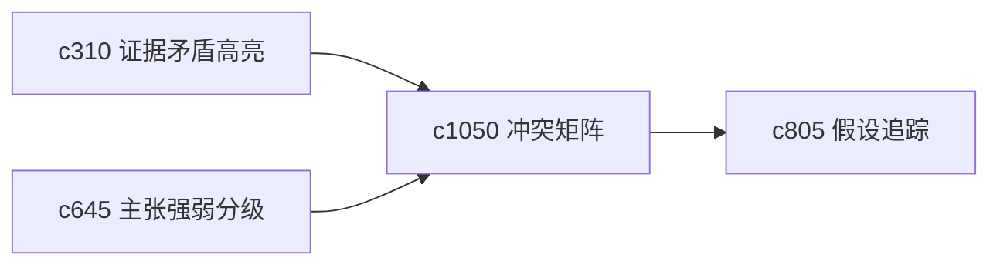

## Why

冲突并不总是“一堆来源互相打架”，有时是某个主张跟几类来源冲突，有时是同一来源支持一半、反驳一半。需要一个更结构化的冲突面，而不是零散提醒。

## What Changes

- 定义 conflict matrix，把主张和来源之间的支持、反驳、模糊关系放到矩阵视图里。
- 增加 resolution lane，帮助用户按冲突类型分流处理。
- 支持矩阵直接跳到来源片段、假设演化和决策日志。
- 保持视图用于判断，不把它做成复杂审批流。

## Capabilities

### New Capabilities
- `source-claim-conflict-matrix-and-resolution-lanes`: 定义主张与来源冲突矩阵和处理分道。

### Modified Capabilities
- `evidence-contradiction-highlights-and-resolution-notes`: 矛盾说明需要进入矩阵视图。
- `claim-strength-grading-and-evidence-weight`: 主张强弱需要读取冲突压力。
- `hypothesis-tracking-and-verdict-evolution`: 冲突处理需要影响判断演化。

## Impact

- Backend：会影响冲突关系建模、矩阵摘要和分流分类。
- Frontend：会影响冲突视图、主张详情和处理入口。
- Dependencies：这条线承接 `c310`、`c645`、`c805`，会把矛盾处理拉到更可操作的层面。

