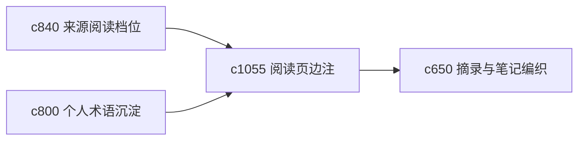

## Why

阅读时很多有价值的理解并不值得进正式笔记，但也不该彻底消失。需要一种更轻的“页边 gloss”，让用户保留阅读中的即时理解，而不把主工作面弄得很重。

## What Changes

- 定义 reader-side gloss，让来源阅读器支持轻量边注和短解释。
- 增加 progressive annotation，允许边注按重要程度逐步升级为摘录或笔记。
- 支持 gloss 与术语解释、双语对照和阅读档位联动。
- 区分私人阅读批注和正式可复用笔记，避免界限模糊。

## Capabilities

### New Capabilities
- `reader-side-glosses-and-progressive-annotations`: 定义阅读页边注和渐进式批注升级。

### Modified Capabilities
- `source-reading-modes-and-density-controls`: 阅读档位需要控制边注显示强度。
- `personal-glossary-growth-and-term-settling`: 术语解释需要能从边注沉淀。
- `quote-clipping-and-note-weaving`: 边注需要可升级为摘录或编织节点。

## Impact

- Backend：会影响边注对象、升级 lineage 和局部存储。
- Frontend：会影响阅读器、边注层和升级动作入口。
- Dependencies：这条线承接 `c840`、`c800`、`c650`，属于阅读面更自然的轻量补充。

