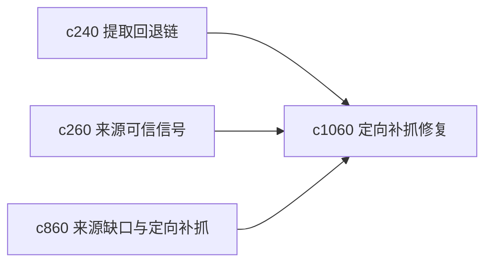

## Why

来源坏掉或太薄时，最烦的不是知道它坏了，而是不知道该怎么最小代价地补回来。需要一种更定向的 recapture，而不是重新把整条抓取链路走一遍。

## What Changes

- 定义 targeted recapture，针对缺页、提取失败、正文过薄、锚点断裂等情况做定向补抓。
- 增加候选补抓路径比较，帮助用户选更划算的修复办法。
- 支持修复结果直接回接来源包、引用队列和主张链。
- 区分“重新抓取原来源”和“寻找等价替代来源”两类路径。

## Capabilities

### New Capabilities
- `targeted-recapture-for-broken-or-thin-sources`: 定义薄弱来源定向补抓和替代修复路径。

### Modified Capabilities
- `extractor-fallback-chain-and-capture-provenance`: 提取回退需要暴露可再次尝试的路径。
- `source-trust-signals-and-quality-hints`: 质量提示需要能触发定向补抓建议。
- `source-coverage-holes-and-targeted-fetch-suggestions`: 覆盖缺口需要区分由坏来源造成的假缺口。

## Impact

- Backend：会影响补抓策略、替代来源匹配和修复 lineage。
- Frontend：会影响来源详情、修复建议和批量处理入口。
- Dependencies：这条线承接 `c240`、`c260`、`c860`，是来源维护链上的实用补件。

