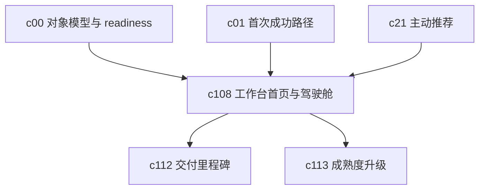

## Why

现在这套产品已经能让人建 notebook、导入来源、发起会话、生成结果，但用户一旦不是第一次来，回到 Workspace 时还是容易愣住。要么信息太散，要么不知道今天先看哪块，久了就会把它当成一堆功能拼起来的工作台，而不是一个能持续推进事情的地方。

## What Changes

- 增加 workspace home，把用户最近的 notebook、待处理事项、关键阻塞、结果更新和推荐动作收进同一个入口。
- 把“今天该先做什么”做成持续使用阶段的 operating cockpit，而不是只在首次进入时给一次性引导。
- 允许按角色和工作阶段切换视角，比如个人推进、协作审阅、交付跟进和长期监测。
- 统一展示 workspace readiness、目标摘要、关键 run、待审项和即将过期事项，减少用户在多个面板之间来回找状态。

## Capabilities

### New Capabilities
- `workspace-home-and-operating-cockpit`: 定义 Workspace 首页、日常驾驶舱、关键状态聚合和持续推进入口。

### Modified Capabilities
- `workspace-ui-core`: 需要增加稳定的 home 入口、驾驶舱布局和跨面板状态承载。
- `workspace-ui-panels`: 需要向首页暴露统一的摘要卡片、阻塞原因和跳转入口。
- `workspace-api-contract`: 需要提供 workspace home 所需的聚合摘要、待办信号和推荐动作接口。
- `workspace-shared-ui-state`: 需要让首页和各面板共享筛选、焦点对象和最近上下文。

## Impact

- Backend：需要补 workspace home 聚合接口、摘要计算和状态归并逻辑。
- Frontend：需要新增首页壳层、驾驶舱卡片、角色视角切换和跨面板跳转。
- Product：这条线接在 `c01` 之后，处理的不是“第一次成功”，而是“第二天回来还知道怎么继续”。
- Dependencies：建议接在 `c00-workspace-object-model-and-readiness-contract`、`c01-first-run-success-path`、`c21-proactive-recommendations-and-next-best-actions` 之后。

## Dependency Sketch

