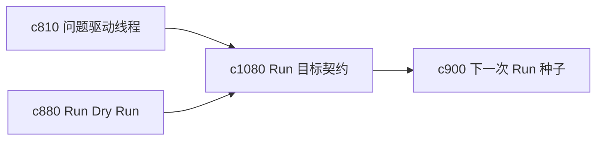

## Why

很多 run 看起来执行成功了，但其实并没有真正回答用户要解决的事。没有明确的 goal contract，系统只是在完成流程，不一定在完成目标。

## What Changes

- 定义 run goal contract，在执行前明确本次 run 的目标、边界和最低成功条件。
- 增加 success check，在结束后判断结果是否真的满足这次目标。
- 支持 goal contract 和问题线程、scope box、下一次 run 种子联动。
- 区分“流程跑通”和“目标达成”，避免误把空成功当成功。

## Capabilities

### New Capabilities
- `run-goal-contracts-and-success-checks`: 定义执行目标契约和成功检查。

### Modified Capabilities
- `question-led-research-threads-and-answer-status`: 问题线程需要能给出执行目标。
- `run-plan-dry-run-and-simulation`: 预演需要先展示目标契约。
- `next-run-seeding-and-carry-forward-briefs`: 未达成目标时需要自动生成续跑种子。

## Impact

- Backend：会影响目标元数据、结束校验和建议生成。
- Frontend：会影响 run 启动页、结果页和目标达成提示。
- Dependencies：这条线承接 `c810`、`c880`、`c900`，是 run 更像“完成任务”而不是“执行任务”的关键一步。

