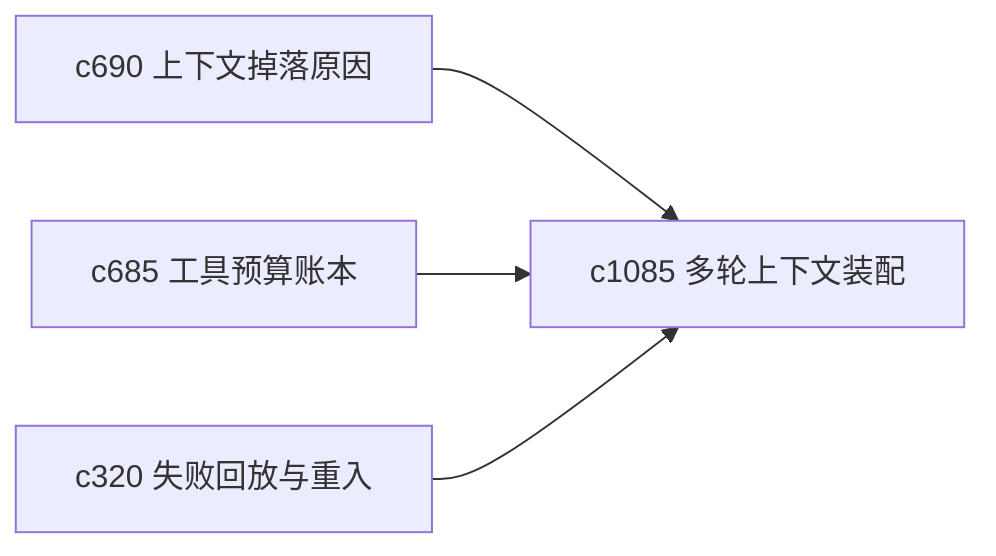

## Why

上下文装配不是越多越好，很多时候更合理的是先用一层较轻的上下文试跑，再逐步扩展。如果一上来就把所有东西塞进上下文，不仅贵，也更难解释为什么结果会这样。

## What Changes

- 定义 multi-pass context staging，把上下文装配拆成几轮由轻到重的阶段。
- 增加 progressive expansion，在前一轮不足时再按明确规则扩展上下文。
- 支持 staging 与掉落原因、预算账本和风险刹车协同。
- 避免 staging 变成新的黑盒，让每一轮扩展都有清楚理由。

## Capabilities

### New Capabilities
- `multi-pass-context-staging-and-progressive-expansion`: 定义多轮上下文装配和渐进扩展。

### Modified Capabilities
- `context-assembly-drop-reasons-and-recovery-actions`: 掉落信息需要转成下一轮扩展依据。
- `tool-budget-ledger-and-step-cost-attribution`: 成本账本需要表达每一轮装配代价。
- `research-run-failure-replay-and-step-reentry`: 回放需要能重走某一轮上下文扩展。

## Impact

- Backend：会影响上下文编排、轮次记录和预算控制。
- Frontend：会影响 run 解释、上下文预览和重试入口。
- Dependencies：这条线承接 `c690`、`c685`、`c320`，是更精细的上下文控制层。

