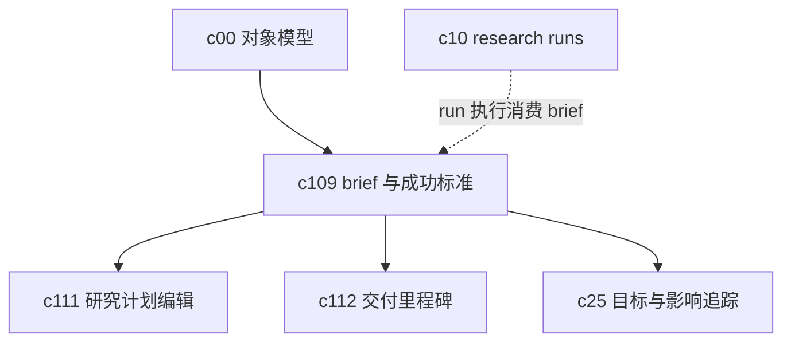

## Why

现在很多对象已经有了，但真正把工作拉到一条线上之前，最容易含糊的仍然是 brief 本身。目标是什么，做到什么算完成，哪些不在范围内，哪些约束不能碰，这些如果一开始没钉住，后面的研究、审阅和交付看起来都很忙，最后还是会返工。

## What Changes

- 引入 goal brief，把目标、成功标准、边界条件、非目标、交付格式和时限收成正式对象。
- 支持一个 workspace、research run 或交付流程挂接多个 brief 版本，而不是把需求变化散在聊天和评论里。
- 让成功标准可被后续 evidence review、delivery milestone 和 outcome tracking 直接消费，不再靠人自己理解上下文。
- 提供 brief 缺失、目标冲突、成功标准过粗等提示，减少后面才发现任务定义不清。

## Capabilities

### New Capabilities
- `goal-briefs-and-success-criteria`: 定义目标简报、成功标准、范围约束和 brief 版本语义。

### Modified Capabilities
- `workspace-api-contract`: 需要增加 brief 对象、版本、关联关系和成功标准查询接口。
- `evidence-review-workflow`: 需要支持按 brief 中的成功标准组织审阅和结论。
- `publishable-artifacts`: 需要支持产物回指其来源 brief 和满足情况摘要。
- `workspace-ui-core`: 需要提供 brief 入口、状态提醒和范围变更提示。

## Impact

- Backend：需要新增 brief 模型、版本关系、关联索引和成功标准摘要逻辑。
- Frontend：需要补 brief 面板、目标摘要视图、范围变更提示和产物挂接入口。
- Product：这条线是 `c25` 的前置层。`c25` 解决“结果服务了什么目标”，`c109` 先解决“目标一开始到底怎么定义”。
- Dependencies：建议接在 `c00-workspace-object-model-and-readiness-contract`、`c10-agentic-research-runs`、`c25-outcome-goals-and-impact-tracking` 之前或并行讨论。

## Dependency Sketch

