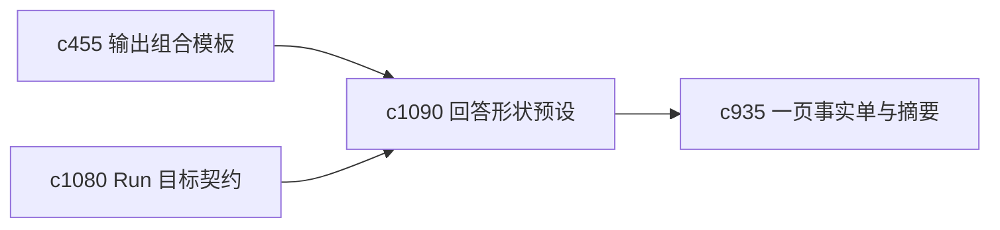

## Why

用户并不总是缺内容，很多时候缺的是“这次我到底想落成什么形状”。没有明确的 answer shape，系统会在不同输出之间来回摆，用户也更难建立稳定习惯。

## What Changes

- 定义 answer shape preset，把常见回答形状收成稳定档位。
- 增加 output landing zone，明确某次 run 结果应该优先落到 briefing、fact sheet、notebook 还是 report。
- 支持 shape preset 受 goal contract、template 和不确定性带影响。
- 保持 landing zone 是引导，不强迫所有结果都走同一路径。

## Capabilities

### New Capabilities
- `answer-shape-presets-and-output-landing-zones`: 定义回答形状预设和结果落点规则。

### Modified Capabilities
- `output-composition-templates-and-layout-guards`: 模板层需要表达默认回答形状。
- `run-goal-contracts-and-success-checks`: 目标契约需要包含期望落点。
- `output-fact-sheets-and-one-page-abstracts`: 轻产物需要能作为默认落点之一。

## Impact

- Backend：会影响结果路由、模板选择和落点元数据。
- Frontend：会影响 run 启动页、结果页和快捷继续入口。
- Dependencies：这条线承接 `c455`、`c1080`、`c935`，把结果去向讲得更清楚。

