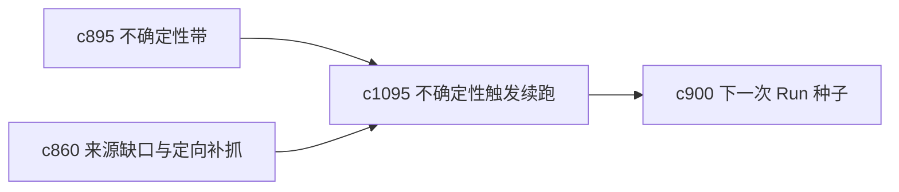

## Why

不确定性既然已经能被识别，就不该只停在标签上。很多时候最有价值的下一步，就是让系统基于不确定点自动建议一轮更小、更精确的 follow-up run。

## What Changes

- 定义 uncertainty-triggered follow-up，根据高不确定段落、薄弱主张或关键缺口生成续跑建议。
- 支持 follow-up run 自动带入更窄的目标、来源缺口和上下文策略。
- 让续跑建议能回接问题线程和决策日志，而不是只在结果页停留一下。
- 避免无休止自动续跑，默认仍由用户确认。

## Capabilities

### New Capabilities
- `uncertainty-triggered-follow-up-runs`: 定义由不确定性触发的续跑建议。

### Modified Capabilities
- `uncertainty-bands-and-answer-confidence-shaping`: 不确定性带需要产出可行动的后续建议。
- `source-coverage-holes-and-targeted-fetch-suggestions`: 续跑需要携带更具体的补抓方向。
- `next-run-seeding-and-carry-forward-briefs`: 续跑建议需要沉淀成正式 seed。

## Impact

- Backend：会影响续跑建议生成、范围收缩和 seed 装配。
- Frontend：会影响结果页、风险提示和继续入口。
- Dependencies：这条线承接 `c895`、`c860`、`c900`，把“不确定”变成“下一步”。

