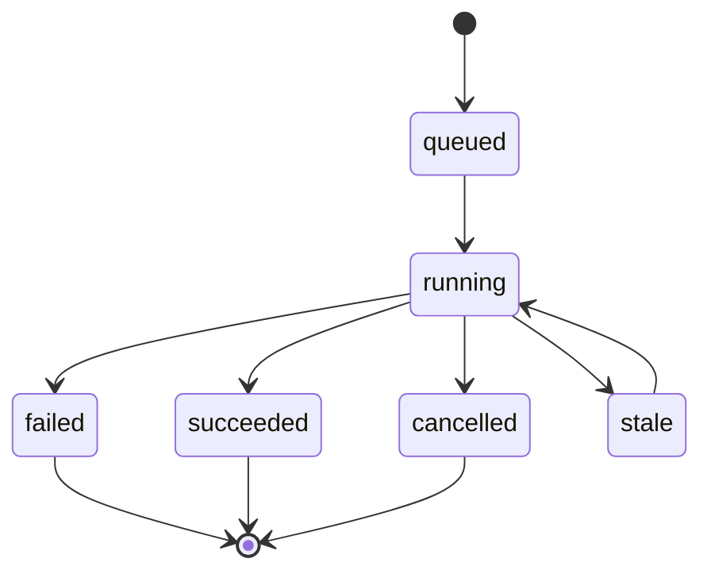

## Why

我们已经有后台任务、SSE 进度、以及一堆“看起来像 run 的东西”（research session、QA stream、output queue…）。但它们的生命周期并没有收口：启动方式不一致、取消/重试语义不统一、服务重启后的恢复策略也各自为政。

真正麻烦的地方在于：当用户问“刚刚那次生成到底怎么样了？”我们很难用一个稳定对象回答。需要一个明确的 Run 契约把这件事钉住。

## What Changes

- 定义 `Run` 作为一等对象：拥有 `id`、`type`、`status`、`created_at/started_at/finished_at`、以及最小上下文（notebook/session/output）。
- 统一启动/取消/查询接口：
  - `POST /runs`（支持 client_request_id 做幂等）
  - `POST /runs/{run_id}:cancel`
  - `GET /runs/{run_id}`（状态 + 摘要）
  - `GET /runs/{run_id}/stream`（统一 SSE：引用 `c09` 的 event envelope）
- 明确服务重启后的恢复策略：run 与 task 的映射、是否自动 resume、何时标记为 `stale`。
- 明确“用户可见状态”与“内部阶段”之间的映射：UI 不需要知道所有细节，但要能解释正在发生什么。

## Capabilities

### New Capabilities

- `run-lifecycle-contract`: Run 的生命周期、状态机、接口与幂等/取消语义。

### Modified Capabilities

- `background-jobs-and-task-runtime`: task ↔ run 的映射与重启恢复要求。
- `workspace-api-contract`: run 相关 API、错误码与 SSE 事件关联字段。
- `workspace-ui-panels`: UI 需要能展示 run 状态、取消、失败原因与下一步动作。

## Impact

- Backend：需要把 research/qa/output 这些“各自的执行对象”对齐到 run；task queue 的 durable 状态也要更明确。
- Frontend：不用再针对每条 stream 写不同的状态机；run 面板/队列可以复用。
- Dependencies：建议先落地 `c08` 的对象/ID 约定，再用 `c09` 的 SSE 契约把 run stream 统一起来。

## Dependency Sketch

