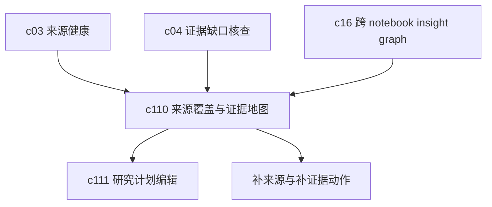

## Why

来源多起来以后，团队常见的问题不是“有没有资料”，而是“这些资料到底覆盖了哪些问题，哪里还是空的”。如果看不到 coverage，用户就只能凭感觉继续补来源、继续跑结果，最后不是冗余很多，就是关键缺口一直没补上。

## What Changes

- 增加 source coverage 和 evidence map，把问题域、来源集合、证据块和结论之间的覆盖关系画清楚。
- 支持查看某个问题已经有哪些来源支撑、哪些来源质量一般、哪些关键结论还没有足够依据。
- 把 coverage 结果和来源健康、证据核查、主动推荐接起来，让系统知道“缺的不是更多资料，而是某一类资料”。
- 为长期监测和交付复盘提供覆盖面快照，方便比较这次比上次多掌握了什么、还缺什么。

## Capabilities

### New Capabilities
- `source-coverage-and-evidence-map`: 定义问题覆盖、来源分布、证据映射和缺口可视化能力。

### Modified Capabilities
- `knowledge-curation-and-freshness`: 需要暴露来源质量、新鲜度和可用性信号给 coverage 视图。
- `evidence-review-workflow`: 需要支持从 claim / evidence 关系回写到覆盖地图。
- `workspace-ui-panels`: 需要提供覆盖面视图、缺口入口和问题域切换。
- `workspace-api-contract`: 需要增加 coverage 计算结果、证据映射和缺口摘要接口。

## Impact

- Backend：需要补 coverage 计算、问题到来源的映射索引、缺口聚合和快照逻辑。
- Frontend：需要新增 evidence map 视图、缺口高亮、问题切换和回链交互。
- Product：这条线夹在 `c03` 和 `c04` 中间，既不只是看来源状态，也不只盯结论核查，而是把“覆盖情况”作为独立视角补出来。
- Dependencies：建议接在 `c03-source-readiness-and-freshness-hub`、`c04-evidence-gap-and-claim-checking`、`c16-cross-notebook-insight-graph` 之后。

## Dependency Sketch

